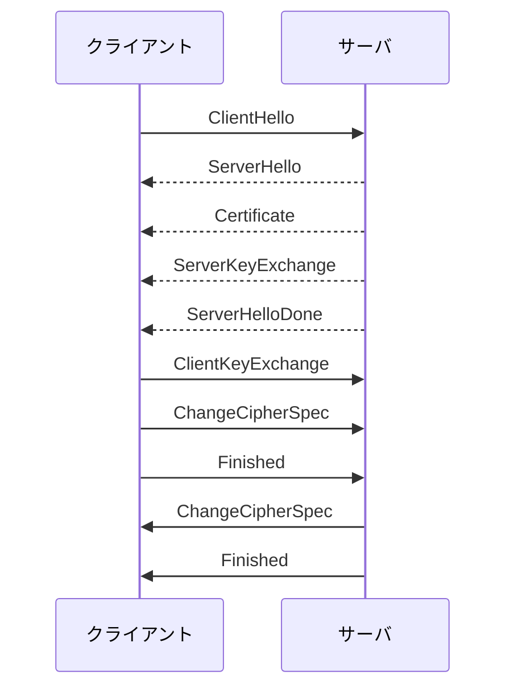
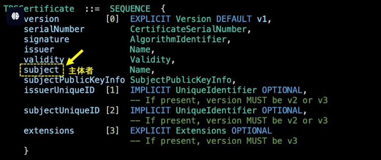

## ディジタル証明書

PKIとはPKを用いてデジタル署名の正当性を証明する基盤(システム)

RA・CA：ある意味公的な証明書の発行を行う機関
秘密鍵：秘密に保管しておく
デジタル署名：契約書に押印
デジタル証明書：デジタル署名の正当性を証明する役割

#### デジタル証明書

デジタル署名の正当性を証明するデジタル証明書
デジタル証明書の中に存在する情報

- 公開鍵
- 有効期限
- 証明書の正当性(認証局のデジタル証明書)
  表記のフォーマット：X.509
  X.509という言葉は一般的にはIETFのPKI(X.509)と証明書失効リストプロファイル（CRL）
  X.509形式は証明書、CRLのフォーマット

#### PKIの運用環境

3つの役割

- CA:デジタル証明書のお墨付きを与える信頼のおける第3者機関
- RA:利用者からデジタル証明書の登録を受け付けて承認や認可を行う機関
- IA:デジタル証明書の正当性をかくにんするAPPが直接やり取りを行う

## PKIの仕組み

#### デジタル証明書が発行されるまでの手順

1. 本人が公開鍵の鍵ペア生成
2. 秘密鍵は保管。公開鍵と登録申請書記載→RAに申請(CSRと呼ぶ)
3. RAはCSRを受け取ると内容を審査する
4. CAがデジタル証明書を発行

#### デジタル証明書の利用例

通信相手の正当性を検証する

1. 送信者は文章のハッシュ値を計算→メッセージダイジェストと呼ばれる
2. メッセージダイジェストを秘密鍵を用いて暗号化→デジタル署名
3. 送信メッセージに、CAより発行されたデジタル証明書を添付
4. 3と文章、デジタル署名を相手に送信する
5. 送信者は4の内容より、デジタル署名を検証し、CAの正当性を確認する
   1. CAの公開鍵を用いてCAのデジタル署名を復号→デジタル証明書のハッシュ値を算出
6. デジタル証明書の中にあるPKを用いて、主体のデジタル署名を元のメッセージダイジェストに戻す
7. 受信者は受信した文章とデジタル署名を用いて、相手の正当性を確認する
8. 復号した送信メッセージダイジェストと、作成した作成メッセージダイジェストを比較する

CSR:デジタル証明書を取得するためのCAに対する申請書

CPS:認証局運用規定のこと。CA側でCPを作成して管理して、公開する。

#### デジタル証明書のチェック方法

取得したデジタル証明書のチェックする内容について説明する。

1. デジタル署名の検証
2. 有効期限の検証
3. 失効情報のチェック
4. ルート認証局、ルート証明書の検証
5. 証明書のレベルチェック
6. アクセス先のチェック

__失効情報のチェック__

有効期限が残っているのに強制的に執行することがある

CRLを確認する方法と、OCSPを確認する方法がある

__ルート認証局、ルート証明書の検証__

ルート認証局が信頼してよいCAかどうかを確認する

※ルート認証局は誰でも立ち上げることが出来るため。自組織で信頼してよいかが判断されたCAかをチェックする必要がある

巷で使われるブラウザにはデフォルトで信頼されたルート認証機関がインストールされていて、ここにない認証局が発行したデジタル証明書であることが確認されると”信頼されていない”

__証明書のレベル__

発行時の確認内容や審査内容の厳格さにより以下の３種類に分けられる

DV: ドメインだけを確認

OV: 企業や組織の実在性を確認

EV: OVよりも厳しく内容を確認

__アクセス先のチェック__

デジタル証明書を検証する場合、アクセス先のサーバがデジタル証明書に記載されたものと同じかをチェックして確認。確認するのは以下の２つ

| デジタル証明書                           | アクセス先 |
| ---------------------------------------- | ---------- |
| subejectAltName(SAN)に記載されているFQDN | FQDN       |
| subjectに記載されているFQDN              | FQDN       |

__SAN__

サーバー証明書のSubjectAltNameフィールド。

SANには、そのサーバー証明書を設定・使用するサーバーを示すドメイン名・IPアドレス・URIなどを記述し、それらの識別子（ID）をその証明書に関連付け。

確認すべきは以下２点のどちらか

デジタル証明書のSANのFQDNと、実際にアクセスしているFQDNが整合？

デジタル証明書とsubjectに記載されているFQDNと、実際にアクセスしているFQDNが整合？

__FQDN__

```
日本語で完全修飾ドメイン名。ホスト名＋ドメイン名で表現される
```

#### 常時SSLと内容の検査

すべてのページをSSL/TLS対応とする常時SSL化が一般化
この時に問題となるのはUTMによる通信内容のチェック。暗号化されているため、そのままではウイルスチェックができなくなってしまう。
このため、実装されているのがSSLインスペクション

__SSLインスペクション__
暗号化されたデータを、UTMなどの機器が仲介して、内容の復号化を行い、内容のチェックを行う方法
復号化のポイントは2点

- UTMが自身のデジタル証明書を作成して、端末側の検証でパスすること
- UTMのデジタル証明書をブラウザの信頼されたルート証明書として登録しておくこと
  →自作したデジタル証明書で信頼させることになるので、オレオレ証明書と呼ばれる
  ※手口は中間者攻撃と同様
  ※通信の仲介をするが、復号化、他方の暗号化が必要となり、負荷がかかる。処理を高速に行うために、専用のデバイスを搭載する。この専用デバイスをSSLアクセラレータ。処理をSSLアクセラレーションと呼ぶ。

## TLS(SSL)

PKIを活用した、ブラウザとWEBサーバとの通信を暗号化するプロトコルがTLS。
SSLが出てから、改版をされてTLSとなった。

TLSはSSL3.0を、IETFが改修して開発された。BEAST攻撃を回避するため、暗号化を大幅に強化した

#### 通信シーケンス

ハンドシェイクにより通信を行う

step1. Hello Requestの交換。クライアント側から利用可能な暗号アルゴリズムや圧縮方式を通知→サーバーで組み合わせを選択

step2. サーバーからクライアントへのメッセージ送信のフェーズ。サーバーからクライアントに対して、サーバのデジタル証明書を送付する。

step3. クライアントがサーバーからのデジタル証明書を検証→サーバーの正当性を確認する

step4. step3で正当だった場合。サーバーの公開鍵を用いて、クライアントが生成したプレマスタシークレットをサーバーに送信する(Client Key Exchange)。一通りメッセージ送信するとChange Cipher Specを送信して、暗号通信の開始を宣言する。

step5. サーバーもCHange Cipher Specを送信して、双方向の暗号通信が開始する。

#### SNI

SSL/TLSの拡張仕様の一つにSNIが存在(RFC6066)

従来は１台のサーバで一つのデジタル証明書しか持つことが出来なかったが、SNIを用いることで、複数のデジタル証明書をつかうことが出来るようになる。

ハンドシェイク時に、クライアント側がアクセスしたいFQDNを伝える。サーバーはFQDNに対応するデジタル証明書を返すという形で実現する。→サーバーとクライアント両方がSNIに対応している必要がある。

ハンドシェイク時のホスト名は平文だが、暗号化したESNIが存在する

#### SSL/TLSの脆弱性と攻撃

__ダウンロード攻撃__

SSL/TLSの暗号化スイートを決める際に、暗号化の弱いスイートを強制して、解読しやすい暗号通信を行う攻撃

__バージョンロールバック__

SSLのバージョンロールバック攻撃。SSL2.0のような古いバージョンを促して、解読しやすい暗号化通信を行う攻撃

__BEAST 攻撃__

SSL3.0/TLS1.0のCBCモードの脆弱性を利用して選択平文攻撃を行い、Cookieを得る攻撃。

Cookieの中の認証情報を取得して、通信に悪用するような可能性が考えられる。

__POODLE攻撃__

SSL3.0にあるブロック暗号上のパディングに関する設計上の脆弱性をついた攻撃。パディングを悪用して暗号通信を解読する。対策としては、SSL3.0を無効化すること。

##### CBCモード

CBCモード（Cipher Block Chainingモード）は、暗号化モードの一つで、ブロック暗号の運用モードの一種です。このモードでは、各ブロックの暗号化に前のブロックの暗号文を使用します。具体的には、次のように動作します2:

1. 最初の平文ブロックと初期化ベクトル（IV）をXOR演算します。
2. その結果を暗号化アルゴリズムに入力し、暗号文ブロックを生成します。
3. 次の平文ブロックと前の暗号文ブロックをXOR演算し、その結果を再び暗号化アルゴリズムに入力します。
4. このプロセスを繰り返して、全てのブロックを暗号化します。

CBCモードの特徴は、同じ平文ブロックが繰り返されても異なる暗号文ブロックが生成されるため、セキュリティが向上する点です

CBCモードは共通暗号化の１種。

##### 利用可能なアルゴリズム例

* **共通鍵暗号（対称鍵暗号）** :
* **AES（Advanced Encryption Standard）** : AES-GCM、AES-CCMなどがあり、TLS 1.3では特にAES-GCMが広く使用されています2。
* **ChaCha20** : Poly1305と組み合わせて使用され、TLS 1.3で標準として採用されています。
* **公開鍵暗号（非対称鍵暗号）** :
* **RSA** : 鍵交換やデジタル署名に使用されますが、TLS 1.3ではセキュリティ向上のため、使用が減少しています。
* **ECDHE（Elliptic Curve Diffie-Hellman Ephemeral）** : 鍵交換に使用され、TLS 1.3で推奨されています。
* **ハッシュ関数** :
* **SHA-256** : メッセージ認証コード（MAC）やデジタル署名に使用されます。
* **SHA-384** : 同様に、メッセージ認証コードやデジタル署名に使用されます

## HSTS(HttpStrict Transport Security)

WEBサイトがアクセスするブラウザに対して、HTTPSの通信を強制する機能。

ただし、始めてアクセスした場合はhttpでもアクセス可能。ここで中間者攻撃を受ける可能性がある。

## デジタル証明書の利用シチュエーション

デジタル証明書を利用するシチュエーションは以下の通り

| 証明書の種類           | 用途                                                                                                   |
| ---------------------- | ------------------------------------------------------------------------------------------------------ |
| サーバー証明書         | WEBサーバの正当性を証明するために利用されるときのデジタル証明書                                        |
| クライアント証明書     | クライアントの正当性を証明するために利用されるデジタル証明書                                           |
| S/MIME証明書           | 電子メールにデジタル証明書と暗号化を行い、メール送信者の身元証明と改ざん検知を行う                     |
| コードサイニング証明書 | SWの正当性を証明するデジタル証明書。<br />SWの配布元を認証し、改ざん検知やなりすましの検知を可能にする |

## 時刻認証

電子データにタイムスタンプを付与することで以下２点を証明する技術

* 存在性証明
  タイムスタンプ時に、電子データが存在すること
* 完全性証明
  タイムスタンプ時以降に、電子データが改ざんされていないこと

#### タイムビジネス認定制度

信頼のおける時刻情報を提供するための機関

* TSA
  タイムスタンプを発行したり、有効性を証明する機関
* TAA
  TSAに正確な時刻を配信する機関

#### 時刻認証方式

TSAの時刻認証方式にはでじt瑠署名方式、アーカイブ方式、リンキング方式がある。

取得の流れ

1. ドキュメント作成者は文章からハッシュを作成→TSAに送付
2. TSAはハッシュ値に、TAAから入手した時刻情報を付加して、ハッシュ値を計算
3. 2にTSAのみが保持する秘密鍵を用いて暗号化＝タイムスタンプトークン
4. 作成者に作成時刻とタイムスタンプトークンが返送される
5. 作成者は4の情報と、オリジナルの文章を保持しておく

検証の流れ

1. 元の文章からハッシュ値を作成
2. 1のハッシュに日時データを合わせて、ハッシュ化する
3. TSTを、TSAの公開鍵を用いて復号化して2と整合するか検証する

タイムスタンプトークンが整合チェックするもの

# PKI
public key infrastructure
公開鍵暗号化技術を用いてディジタル署名の正当性を証明する基盤

登録局：RA、認証局：CA

## ディジタル証明書
PKIにおいて、ディジタル署名の世知統制を証明する重要な役割を担う。
公開鍵証明書、電子証明書ともいう

ことなる環境や異なるアプリケーションでも問題なく利用できるようにX.509で標準化されている。

公開鍵や有効期限、証明書の正当性を証明する情報がふくまれている。
CRLと合わせて、有効性や正当性を証明出来るようになっている。

>PKCS#7
>証明書のフォーマットでX.509以外のもの
>複数の証明書をふくむことができるフォーマット

>PKCS#12
>複数の証明書だけでなく、秘密鍵も格納できるフォーマット

### PKIの運用環境
CA：ディジタル証明書にお墨付きを与える信頼のおける第3者機関

RA：利用者からディジタル証明書の登録申請を受け付けて承認や認可を行う機関。

IA：ディジタル証明書の正当性を確認するアプリケーションが直接やり取りするのがIA。

### PKIの仕組み

登録申請を受けて署名の主体が公開鍵のペアを作成
秘密鍵は依頼者が保存。PKとCSRを申請する
申請をうけると内容確認→ディジタル証明書を作成→リポジトリに登録する
必要に応じてCAに要求を出すとディジタル証明書を発行してもらう

ディジタル証明書の使用例

1. 送信側が文章からハッシュ関数よりハッシュ値を計算→メッセージダイジェストと呼ぶ
2. メッセージダイジェストをSKにより暗号化→ディジタル署名
3. 送信メッセージに主体のディジタル証明書を添付
4. 受信者はディジタル署名を検証して、CAの正当性をアック人→ハッシュ値の比較
5. PKにより元のメッセージダイジェストに戻す
6. メッセージダイジェストの比較によりなりすましかを判断

### ディジタル証明書のチェック方法
1. ディジタル署名を検証
2. 有効期限の検証
3. 失効情報のチェック
CRLを確認する方法とOCSPによる方法がある
CRLはX.509で規定されている有効期限切れ以外の理由で失効された主御名所の一覧表

ルート認証局
ディジタル証明書はCAさえ立ち上げれば誰でも容易に利用するｋとおが可能

そこでディジタル証明書を階層管理し上位の認証局が下位の認証局のディジタル証明書の正当性を証明する仕組みとしている
最上位をルートＣＡ、
ルート認証局自体の正当性は自己署名で行う。

### 証明書のレベル
1. DV:ドメインのみを確認
2. OV：企業の実在性を確認
3. EV:DVやOVよりも厳しい審査基準

### アクセス先のチェック
アクセス先のサーバがディジタル証明書に記載されたものと同一かをチェック

| ディジタル証明書 | アクセス先 |
| ----------------- | ---------- |
| SAN/subjectAltName | FQDN |
| subjectに記載されているFQDN | FQDN |

SANはX.509の拡張量いい気にあるこうk目の一つでマルチドメイン証明書を可能としてる。
SANにFQNDが設定されてれば、そちらを。
なければCNに設定されているFQDNを確認する。

### 常時SSL
全てのページをSSL/TKS対応にする常時SSL化も一般化。
UTMによる通信内容のチェックは、SSL/TLS通信は暗号化されているたえｍ、そのままではウィルスチェック出来ない。

そこでUTM製品に実装されだしたのがSSLインスペクション。

SSL/TLSをUTMで復号する等して通信内容を可視化する。

>SSLインスペクションの仕組み
>
>SSLインスペクションでは、プロキシやファイアウォールが「中間者」として動作し、暗号化通信を一時的に復号して検査を行い、通信内容を安全であると確認してから再暗号化して送信します。
>SSL/TLS接続の中継
クライアントがSSLインスペクションを行うプロキシやファイアウォールに接続をリクエストすると、プロキシはサーバーに対してSSL接続を中継します。
>復号化と検査
プロキシは、クライアントに偽装した証明書を発行してSSL接続を確立し、トラフィックを復号化して内容を確認します。例えば、URLフィルタリングやマルウェア検査、コンテンツのスキャンが行われます。
>再暗号化して送信
セキュリティ検査が完了すると、プロキシはトラフィックを再暗号化し、クライアントに安全な状態で送信します。

SSL複合/暗号化を行う専用のハードウェアを搭載し、高速処理を行う。
このハードウェアをSSLアクセラレータ、処理をSSLアクセラレーションという。

## SSL/TLS
PLIを活用したWebサーバーとブラウザの間の通信を暗号化するときに使うデファクトスタンダードともいえるプロトコルがTSL。

はじめにSSL開発されて、その後、TLSに移行した。

SSL2.0 1994
SSL3.0 1995
TLS1.0 SSL3.0をベースにIETFにより開発される
TLS1.2 暗号アルゴリズム強化
TLS1.3 ハンドシェイク時の暗号化が必須。



## SNI
SSL/TLSの拡張仕様の一つにSNI。

SNIを用いることで複数ドメインのディジタル証明書を利用出来るようになる。

クライアントがアクセスしたいアクセス先を伝え、サーバー名に対応するディジタル証明書を返す形で実現する。

__SSL/TLSの脆弱性をつく攻撃__

ダウングレード攻撃：
SSL/TLSの暗号スイートを決める時に弱い暗号スイートの使用を強制し、解読しやすい暗号化通信を行わせる攻撃。

バージョンロールバック：
SSLのバージョンロールバック攻撃はSSL2.0などの旧いバージョンの通信を促すことで解読しやすい暗号化通信を行わせる。

BEAST攻撃：
SSL3.0/TLS1.0のCBCモードの脆弱性を利用して選択平文攻撃を行い、Cookieを得る攻撃。

1. 概要
2011年に発表された攻撃手法です。
主にTLS 1.0やSSL 3.0の「CBCモード（Cipher Block Chaining）」の設計上の問題を悪用します。
攻撃者は、被害者のブラウザとサーバ間の暗号化通信の一部を解読し、セッションハイジャックなどを行うことができます。
2. 攻撃の仕組み
CBCモードでは、各ブロックの暗号化時に前のブロックの暗号文を利用します。
TLS 1.0/SSL 3.0ではCBCモードの初期化ベクトル（IV）の扱いに問題があり、攻撃者が特定の条件下で平文の一部を推測できてしまいます。
攻撃者は、被害者のブラウザを操作（例：悪意あるJavaScriptを実行）し、通信内容を何度も送らせることで、少しずつ暗号文から平文を復元します。
3. 攻撃の特徴
主にHTTPS通信に対して行われます。
セッションCookieなどの機密情報が漏洩する危険性があります。
「パディングオラクル攻撃」の一種とも言えます。

## HSTS
HSTSはwebサイトがアクセスしてくるブラウザに対してHTTPSの使用を強制させる機能。
webサイト側でブラウザからアクセスを受けた際の応答にStrict-Transport-Securityを指定する。

この指定を受け取ったブラウザはアクセス時に必ずHTTPSでの通信を行うように通信する。

## ディジタル証明書
サーバーの正当性を証明する以外の用途。

| 証明書の種類 | 用途 |
| -------------- | -------------------------------------------------- |
|サーバー証明書 | webサーバの正当性を証明するために利用されるディジタル証明書。 |
| クライアント証明書 | クライアントの正当性を証明書するために利用される。 |
| S/MIME証明書 | 電子メールにディジタル署名と暗号化を行い、電子メール送信者の身元証明と改ざん検知を行う。 |
| コードサイニング証明書 | ソフトの正当性を証明するためのディジタル証明書。改ざん検知やなりすまし検知も可能 |

## 時刻認証
電子データにタイムスタンプを付与することで、以下を証明するための技術。
- 存在性：確かに電子データが存在していたこと
- 完全性：そのデータが改ざんされてないこと

__1. タイムビジネス認定制度__

信頼のおける時刻情報を提供するために必要な機関。
- TSA:時刻認証局
- TAA:時刻配信局

TSAはタイムスタンプをはこうしたりする機関。
TAAはTSAに正確な時刻を配信する期間。

__2. 時刻認証方式__

TSAの時刻認証方式にはディジタル署名方式、アーカイビング方式、リンキング方式がある。
ディジタル署名方式ではディジタル証明書を用いて、時刻認証。

## subject フィールド
ディジタル証明書（特にX.509証明書）の subject フィールドには、その証明書が発行された「主体」（エンドエンティティ、つまり証明書の所有者）の識別情報が記載されています。主に以下のような項目が含まれます。



- UID=jsmith,DC=example,DC=net
- OU=Sales+CN=J. Smith,DC=example,DC=net
- CN=James \"Jim\" Smith\, III,DC=example,DC=net
- CN=Before\0dAfter,DC=example,DC=net

TSAの時刻認証方式にはディジタル署名方式、アーカイビング方式、リンクトークン方式などが存在する。
現在はディジタル署名方式が主流。

__タイムスタンプ取得の流れ__

1. ドキュメントの作成者は元の書類よりハッシュ値を作成し、TSAに送付。
2. TSAはハッシュ値にTAAから入手している正確な時刻を紐づけてハッシュ値2を作成
3. これらのデータにTSAしか持ちえないSKを用いてタイムスタンプトークン=TSTを作成
4. 作成者には、TSAから日時データと、TSTが変装されるので、元の文章とともに保存

__検証の流れ__

1. 元の文章からハッシュ値を作成
2. ハッシュ値と日時データにあつぃいてハッシングをしてハッシュ値を作成
3. TSTをTSAのPKを使って複合して、作成したハッシュ値と比較


