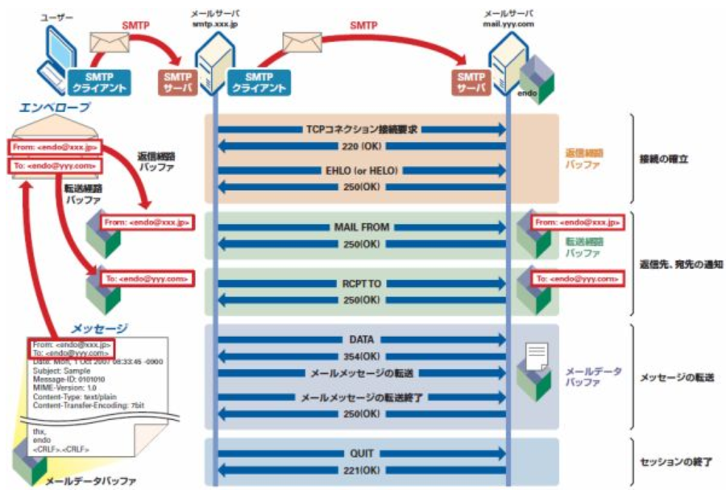

## 電子メールの構造

電子メールはエンベロープとデータに分けられる

さらにデータはヘッダとボディに分けられる

MUA：メールソフト

エンベロープは封筒。

SMTPコマンド：MAIL FROM、RCPT TOがエンベロープと呼ばれる

エンベロープFROMは容易に詐称できる。

対策としてSMTP-AUTH:送信者認証が一般的

データ部はヘッダとボディを空白行で分けている。

1. メール前にTCP接続される
2. HELO、EHLO
3. メールクライアントからMAIL FROM
4. RCPT TO=宛先
5. DATA=送付データは○○
6. QUIT=終わり

## 電子メール関連エージェントとプロトコル

#### 関連エージェント

MUA：メールを見たり送ったりするときに使うソフト

MTA: MUAから受け取ったメールを転送するプログラム

MSA: MUAからのメールを、認証の上受け取り、MTAに送付する

MRA: MUAがメールボックスからメールを取り出すときに通信する

MDA: メールボックスにメールを格納する

#### プロトコル

##### SMTP

- TCPポート番号25
- 電子メールの送信プロトコル
- 主要プロバイダが25番ポートをブロックすることが常態化→MUA側ではサブミッションポート587とSMTP-AUTHを使うことが一般的となっている
- 認証が必要となったため、最近ではMUAからMTAに直接メールを送信するよりは、MSAを経由させることが一般的となっている

##### POP3

- 電子メール受信のプロトコル
- メールサーバに蓄積されたメールをクライアントのメールソフト（MUA)からとりに行くときに用いるプロトコル。
- TCPポート番号：110
- USER/PASSでユーザ認証する。暗号化したい場合はAPOP

##### IMAP4

- 電子メールの受信プロトコル
- POP3との違いは、メールサーバーの中でメールを直接管理できること
- TCPポート番号：143

##### MIME

- マルチパートを用いて、各言語、テキストデータ、画像を一つにまとめてEメールで送受信できるようにしたプロトコル

##### S/MIME

- MIMEにセキュリティを組み込んだもの
- MIMEを暗号化して送受信
- 通常はCA発行の電子証明書が必要となる

##### BASE64

- Eメールでバイナリデータを扱うにはテキストデータのエンコードが必要となる
- 最も広く用いられているのがBASE64

## メールヘッダの解析

作業が容易なところ、困難なところ

| ヘッダ      | 意味                                                                                                                               | 偽装の可能性                       |
| ----------- | ---------------------------------------------------------------------------------------------------------------------------------- | ---------------------------------- |
| Return-path | 送信先メールアドレスまで到達しないなどのエラーで、メールを送り返すアドレス 通常はMAIL FROMと同じ                              | 送信者が自由に設定可能             |
| Received    | メールを中継したサーバーの情報が記載される 中継サーバーの情報が自動的に記載される 下の方が送信元に近く、上が受信者に近い | 上位に記載されているものは偽装困難 |
| From        | 眼０瑠送信者のメールアドレス                                                                                                       | 詐称可能                           |
| To          | メールの宛先のアドレス                                                                                                             | 詐称の意味なし                     |
| Subject     | メールの件名                                                                                                                       | 記載は自由にコントロール可能       |
