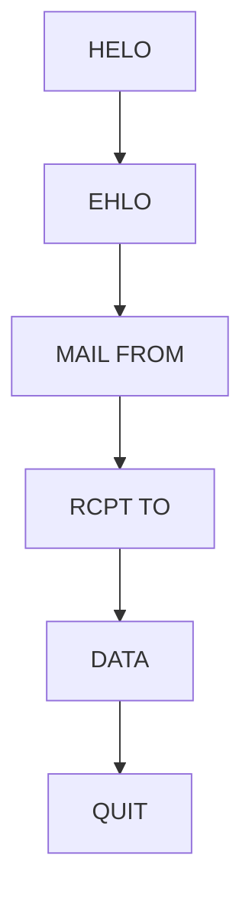

## 電子メールの構造

電子メールはエンベロープとデータに分けられる

さらにデータはヘッダとボディに分けられる

MUA：メールソフト

エンベロープは封筒。

SMTPコマンド：MAIL FROM、RCPT TOがエンベロープと呼ばれる

エンベロープFROMは容易に詐称できる。

対策としてSMTP-AUTH:送信者認証が一般的

データ部はヘッダとボディを空白行で分けている。

1. メール前にTCP接続される
2. HELO、EHLO
3. メールクライアントからMAIL FROM
4. RCPT TO=宛先
5. DATA=送付データは○○
6. QUIT=終わり

## 電子メール関連エージェントとプロトコル

#### 関連エージェント

MUA：メールを見たり送ったりするときに使うソフト

MTA: MUAから受け取ったメールを転送するプログラム

MSA: MUAからのメールを、認証の上受け取り、MTAに送付する

MRA: MUAがメールボックスからメールを取り出すときに通信する

MDA: メールボックスにメールを格納する

#### プロトコル

##### SMTP

- TCPポート番号25
- 電子メールの送信プロトコル
- 主要プロバイダが25番ポートをブロックすることが常態化→MUA側ではサブミッションポート587とSMTP-AUTHを使うことが一般的となっている
- 認証が必要となったため、最近ではMUAからMTAに直接メールを送信するよりは、MSAを経由させることが一般的となっている

##### POP3

- 電子メール受信のプロトコル
- メールサーバに蓄積されたメールをクライアントのメールソフト（MUA)からとりに行くときに用いるプロトコル。
- TCPポート番号：110
- USER/PASSでユーザ認証する。暗号化したい場合はAPOP

##### IMAP4

- 電子メールの受信プロトコル
- POP3との違いは、メールサーバーの中でメールを直接管理できること
- TCPポート番号：143

##### MIME

- マルチパートを用いて、各言語、テキストデータ、画像を一つにまとめてEメールで送受信できるようにしたプロトコル

##### S/MIME

- MIMEにセキュリティを組み込んだもの
- MIMEを暗号化して送受信
- 通常はCA発行の電子証明書が必要となる

##### BASE64

- Eメールでバイナリデータを扱うにはテキストデータのエンコードが必要となる
- 最も広く用いられているのがBASE64

## メールヘッダの解析

作業が容易なところ、困難なところ

| ヘッダ      | 意味                                                                                                                               | 偽装の可能性                       |
| ----------- | ---------------------------------------------------------------------------------------------------------------------------------- | ---------------------------------- |
| Return-path | 送信先メールアドレスまで到達しないなどのエラーで、メールを送り返すアドレス 通常はMAIL FROMと同じ                              | 送信者が自由に設定可能             |
| Received    | メールを中継したサーバーの情報が記載される 中継サーバーの情報が自動的に記載される 下の方が送信元に近く、上が受信者に近い | 上位に記載されているものは偽装困難 |
| From        | 眼０瑠送信者のメールアドレス                                                                                                       | 詐称可能                           |
| To          | メールの宛先のアドレス                                                                                                             | 詐称の意味なし                     |
| Subject     | メールの件名                                                                                                                       | 記載は自由にコントロール可能       |

## 迷惑メールへの対応
e-mailサーバーを運用する場合、迷惑メールへの対応で、踏み台に利用させない点も重要。

迷惑メール対策
1. SMTPのオープンリレー
   外部から来たメールは中継しないように設定
2. 送信者認証
   SMTP前にも送信元を認証しようという考えが出てきた。→詐称防止のため。
   AUTHコマンドを用いる方法とPOP before SMTPを使う方法の２パターン存在
   現在の主流はSMTP-AUTHで、ユーザーアカウントとパスワードで利用者を認証する方式。
   当初はPOP bdefore SMTPが普及していた。これは、POPで受信者がログインしたときにユーザーの正当性が認証されることを利用して、一定の期間、特定のIPアドレスのみからSMTP接続を受け付ける方式。
3. OP25B
   迷惑メールに悩まされているISPが行う対策。
   ISPが自分の管理下の契約者から外部に迷惑メールを送信できないようにする対策
   メール送信時に、ISPのメールサーバー経由でしかメール送信できないようにする。→大量の迷惑メールを抑制することができる。
   契約者が正当な理由で外部のメールサーバを利用したい場合はサブミッションポートやSMTP over SSKを用いる。（両方ともSMTP-AUTHを使うことが前提）
4. IP25B
   管理課の契約者に迷惑メールが届かないように、受信メール側に行う対策
   ブロックの対象は、送信元IPアドレスが動的IPアドレスのメール
5. 送信ドメイン認証
   送信元のドメインを検証して、迷惑メールを見極める仕組みのこと
   - SPF：IPアドレスを用いて認証する
    送信側のDNSサーバーにSPFレコード(実態はTXTレコード)を登録
    E-メールを相違sン
    受信側のメールサーバーは受信したメールのドメイン名をもとに送信元のDNSサーバーに問い合わせしてSPFレコードを入手
    メールの送信元IPアドレスとSPFレコードのIPアドレスを比較
   - DKIM：デジタル署名を用いて認証する
    DNSサーバーに公開鍵を登録
    送信側メール本文およびヘッダをもとにデジタル署名を作成し、メール送信
    受信側メールサーバーは送信元のDNSサーバーから公開鍵を入手して署名を検証して確認する
   - DMARC：SPFおよびDKIMを補強する
    SPFやDKIMによる認証を補強する技術。

## セキュリティ関連NIST文書
米国国立標準技術研究所（NIST: National Institute of Standards and Technology）の発行するSP800シリーズ（SP: Special Publications）とFIPS（Federal Information Processing Standards）の中から、日本において参照するニーズが高いと想定される文書の翻訳・監修を行い、公開するとともに、NISTの文書体系や内容について、日本の実情に即した解説を行うような研究も行います。

NIST
概要: NISTは、アメリカ合衆国商務省の下にある機関で、標準化、計量、技術関連の研究を行っています。
役割: 情報セキュリティのガイドライン、標準、ベストプラクティスを提供し、連邦政府を含むさまざまな組織のセキュリティ向上を促進しています。
ドキュメント: NISTは、NIST SP（Special Publication）シリーズとして多くのガイドラインを発行しています。
FIPS
概要: FIPSは、NISTが策定する連邦情報処理標準であり、主に政府機関や政府契約者に対して適用されます。
役割: 特定の技術やプロセスにおいて、政府が必要とする基準を定めており、特に暗号技術に関連するものが多いです。
強制性: FIPSは、連邦政府に義務付けられる標準として位置づけられているため、従わなければならない場合があります。
まとめ
NISTは、広範な標準とガイドラインを提供する機関。
FIPSは、特定の基準を政府機関向けに提供する規格。

# 電子メールの2nd
電子メールの構造

エンベロープ、データ部分→ヘッダ、ボディ

MUAで見ているのはデータ部分のボディのみなので、他にもエンベロープやヘッダなるものがある

エンベロープFROMは容易に詐称が可能。
対策としてSMTP-AUTHを用いることが一般的。

EHLOにより認証のやり取りが開始される。
データ部はヘッダとボディに分けられる。

RFC5322に準拠する電子メールの場合、区切りはCRLFの前後で分割される。

## 電子メール関連エージェントと関連プロトコル
エージェントにはMS outlookなどの電子メールで稼働しているMUAやMTA、MSA、MDA、MRAなどの役割が存在する。

MSA：メール発信プログラム。メールの認証受け入れ後にMTAに転送。

MTA：メール転送プログラム

MDA：メール配送プログラム

MRA：メール取り出しプログラム

### 電子メール関連のプロトコル
#### SMTP
電子メールの送信プロトコル。
クライアントPCから電子メールをメールサーバに転送する時に、他のメールサーバに転送するときに用いられる。
TCPポート番号は25番。

#### POP3
電子メールの受信プロトコル。
MUAからメールを取りに行くとに使うプロトコル。
TCP110。
パスワードを暗号化したい場合はAPOP。

#### IMAP4
IMAP4も電子メールの受信プロトコル。
POP3との相違点はメールサーバにメールを直接蓄積管理出来る。
モバイル端末の盗難や紛失対策としても有効。

## メールヘッダの解析
用途

1. 迷惑メールやウイルス添付
2. メール送信の組織を特定
3. ISPの特定

上記を行いたい場合、メールヘッダを解析することで実現する。
それぞれの項目に意味がある。

| ヘッダ | 意味 | 偽装の可能性 |
| ------------- | --------------------------------------------- | -------------------- |
| return-path | 送信メールアドレスまで到達しないなどのエラーが生じた場合に、メールを送信するアドレスを記載する | 送信者が自由に設定することが可能 |
| Received | メールを中継したサーバが記載される。複数のサーバー経由する→その数だけ付加される。下の方ほど、送信元に近い | 偽造不可 |
| from | メール送信者のメアド | 詐称可能 |
| To | メール宛先のアドレス | - |
| subject | メールの件名 | - |

## 迷惑メールへの対応
電子メールサーバを運用する場合に迷惑メールへの対応、踏み台として利用させないという運用も重要となる。

### 一般的なメール対策
1. SMTPのオープンリレーの禁止

外部から来た外部宛のメールを中継しないように設定する。
2. 送信者認証
   1. AUTHコマンドを使う
   2. POP before SMTP
送信元を詐称したメールや迷惑メールの踏み台になることが問題となってきた→SMTPの通信にも認証を行う。
プロバイダのメールサーバーを自社の顧客にのみ限定利用させる→AUTHコマンド or POP before SMTP
3. OP25B

迷惑メールに悩まされるISPが行う対策の一つ。
ISPが自分の管理下にある契約者から外部に迷惑メールを相信出来兄ようにする対策。
そうでない場合はサブミッションポートを用いるが、認証を使うことが前提
4. IP25B

ISPが行う迷惑メール対策には、管理下の契約者に迷惑メールが届かないように、受信するメールに関してもブロックｓるう対策を実施
5. 送信ドメイン認証

送信者のドメインを検証し、迷惑メールを見極める仕組み。
IPアドレスを使って認証するSPFとディジタル署名を使ってDKIM。

SPFとDKIMを補強するDMARCがある。

__SPF__

DNSサーバにSPFとして機能するTXTレコードを登録する。
メール受信サーバが、受信メールをもとにDNSサーバーに問合せの上、SPFレコードを入手→IPアドレスが対応するものか確認

__DKIM__

送信DNSサーバーに公開鍵を登録。本文とメールヘッダをもとにディジタル署名を作成→受信サーバが公開鍵をもとに署名を検証する。

__DMARC__

SPFやDKIMによる認証を補強する技術。
DNSでポリシとして公開しておくことで、送信者側で決めることが出来る。

