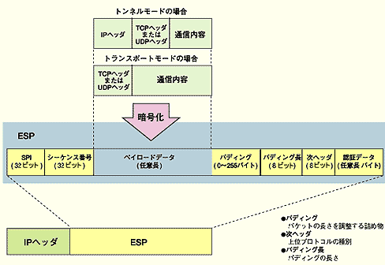
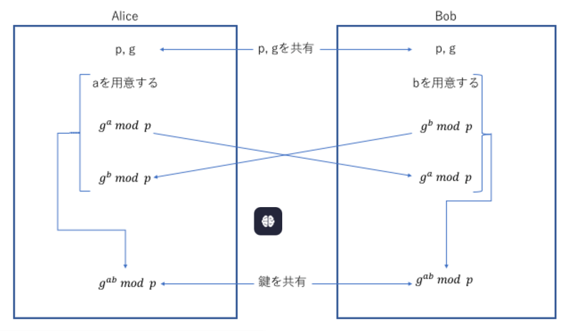

## scope

クライアント端末のセキュリティ
※Section4はサーバー。サーバーに願いを出す側のセキュリティという目線。

## ゼロトラスト

ファイアウォールによる境界を設け、内側と外側を分割する考えに対して、内側のネットワークを含めて信用しないことをベースとして対策を講じることをゼロトラストと呼ぶ。

#### コネクタ

組み込みの Identity and Access Management 認証を使用して、他の Google Cloud プロダクトとやり取りします。なお、コネクタを使用するワークフローで特定の API に対する適切な認証を行うには、サービス アカウントに適切な権限が割り当てられている必要があります。
リソースのアクセス権を流用して他サービスにアクセスすることのできるデバイス。

#### ソリューション

ゼロトラストに利用されるソリューション

| 構成要素 | 機能                                                                                           |
| -------- | ---------------------------------------------------------------------------------------------- |
| IAM      | ユーザ認証・認可を行うシステム                                                                 |
| IAP      | クライアントとアプリケーションの仲介を行うシステム。クライアントに許可された操作のみを許可する |
| CASB     | クラウドサービスの利用・操作を可視化するサービス                                               |
| SWG      | セキュリティ機能を向上したプロキシサービス。アンチウィルス、CASB、DLPなどの機能を有する        |
| CSPM     | クラウドサービスの設定誤りを防止するサービス                                                   |
| EMM      | 組織に存在するタブレットや、PC端末などのモバイルでバスを集中管理する統合システム               |
| SIEM     | FW、プロキシサーバ、CASBなどのログを分析して、攻撃検知する仕組み                               |
| EDR      | 端末の操作や動作解析を行い、攻撃を検知する仕組み                                               |

#### SASE

VPN中心のネットワークからSASEへの移行。
SASEは、ネットワークとセキュリティの機能をクラウド上に統合して、利用者にサービスとして提供していこうという考え方。
SASEを利用すれば、会社でも自宅でも、SASEとの接続ポイントを利用するだけで、安全な通信環境を利用できる

## エンドポイントセキュリティ

クライアント端末やモバイル端末、スマホ、サーバーなどの終端で実施するセキュリティ対策のことをエンドポイントセキュリティ。

#### EPP

エンドポイントを守るための対策。
マルウェア対策が基本となるため、アンチウィルスソフトがメインとなる。

#### EDR

エンドポイントの操作や動作の監視を行い、攻撃を受けたときに検出するソリューション。
EPPは予防的対策、EDRは主に事後対策のイメージ

## クライアントセキュリティ

クライアントとして利用するPCやスマホ、タブレットそのもののセキュリティ対策。
盗難や紛失、内部不正による情報漏洩を想定したセキュリティ対策。

#### 暗号化

端末に組み込まれたモバイル端末やデバイスの暗号化が紛失や盗難対策の基本。
__フルディスク暗号化方式__
ディスクをまるごと暗号化する方式。
起動→認証が通らないと起動しない。
PCが休止モードとなった場合のハイバーネーション用領域も暗号化される

__仮想ディスク暗号化方式__
仮想的な暗号化領域を作成し、仮想ディスクとして利用する方式。

#### TPM

PCに内臓されるセキュリティチップ。
対タンパ性を持ち、暗号鍵生成、ハッシュ値の計算などを行う。

## EMM

スマホやタブレット端末などのモバイル端末をリモートで集中管理する統合システムがEMM。

EMMの主要要素

| EMMの要素 | 内容                                                                                                                                                                                                    |
| --------- | ------------------------------------------------------------------------------------------------------------------------------------------------------------------------------------------------------- |
| MDM       | モバイルそのままを管理する                                                                                                                                                                              |
| MAM       | MAMはモバイル上で動作するアプリケーションごとの機能を細かく管理する。 業務アプリとほかアプリの連携や、操作の制御を行う。 デバイス内に仮想の業務エリアを作ることができるのでBYOD端末に適する。 |
| MCM       | モバイルで利用する業務コンテンツへのアクセス制御や管理を行う。                                                                                                                                          |

主な機能は以下通り

1. 資産管理
2. 遠隔操作

   1. 管理ポリシーの適用や設定ファイルの送信
   2. カメラの起動や禁止などのデバイス制御する機能
   3. アプリケーションの配布
   4. リモートロックなどのメモリ管理

EMM自体明確に定義されている言葉ではない

## SWG(Secure Web Gateway)

端末からインターネットへのアクセスを制御するためにプロキシとして用いられるソリューションをSWGと呼ぶ。

#### SWGの機能

| 機能                    | 内容                                                                        |
| ----------------------- | --------------------------------------------------------------------------- |
| webフィルタリング       | 業務上必要ないwebサイトの閲覧禁止                                           |
| アンチウィルス          | ウィルスの検知・駆除 サンドボックスでの実行から検知                    |
| RBI                     | 端末からwebサイトへのアクセスを中継し、コンテンツ中の危険な要素を無効化する |
| 不正侵入防止            | 不正アクセスを検知する                                                      |
| SSL/TLSインスペクション | webサイトのSSL/TLSの暗号通信を内容をチェックするために復号する              |
| CASB                    | 利用状況の可視化。データセキュリティ対策。                                  |

## BYOD

個人持ち出しのPCや携帯端末を会社業務に利用すること。

#### メリット

- 会社に初期導入コストを描ける必要がない
- 従業員は好きな端末を利用することが可能となる

#### デメリット

- 会社での一元管理が困難
- 脆弱性の一括修正が困難
- 私的データと会社データが混在する

#### 留意点

BYODを導入する場合に以下のような対応策を検討するべき

- BYODの利用規定を策定する
- OSやアプリケーションに脆弱性対策パッチを適用する
- 従業員の個人端末の機種とOSバージョンの申請を義務付ける
- ウイルス対策ソフトの導入
- 私的改造を行わない
- アプリケーションは信頼できるところのみに限定する

## VPN

Internetのようなリスクの高いネットワークを利用する場合に、安全な通信を行う技術がVPN。

以下の３つの機能を適用して仮想的な専用ネットワークを構築する。

- 暗号化
- 完全性検査
- トンネル化：本来のパケットに新しいヘッダをつけて、カプセル化を行う

#### VPNを実現するプロトコル

1. PPTP
   MSが開発した第２レイヤでVPNを構築するプロトコル。
   家庭用の低価格ルータで標準的なVPN実現可能なプロトコルで、インターネットVPNで利用されている。
2. IPsec
   IPレベルでVPNを実現するプロトコル。
   InternetVPNを構築する主要な技術。

   

   ##### ESPトレーラ

   * 構成：ESPトレーラには、 **パディング** （データの長さを一定に保つために追加される無意味なデータ）、 **パディングの長さ** 、**次のヘッダの種類**を示すフィールドが含まれます。
   * 役割：パディングは、暗号化されたデータが一定のブロックサイズを満たすようにするために使用されます。このESPトレーラが暗号化の対象に含まれるのも納得ですね～。次のヘッダのフィールドは、ESPトレーラの後に続くプロトコルの種類を識別します。

   ##### ESPヘッダ

   ESPヘッダには、**SPI（Security Parameter Index）とシーケンス番号**で構成されています。

   役割：受信側でどのセキュリティアソシエーションが適用されるかを識別するために使用。シーケンス番号はリプレイ攻撃を防ぐために利用。
3. SSL-VPN

   SSL-VPNはサーバー群のある本社側にSSL-VPNゲートウェイを設置して、クライアントとSSL-VPNゲートウェイとの間でSSL通信を行う仕組みのVPN。暗号化されるのはクライアントとSSL-VPNゲートウェイの間。

   実現方法には３種類存在する

   - リバースプロキシ：SSL-VPN装置をリバースプロキシとしてのみ利用
   - ポートフォワーディング：SSL-VPN装置と各種サーバーの間に設定が必要。専用モジュールのインストールが必要。
   - L2フォワーディング：クライアントに仮想NICを設定して、サーバー側のネットワークに所属する。すべてのアプリケーションを透過的に利用できる。専用モジュールのインストールが必要
4. SSH

   SSHサーバーとSSHクライアントを設置。SSHプロトコルを使ってVPNを構築する。

   OSSが公開されている。(OpenSSH)

   SSHにもポートフォワーディングが存在。TCPの上位で動作してアプリケーションを暗号化して安全に動作させる。

#### IPsecの仕組み

IPsecにはモードが存在する

| 各モード   | 選択肢1                                                                          | 選択肢2                                                                                                                            |
| ---------- | -------------------------------------------------------------------------------- | ---------------------------------------------------------------------------------------------------------------------------------- |
| 通信モード | トンネルモード IPパケットをヘッダごと暗号化する そのため、透過的で安全 | トランスポートモード IPパケットのデータ部だけを暗号化。 セキュアなホスト間でエンドツーエンドの通信などの用途が限られる。 |
| プロトコル | ESP 暗号化と認証が可能                                                      | AH 認証のみ                                                                                                                   |
| 認証モード | メインモード 相互認証に固定IPを用いる →LAN間の接続に適する            | アグレシヴモード 相互認証にIPアドレスを含めなくても良い →動的IPアドレスでも対応可能なためリモートアクセスに適する       |

#### IPsecの通信手順

3つの通信フェーズを経て通信される

フェーズ1:IKE SAを作成

相互認証には事前共有鍵を用いる。

あらかじめ両方のVPN装置に設定しておく。

フェーズ2でつくるための鍵のもとの生成、暗号アルゴリズム、認証アルゴリズムの交換を行うための制御トンネルをつくる。その際の鍵をDH方式で交換→こうして作成したトンネルが制御用トンネル。

フェーズ2:IPsecSAを作成
IKE SAをつくり、制御用トンネル化が出来る

暗号アルゴリズムと認証アルゴリズムを決定の上で、双方のSPI値と乱数を交換する

→上り通信用の暗号鍵と認証鍵、下り通信用の暗号鍵と認証鍵を作成する

フェーズ3:暗号通信開始

フェーズ2で決めた暗号アルゴリズム、認証アルゴリズムで暗号通信を開始する

Diffie-Hellman鍵共有プロトコル

DH鍵共有と呼ばれる、共通鍵を安全に共有するアルゴリズム。

この鍵交換方式を用いると、インターネットのような安全でない通信路で、安全に鍵を交換することができる。

#### セキュリティアソシエーション（Security Association、SA）

通信する二つのエンティティ（例えば、コンピュータやネットワークデバイス）間でセキュリティパラメータを共有し、セキュアな通信を確立するためのもの

共有する情報としては以下のようなものがある
* 暗号化アルゴリズムとそのキー
* 認証アルゴリズムとそのキー
* セキュリティプロトコル（例えば、IPsecやTLS）
* セキュリティパラメータインデックス（SPI）

これにより、データの機密性、完全性、および認証が確保され、通信が第三者により傍受されたり改ざんされたりするリスクが低減されます。

#### ポートフォワーディング

ポートフォワーディング（Port Forwarding）は、ネットワークのルーターやファイアウォールが特定のポート番号に対する通信を特定の内部IPアドレスに転送する技術です。これにより、外部からの通信を内部ネットワークの特定のデバイスやサービスにルーティングすることができます。

例えば、家庭内のネットワークでウェブサーバーを運用している場合、外部からのHTTPリクエスト（通常ポート80）をそのウェブサーバーに転送するようにルーターを設定することができます。これにより、外部のユーザーが家庭内のウェブサーバーにアクセスできるようになります。

ポートフォワーディングの主な用途には以下のようなものがあります：

* **リモートアクセス** ：外部から内部ネットワークのデバイスにアクセスするため。
* **サーバー公開** ：内部ネットワーク内のサーバーを外部に公開するため。
* **セキュリティ** ：特定のポートのみを開放し、他のポートを閉じることでセキュリティを向上させるため。

#### Diffie-Hellman方式
RFC 2539として規格化。
通信時に利用する共通鍵を安全に共有するアルゴリズム。
一般的には鍵交換アルゴリズムと呼ばれている。
流れは以下通り
