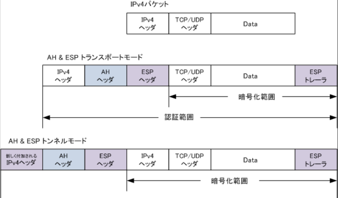
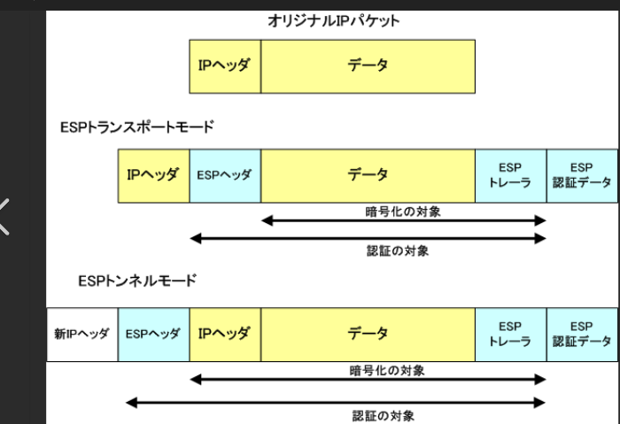
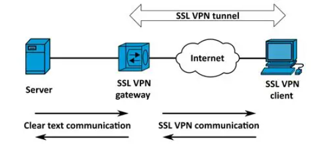

## scope

クライアント端末のセキュリティ
※Section4はサーバー。サーバーに願いを出す側のセキュリティという目線。

## ゼロトラスト

ファイアウォールによる境界を設け、内側と外側を分割する考えに対して、内側のネットワークを含めて信用しないことをベースとして対策を講じることをゼロトラストと呼ぶ。

#### コネクタ

組み込みの Identity and Access Management 認証を使用して、他の Google Cloud プロダクトとやり取りします。なお、コネクタを使用するワークフローで特定の API に対する適切な認証を行うには、サービス アカウントに適切な権限が割り当てられている必要があります。
リソースのアクセス権を流用して他サービスにアクセスすることのできるデバイス。

#### ソリューション

ゼロトラストに利用されるソリューション

| 構成要素 | 機能                                                                                           |
| -------- | ---------------------------------------------------------------------------------------------- |
| IAM      | ユーザ認証・認可を行うシステム                                                                 |
| IAP      | クライアントとアプリケーションの仲介を行うシステム。クライアントに許可された操作のみを許可する |
| CASB     | クラウドサービスの利用・操作を可視化するサービス                                               |
| SWG      | セキュリティ機能を向上したプロキシサービス。アンチウィルス、CASB、DLPなどの機能を有する        |
| CSPM     | クラウドサービスの設定誤りを防止するサービス                                                   |
| EMM      | 組織に存在するタブレットや、PC端末などのモバイルでバスを集中管理する統合システム               |
| SIEM     | FW、プロキシサーバ、CASBなどのログを分析して、攻撃検知する仕組み                               |
| EDR      | 端末の操作や動作解析を行い、攻撃を検知する仕組み                                               |

#### SASE

VPN中心のネットワークからSASEへの移行。
SASEは、ネットワークとセキュリティの機能をクラウド上に統合して、利用者にサービスとして提供していこうという考え方。
SASEを利用すれば、会社でも自宅でも、SASEとの接続ポイントを利用するだけで、安全な通信環境を利用できる

## エンドポイントセキュリティ

クライアント端末やモバイル端末、スマホ、サーバーなどの終端で実施するセキュリティ対策のことをエンドポイントセキュリティ。

#### EPP

エンドポイントを守るための対策。
マルウェア対策が基本となるため、アンチウィルスソフトがメインとなる。

#### EDR

エンドポイントの操作や動作の監視を行い、攻撃を受けたときに検出するソリューション。
EPPは予防的対策、EDRは主に事後対策のイメージ

## クライアントセキュリティ

クライアントとして利用するPCやスマホ、タブレットそのもののセキュリティ対策。
盗難や紛失、内部不正による情報漏洩を想定したセキュリティ対策。

#### 暗号化

端末に組み込まれたモバイル端末やデバイスの暗号化が紛失や盗難対策の基本。
__フルディスク暗号化方式__
ディスクをまるごと暗号化する方式。
起動→認証が通らないと起動しない。
PCが休止モードとなった場合のハイバーネーション用領域も暗号化される

__仮想ディスク暗号化方式__
仮想的な暗号化領域を作成し、仮想ディスクとして利用する方式。

#### TPM

PCに内臓されるセキュリティチップ。
対タンパ性を持ち、暗号鍵生成、ハッシュ値の計算などを行う。

## EMM

スマホやタブレット端末などのモバイル端末をリモートで集中管理する統合システムがEMM。

EMMの主要要素

| EMMの要素 | 内容                                                                                                                                                                                                    |
| --------- | ------------------------------------------------------------------------------------------------------------------------------------------------------------------------------------------------------- |
| MDM       | モバイルそのままを管理する                                                                                                                                                                              |
| MAM       | MAMはモバイル上で動作するアプリケーションごとの機能を細かく管理する。 業務アプリとほかアプリの連携や、操作の制御を行う。 デバイス内に仮想の業務エリアを作ることができるのでBYOD端末に適する。 |
| MCM       | モバイルで利用する業務コンテンツへのアクセス制御や管理を行う。                                                                                                                                          |

主な機能は以下通り

1. 資産管理
2. 遠隔操作

   1. 管理ポリシーの適用や設定ファイルの送信
   2. カメラの起動や禁止などのデバイス制御する機能
   3. アプリケーションの配布
   4. リモートロックなどのメモリ管理

EMM自体明確に定義されている言葉ではない

## SWG(Secure Web Gateway)

端末からインターネットへのアクセスを制御するためにプロキシとして用いられるソリューションをSWGと呼ぶ。

#### SWGの機能

| 機能                    | 内容                                                                        |
| ----------------------- | --------------------------------------------------------------------------- |
| webフィルタリング       | 業務上必要ないwebサイトの閲覧禁止                                           |
| アンチウィルス          | ウィルスの検知・駆除 サンドボックスでの実行から検知                    |
| RBI                     | 端末からwebサイトへのアクセスを中継し、コンテンツ中の危険な要素を無効化する |
| 不正侵入防止            | 不正アクセスを検知する                                                      |
| SSL/TLSインスペクション | webサイトのSSL/TLSの暗号通信を内容をチェックするために復号する              |
| CASB                    | 利用状況の可視化。データセキュリティ対策。                                  |

## BYOD

個人持ち出しのPCや携帯端末を会社業務に利用すること。

#### メリット

- 会社に初期導入コストを描ける必要がない
- 従業員は好きな端末を利用することが可能となる

#### デメリット

- 会社での一元管理が困難
- 脆弱性の一括修正が困難
- 私的データと会社データが混在する

#### 留意点

BYODを導入する場合に以下のような対応策を検討するべき

- BYODの利用規定を策定する
- OSやアプリケーションに脆弱性対策パッチを適用する
- 従業員の個人端末の機種とOSバージョンの申請を義務付ける
- ウイルス対策ソフトの導入
- 私的改造を行わない
- アプリケーションは信頼できるところのみに限定する

## VPN

Internetのようなリスクの高いネットワークを利用する場合に、安全な通信を行う技術がVPN。

以下の３つの機能を適用して仮想的な専用ネットワークを構築する。

- 暗号化
- 完全性検査
- トンネル化：本来のパケットに新しいヘッダをつけて、カプセル化を行う

#### VPNを実現するプロトコル

1. PPTP
   MSが開発した第２レイヤでVPNを構築するプロトコル。
   家庭用の低価格ルータで標準的なVPN実現可能なプロトコルで、インターネットVPNで利用されている。
2. IPsec
   IPレベルでVPNを実現するプロトコル。
   InternetVPNを構築する主要な技術。

   

   ##### ESPトレーラ

   * 構成：ESPトレーラには、 **パディング** （データの長さを一定に保つために追加される無意味なデータ）、 **パディングの長さ** 、**次のヘッダの種類**を示すフィールドが含まれます。
   * 役割：パディングは、暗号化されたデータが一定のブロックサイズを満たすようにするために使用されます。このESPトレーラが暗号化の対象に含まれるのも納得ですね～。次のヘッダのフィールドは、ESPトレーラの後に続くプロトコルの種類を識別します。

   ##### ESPヘッダ

   ESPヘッダには、**SPI（Security Parameter Index）とシーケンス番号**で構成されています。

   役割：受信側でどのセキュリティアソシエーションが適用されるかを識別するために使用。シーケンス番号はリプレイ攻撃を防ぐために利用。
3. SSL-VPN

   SSL-VPNはサーバー群のある本社側にSSL-VPNゲートウェイを設置して、クライアントとSSL-VPNゲートウェイとの間でSSL通信を行う仕組みのVPN。暗号化されるのはクライアントとSSL-VPNゲートウェイの間。

   実現方法には３種類存在する

   - リバースプロキシ：SSL-VPN装置をリバースプロキシとしてのみ利用
   - ポートフォワーディング：SSL-VPN装置と各種サーバーの間に設定が必要。専用モジュールのインストールが必要。
   - L2フォワーディング：クライアントに仮想NICを設定して、サーバー側のネットワークに所属する。すべてのアプリケーションを透過的に利用できる。専用モジュールのインストールが必要
4. SSH

   SSHサーバーとSSHクライアントを設置。SSHプロトコルを使ってVPNを構築する。

   OSSが公開されている。(OpenSSH)

   SSHにもポートフォワーディングが存在。TCPの上位で動作してアプリケーションを暗号化して安全に動作させる。

#### IPsecの仕組み

IPsecにはモードが存在する

| 各モード   | 選択肢1                                                                          | 選択肢2                                                                                                                            |
| ---------- | -------------------------------------------------------------------------------- | ---------------------------------------------------------------------------------------------------------------------------------- |
| 通信モード | トンネルモード IPパケットをヘッダごと暗号化する そのため、透過的で安全 | トランスポートモード IPパケットのデータ部だけを暗号化。 セキュアなホスト間でエンドツーエンドの通信などの用途が限られる。 |
| プロトコル | ESP 暗号化と認証が可能                                                      | AH 認証のみ                                                                                                                   |
| 認証モード | メインモード 相互認証に固定IPを用いる →LAN間の接続に適する            | アグレシヴモード 相互認証にIPアドレスを含めなくても良い →動的IPアドレスでも対応可能なためリモートアクセスに適する       |

#### IPsecの通信手順

3つの通信フェーズを経て通信される

フェーズ1:IKE SAを作成

相互認証には事前共有鍵を用いる。

あらかじめ両方のVPN装置に設定しておく。

フェーズ2でつくるための鍵のもとの生成、暗号アルゴリズム、認証アルゴリズムの交換を行うための制御トンネルをつくる。その際の鍵をDH方式で交換→こうして作成したトンネルが制御用トンネル。

フェーズ2:IPsecSAを作成
IKE SAをつくり、制御用トンネル化が出来る

暗号アルゴリズムと認証アルゴリズムを決定の上で、双方のSPI値と乱数を交換する

→上り通信用の暗号鍵と認証鍵、下り通信用の暗号鍵と認証鍵を作成する

フェーズ3:暗号通信開始

フェーズ2で決めた暗号アルゴリズム、認証アルゴリズムで暗号通信を開始する

Diffie-Hellman鍵共有プロトコル

DH鍵共有と呼ばれる、共通鍵を安全に共有するアルゴリズム。

この鍵交換方式を用いると、インターネットのような安全でない通信路で、安全に鍵を交換することができる。

#### セキュリティアソシエーション（Security Association、SA）

通信する二つのエンティティ（例えば、コンピュータやネットワークデバイス）間でセキュリティパラメータを共有し、セキュアな通信を確立するためのもの

共有する情報としては以下のようなものがある
* 暗号化アルゴリズムとそのキー
* 認証アルゴリズムとそのキー
* セキュリティプロトコル（例えば、IPsecやTLS）
* セキュリティパラメータインデックス（SPI）

これにより、データの機密性、完全性、および認証が確保され、通信が第三者により傍受されたり改ざんされたりするリスクが低減されます。

#### ポートフォワーディング

ポートフォワーディング（Port Forwarding）は、ネットワークのルーターやファイアウォールが特定のポート番号に対する通信を特定の内部IPアドレスに転送する技術です。これにより、外部からの通信を内部ネットワークの特定のデバイスやサービスにルーティングすることができます。

例えば、家庭内のネットワークでウェブサーバーを運用している場合、外部からのHTTPリクエスト（通常ポート80）をそのウェブサーバーに転送するようにルーターを設定することができます。これにより、外部のユーザーが家庭内のウェブサーバーにアクセスできるようになります。

ポートフォワーディングの主な用途には以下のようなものがあります：

* **リモートアクセス** ：外部から内部ネットワークのデバイスにアクセスするため。
* **サーバー公開** ：内部ネットワーク内のサーバーを外部に公開するため。
* **セキュリティ** ：特定のポートのみを開放し、他のポートを閉じることでセキュリティを向上させるため。

#### Diffie-Hellman方式
RFC 2539として規格化。
通信時に利用する共通鍵を安全に共有するアルゴリズム。
一般的には鍵交換アルゴリズムと呼ばれている。
流れは以下通り

## シンクライアント
クライアント端末に必要最小限の機能しかもたせないシンクライアントえお知用づつのもセキュリティ上の対策となる。
シンクライアントにはいくつかの実現ほほうがある。
大別するとネットワークブート型と画面転送方。
前者は起動時にOSやアプリケーションを端末に送って、端末側で動作する
後者は操作の入力情報をサーバーに送信し、サーバー側で処理を行う。

## RADIUS
インターネットがまだ普及していない頃にリモートアクセスは公衆回線やINS回線を用いて、アクセスポイントのアクセスサーバーに電話をかけて接続していた。
アクセスポイントが分散した場合、ユーザーの認証情報を分散させておくと、効率が良くない→１か所で認証サーバーを設置して、アクセスポイントとは別に管理するようにすることで、認証情報を一元管理するようになった。

## IoT機器のセキュリティ対策
IoT機器には以下のようなリスクが存在する
- 脅威の盈虚範囲と影響度合が大きい
- IoT機器のライフサイクルが長い
- IoT機器に対する監視が行き届きにくい
- IoT機器のリソースが限られているため、十分なセキュリティ対策ができない

#### 対応
組み込みシステムのセキュリティ設計を基本とする。対タンパ製を向上し、想定しない接続に対してはフェールセーフを基本に設計する。
機器がどのような状態にあるかを把握し、記録する→運用管理システムを導入したり、リアルタイムに現状把握する死活監視をする
不正アクセスに備える：非公開の内部のアクセスポイントと同じような考えで、配慮を行う
更新プログラムの確実な適用

## シグネチャとは

シグネチャとは、ネットワーク上のデータ通信やパケットに含まれる特定のパターンや特徴を表す識別情報のことです。これを使って、通信先が信用できるかどうかを判断します。

具体的には、シグネチャは以下のような役割を果たします：

攻撃シグネチャ:
DDoS攻撃やSQLインジェクションなど、特定の攻撃パターンを識別します。
マルウェアシグネチャ:
マルウェアが通信時に生成する特定のパターンを検出します。例えば、ランサムウェアやボットネットの通信パターンです。
プロトコルシグネチャ:
HTTPやDNSなどのプロトコルにおける異常な動作を検出します12。
シグネチャは、IDS（侵入検知システム）やIPS（侵入防止システム）で使用され、ネットワークトラフィックをリアルタイムで監視し、既知の脅威パターンと照合することで不正な通信を検出します1。

# クライアントセキュリティ2nd

SASEやゼロトラストネットワークに近い場合。

__VPNがある__

1. IPsecの通信手順に関する設問はないか
2. Diffier-Hellmanの設問はないか

## クライアントセキュリティの知識
### ゼロトラスト
ファイアウォールによって境界を設け、内側を安全な場所、外側を危険な場所と考える境界防御の考え方に対して、内側のネットワークを含めてすべてのネットワークを信頼しないことをベースにする考え方をゼロトラストと呼ぶ。

従来セキュリティは境界防御が主流。近年はゼロトラストに遷移している。
近年のネットワークの環境の変化や、境界防御の限界が関与している。

### IAM
ユーザ認証・認可

### IAP
アプリケーションシステムに対するアクセス制御
アプリケーションとユーザーの間の通信を仲介するプロキシ。
ユーザーを認証し、ユーザーに許可されているアプリケーションだけを利用させるソリューション。

### CASB
クラウドサービスに対するアクセス制御

利用状況の可視化、データセキュリティ、コンプライアンス、脅威防御

### SWG
SecureWebGateway
Webサイトやクラウドサービスに対するアクセス制御

### CSPM
クラウドサービスの設定誤りを防止

### EMM
端末管理

### SIEM
ログの集中管理

### EDR
端末のセキュリティ対策

### SASE
ネットワークセキュリティの機能をクラウド上に統合して利用者にサービスとして提供していこうという考え。
ＳＡＳＥを利用すれば、自宅でも会社からでもＳＡＳＥの接続ポイントPOPに接続するだけで、安全でスケーラブルな通信環境を利用することが出来る。

### エンドポイントセキュリティ
クライアント端末やモバイル端末、スマホ、タブレットなどのエンドポイントで実施するセキュリティ対策のことをエンドポイントセキュリティと呼ぶ。
予防対策としてのEPPや、事後対策としてのEDR。

__EPP__

エンドポイントを守るための対策。
マルウェア対策が基本となるので各種アンチウィルスソフトがメインとなる。

__EDR__

エンドポイントの動作や操作の監視を行い、サイバー攻撃を受けたかを発見次第対処するソリューション。
EPPでは出来ないファイルレスマルウェアに有効で、従来からあるEPPの限界から重要性が高まっている。

### クライアントセキュリティ
暗号化：端末に組み込まれるモバイル端末やUSBのデバイスの暗号化。

フルディスク暗号化：ディスクをまるごと暗号化する方式。

仮想ディスク暗号化方式：仮想的な暗号化領域を作成し、仮想ディスクとして利用する方式が仮想ディスク暗号化方式。

#### EMM
Enterprise Mobility Management

スマホやOC端末などのモバイルデバイスをリモートで集中管理する統合システムをEMM。

3つの要素で構成される。
1. MDM
Mobile Device Management。モバイルそのもの。
2. MAM
Mobile Application Management。モバイル上で動作するアプリケーション。
業務アプリと他のアプリの連携やコピペを禁止したり、特定のアプリ、もしくはデータのみをリモートで消去することが可能。
3. MCM
Mobile Contents Mangement。モバイルで利用する業務コンテンツへのアクセス制御や管理を行う。

#### 機能
1. 資産管理

H/W、OS、アプリケーションなどの情報を自動収集する機能
2. 遠隔操作

管理ポリシーの適用や設定ファイルを送信し、セキュリティを確保する機能。
カメラの起動や禁止等のデバイス制御する機能。
アプリケーションの配布、インストールの禁止。

#### SWG
端末からインターネットへのアクセスを制御するために以下リストのような機能を備えて、プロキシとして用いられるソリューションをSWGと呼ぶ。

SWGにはオンプレミス型がある。

リモートワーク時に直接インターネットにアクセスするときのセキュリティ対策としてクラウドサービスのSWGを利用していた。

1. Webフィルタリング

業務上必要のないwebサイトの閲覧禁止

2. アンチウィルス

ウイルスの検知、隔離、駆除

3. RBI

Remote Browser Isolasion。
端末からwebサイトへのアクセスを中継し、コンテンツ中に危険な要素があれば無効化して安全な部分のみ再生成する。

4. 不正侵入防止

不正アクセスを検知する。

5. SSL/TLSインスペクション

webサイトへのSSL/TLSの暗号通信を内容をチェックするために複合する。

6. CASB

利用状況の可視化を行う

7. DLP

DataLossPrevention。
機密情報や重要データが外部に流出することを防止する。

#### 持ち出し管理規定

モバイルコンピュータやＵＳＢメモリ、ＩＣカードを利用するときに、保護されていない環境化で利用する場合には、リスクから保護するための適切な運用ルールを作成する必要がある。

- ルールを決める
- 外出先や自宅から社内ネットワークにアクセスする場合のルール
- 盗難・紛失に備える
- 盗難。紛失時の対応手順

### BYOD

個人持ちのPCや携帯端末を会社業務に利用することがある。
会社にとって設備投資が不要であることから導入を検討する企業が増えてきている。

1. BYODメリット
- 会社にとって、初期コストや運用コストがかからない
- 特定機種に脆弱性が見つかっても、全ての端末が使えなくなることがない

2. デメリット
- 会社での一元管理が困難
- 脆弱性の一括修正が困難

3. BYOD実現のためのセキュリティ上の留意点

- BYODの利用規定を策定する
- OSやアプリケーションに最新の脆弱性対策パッチを適用する
- 従業員のOS
OSバージョンの申請を義務付ける
ウィルス対策ソフトの導入

### VPN
インターネットは改ざんや盗聴のリスクが高いネットワーク。
安全に通信を行うために必要なネットワークがVPN。

セキュアなプロトコルを利用し、次の3つの機能により"仮想的な専用ネットワーク"を構築する。

- 暗号化：通信回路上を流れるパケットを暗号化する
- 完全性検査：通信途中で改ざんがあったかを検知する。
- トンネル化：本来のパケットに新しいヘッダをつけて通信するなどしてカプセル化し、エンドツーエンドで透過的な通信を可能とする。

__PPTP__

PPTPはMSが開発した第2レイヤでVPNを構築するプロトコル。
家庭用の低価格ルータでは標準的なVPN実現プロトコルになっており、主としてインターネットVPNで利用される。

__IPsec__

IPsecはIPレベルでVPNを構築する場合の主要技術となっている。
IPv4ではオプション、IPv6では標準。

ESPヘッダ：通信トンネルごとに独立管理。チェックしてリプライ攻撃を防止する。

認証データ：相手を認証するもの。

__SSL-VPN__

SSL-VPNは各種サーバ群のある本社側にSSL-VPNゲートウェイを設置し、クライアントとSSL-VPN GWとの間でSSL通信を行う仕組みのVPN。

基本的な仕組みは以下絵の通り。クライアントとSSL-VPNゲートウェイの間。

SSL-VPNの方式
1. リバースプロキシ
webブラウザのみで通信する方式
2. ポートフォワーディング方式
ポートに注目して、やってきたデータを送り出す
ポートに届いたデータは、別の人に送付という設定がされているポートに届いたデータは別のコンピュータに送付する。

ポートフォワーディング（Port Forwarding）とは、ネットワーク機器（主にルーターやファイアウォール）が受信した特定のポート番号への通信を、ネットワーク内の特定の機器やアドレスに転送する仕組みです。

具体例
例えば、自宅のルーターでポートフォワーディング設定をすると：

外部から「自宅のグローバルIPアドレスの8080番ポート」にアクセスがあった場合
ルーターがその通信を「LAN内の192.168.1.10の80番ポート（Webサーバー）」に転送する

__L2フォワーディング__

L2フォワーディング（Layer 2 Forwarding）とは、OSI参照モデルの第2層（データリンク層）で行われるパケット（フレーム）の転送処理を指します。
L2（レイヤ2）は「データリンク層」と呼ばれ、主にMACアドレスを使って通信相手を識別します。
L2フォワーディングは、スイッチ（Switch）などのネットワーク機器が受信したイーサネットフレームを、宛先MACアドレスに基づいて適切なポートへ転送する処理です。

スイッチは各ポートで受信したフレームの送信元MACアドレスを学習し、MACアドレステーブル（転送テーブル）に登録します。
受信したフレームの宛先MACアドレスをテーブルと照合し、対応するポートがわかればそのポートへフレームを転送します。
テーブルに登録がなければ、**全ポートにフレームをフラッディング（同報転送）**します。

クライアント側に仮想NICを設定し、サーバ側のネットワークに属する形にする。
全てのアプリケーションを透過的に利用できる。

### SSH
SSHサーバとSSHクライアントを設置し、SSHプロトコルを使ってVPNを構築するこｔも可能。
SSHにもポートフォワーディング機能があり、TCPの上位で動作するアプリケーションを暗号化して安全に通信できる。

認証方式
- パスワード認証方式
- 公開鍵認証方式

### IPsec
通信モード、パケットの構造、認証方法などが設定可能。

| 設定項目 | 項目1 | 項目2 |
| ------- | ------------------------ | ---------------------------- |
| 通信モード | トンネルモード：IPパケットをヘッダごと暗号化する | IPポートのデータ部のみを暗号化 |
| プロトコル | ESP ：暗号化と認証 | AH : 認証のみ |
| 認証モード | メインモード | アグレッシブモード |

__IKE SA__

総合認証には事前共有鍵を使う。
事前共有鍵は予めVPN装置に設定しておくもの。
Diffie-Hellman方式で共有する。

__IPsec SA__

IKE SA(制御用トンネル)が出来ると、IPsec SAをあがり、くだりを作成する。
具体的には、データ通信時の暗号アルゴリズムと認証アルゴリズムを決定し、双方のSPI値、乱数を交換する。

__暗号通信を開始__

先のフェーズで決めた暗号アルゴリズム、認証アルゴリズムと同じく第2フェーズで作成した暗号鍵、認証鍵を使って暗号通信を開始する。

IPsecの3つのSA

3つのSAを確率することで安全なデータ交換を行う。
第一フェーズのSA
鍵を安全に交換するSA
IKE SAに対して残りの2つのSAはIPsecSA

### IP-VPNや広域イーサネット
WANには専用線、広域イーサネット、IP-VPN、インターネットVPNにはいくつもの種類がある。

__IP-VPN__

通信事業者がサービス提供している回線。
利用者にとっては専用線と同様の閉域網。
レイヤ3のIPで動作するため、通信はIPに限定される。

IPパケットの転送にはMPLSが利用される。
MPLSは高速転送を可能にする技術。
IPヘッダではなく転送用のラベルでカプセル化するのが特徴。

__広域イーサネット__

広域イーサネットも本社と事業所などの拠点間を接続する通信サービスの一つ。
IP-VPNはレイヤ3で動作するのに対して、広域イーサネットはレイヤ2で動作する。

## シンクライアント
クライアント端末に必要最小限の機能しか持たせないシンクライアントを利用するとセキュリティ強化の対策となる。

シンクライアントの実現方式にはいくつかの種類がある。

1. ネットワークブート型

端末起動時にOSやアプリケーションを端末に送って、端末側で動作する。
起動時にネットワークに付加がかかるのが特徴
2. 画面転送型

クライアントからキーボードやマウスの入力情報をサーバに送信し、サーバ側ですべての処理を行う。

- サーバーベース方式

1台のサーバにある環境を共有する。アプリが対応していることが前提。ライセンスにも課題がある。

- ブレードPC方式

ブレード一つで端末を稼働。

- VDI方式

サーバに仮想ソフトをインストールし、そのうえで仮想的に端末ごとの環境を維持管理する。

### RADIUS
インターネットがまだ普及していない時に、INS回線を用いて、アクセスポイントのアクセスサーバに電話して接続していた。
プロトコルはPPP、認証機能はPAPやCHAP。

アクセスポイントが1か所で、かつアクセスサーバーが1台の小規模な構成なら1台のアクセスサーバの中にユーザー情報を登録しておくことが出来る。

ネットワーク上のユーザー認証プロトコルの一つ。
RAIUSという認証プロトコルを使って認証サービスを提供するサービスをRADIUSサーバと呼び、ダイアルアップ回数やISPのサーバとして利用されてきた。

RAIUSサーバ、RADIUSクライアント、ユーザの3要素で構成される。

RADIUSサーバ：RADIUSクライアントからのリクエストを受け、認証処理を行うサーバ。

RADIUSクライアント；ユーザーとRADIUSサーバを仲介するネットワーク機器。

ユーザ：ネットワークに接続するユーザーおよび端末のこと。

__RADIUSサーバの証明書認証__

1. EAP-TLS

RAP-TLSとはEAP実装の一種。TLSはTransport Layer Securityの略。
RADIUSサーバーとRADIUSクライアント間で電子証明書による認証を行う認証方式です。
RADIUSクライアント側はクライアント証明書をインストールしておき、RADIUSサーバー側はサーバー証明書をインストールしておくことで、証明書による認証ができます。
一度証明書をインストールしてしまえば、ID/パスワードの入力が不要になることが大きな特徴です。一方で、秘密鍵情報が漏洩・流出してしまったときには、すぐに失効できるような対策が必要です。

2. EAP-PEAP

MS社、シスコシステムズ、RSAセキュリティが共同開発した規格。
MS製品ではMS-PEAP、シスコシステムズ社ではCisco-Peapが実装されていて、仕様に違いがある。
RADIUSクライアント側はID/PWにより認証を行い、RADIUSサーバ側も電子証明書の準備が必要。

3. EAP-TTLS
TTLS=Tunneled TLSの略称。
クライアント側は電子証明書を波高せず、ID/PWにより認証する認証方式。

暗号鍵を用いることでID/パスワードの通信を保護しています。

EAP-TLS=EAP実装のⅠ種。RADIUSサーバーによる電子証明書による認証を行う手法。
EAP-PEAP=MSかいはつ。ID/PWにより認証を行い電子証明書の準備が必要。
EAP-TTLS=TTLSの略称。

RADIUSプロトコルは常時接続が主流となった現在、IEEE 802.1X認証で使われていた。

### IoT機器のセキュリティ対策
インターネットにつながる→Webサーバに似ている
管理者の手の届かない所で稼働→ICカードと似ている
通常よりも権限の大きい保守員に関しては、特権IDの管理と似ている

__IoT特有の性質__

- 脅威の影響範囲・影響度合いが大きいこと
- IoT機器のライフサイクルが長いこと
  - 経年によるセキュリティ機能の危殆化
  - 新たな脆弱性の発見
- IoT機器に対する監視が行き届きにくいこと
  - 盗難・紛失
  - 管理者のいない場所での物理的攻撃、不正接続
  - 放置
- IoT機器側とネットワーク側の環境や特性の相互理解が不十分であること
