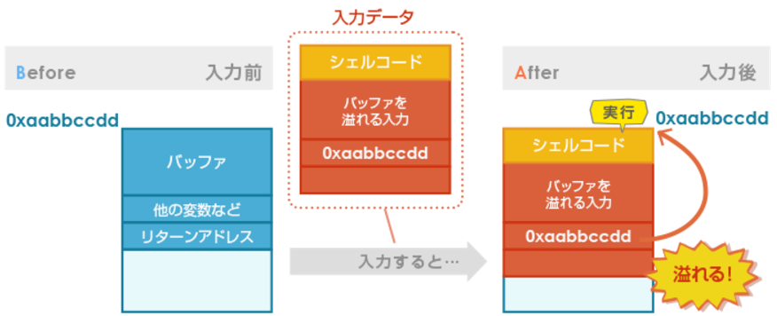
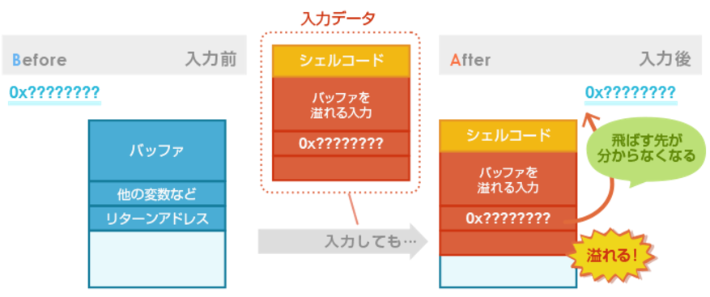
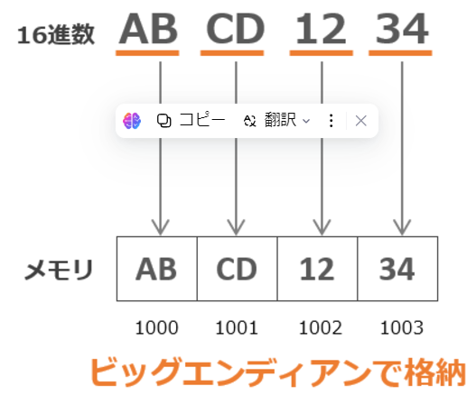

## 言語

#### Java

オブジェクト指向そのもののもつカプセル化の概念により情報が隠蔽される。

Java2からはAccessController or SecurityManagerを用いて任意のセキュリティポリシを適用できる"ポリシベース"のセキュリティ管理が可能となった。

Javaにはサンドボックスモデルというセキュリティモデルがあった。限られた保護領域下のみで実行させることで、安全にJavaプログラムを動作させるモデル。

サンドボックスモデルやポリシーベースを利用すれば、ローカルJava、リモート署名付きモバイルコードのおかげできめ細かい制御が可能となる。

##### メモリ管理

JavaVM：メモリ管理はプログラマが意識しなくてもJavaVMが行う→バッファオーバーフローは生じない。ガーベージコレクションなる機能がある。

#### C言語/C++

セキュリティの概念がなかったころからの言語。

考慮しなくてはならないこと

- バッファオーバーフロー：データ領域からのあふれ
- ポインタによる誤った領域へのアクセス
- データポインタと関数へのポインタへの混同
- 整数演算での桁あふれ
- メモリリーク：動的メモリブロックが解法されない

ヒープ領域：動的な確保可能なメモリ領域

malloc関数：動的メモリ確保の関数

free関数：動的メモリ解放の関数

new演算子：メモリ確保の関数

delete演算子：メモリ解放の演算子

#### ECMAScript

Ecma Internationalにより、Scriptの標準化を狙って策定されたのがECMAScript。多くの企業のJavaScriptがECMAScriptに準拠。

JavaScriptとJScriptから共通部分を取り出すことで標準化。

- Webサーバー自体のセキュリティ対策
- 入力チェックをサーバー側でも実施する
- サニタイジング処理組み込みの徹底
- バリデーションチェック組み込みの徹底

#### JNI

Javaには他言語で書かれたネイティブコードを連携するJNIという仕様がある。JNIを利用することで、他の言語で書かれたネイティブコードを実行したり、他言語で書かれたネイティブコードからJavaで書かれたプログラムを実行することが出来る。

他の言語で書かれた部分については別途メモリ管理する必要がある。JavaVMはメモリ管理を行わないため。

## クロスサイトスクリプティング

一般利用者がインターネットを利用している一般ユーザーが悪意あるサイトを閲覧した際に受ける攻撃の一種。

#### 反射型XSS

代表的なXSS。非持続性という分類がされる。

WEBアプリで入力項目となる文字列をエスケープ処理していないサイト

__事前段階__

自ら立ち上げたwebサイトやメール本文に脆弱性のあるサイトのリンクに、実行させたい"スクリプト"を含めておいてリンクが踏まれるのを待つ。

__被害者がクリック__

ある利用者がリンクをクリックするとリンクに続いてる記述をスクリプトと認識して、スクリプトを含むレスポンスを利用者の画面に返してしまう。

HTMLを組み立てる際の脆弱性なので、サーバー側で対策を行う。

意図しないスクリプトを実行しないようにサニタイジング処理を実施する。

| 入力値 | 置換文字 |
| ------ | -------- |
| &      | &amp;amp |
| <      | &lt      |
| >      | &gt      |
| "      | &quot    |
| '      | &#39;    |

※置換文字側は最後に";"があります

#### 格納型XSS

格納型XSSは反射型XSS同様サーバーの脆弱性をつく攻撃。

スクリプトの文字列をサーバーで永続的に保持する→永続的に保存するため”永続型"

アクセスするユーザが閲覧するたびに攻撃に合う。

#### DOM-BASE XSS

DOMベース型XSSはブラウザで実行するJavaScriptを利用したXSS。

反射型XSSや格納型XSSとは異なり、サーバーを経由しないため

1.攻撃者が悪意あるサイトやメール本文に、悪意あるリンクを準備。利用者がクリックするのを待つ。※リンクの文字列に#悪意あるスクリプトのような形で埋め込みがある

2.利用者がリンクをクリックするのを待つ

3.リンクにアクセスし、レスポンスが返ってくる

4.クライアントでレスポンス中のjava scriptを実行

5.悪意あるスクリプトを取り込み実行してしまう

#### SQLインジェクション

SQLインジェクションもWebアプリケーションが攻撃の対象となる

利用者の入力に対して動的にHTMLページを生成するWebアプリケーションが攻撃対象

入力された項目を使ってSQLを組み立てて実行→入力チェックが甘い場合に意図しないSQL文が実行される

結果、管理者パスワードが漏洩したり、変更されてアクセスされたりする。

６つのパーツよりSQLを組み立てている

SQLインジェクションは埋め込みSQLを利用できる言語ならどんな言語にも発生の可能性がある

Java、C++、ECMAScript、Perl、PHPなど多くの言語で対策必要

①サニタイジング

②バインド機構

バインド機構とは、プレースホルダ＋埋め込むAPIを利用してSQLを組み立てる機能

#### バッファーオーバーフロー

確保しているメモリエリアの大きさを無視した書き込みが可能という脆弱性が存在する

スタック領域にリターンアドレスを退避して実行すうｒ

メモリエリアを確保しプログラムを実行するので、確保してエリアを超えたデータがメモリエリアに渡されるとリターンアドレスまで書き換えることとなる。

そそいて、オーバーフロー部に不正なプログラムのアドレスを入れておくと、不正なプログラムが実行される。
バッファーオーバーフローの脆弱性を持つ関数は、特徴がある。
書き込み先のバッファサイズを指定する引数を指定できない→基本的に上位のセキュアな関数が用意されているので、古いバージョンは使わないようにすること。

#### 対策
1. バッファの大きさを無視した書き込みが可能な関数は使用しない
2. プログラムの中でデータをメモリエリアに転記する際にメモリサイズをチェックするようにコーディングする

#### スタックバッファオーバーフロー
ローカル変数や関数の引数、リターンアドレスなどを格納するメモリーの領域をスタック領域
スタックという名の通り、後入れ先出し(LIFO：Last In First Out)のデータ構造
スタックバッファオーバーフローはスタック領域にあるバッファが溢れること
一般的な対策はバッファのサイズ以上の入力を読み込まないなどが考えられますが、そういった対策を怠った場合に発生する脆弱性

```C++
// C言語における脆弱性のあるコードのイメージ
char buf[64];
gets(buf);    // 64バイト以上でオーバーフロー
// 対策例：fgets(buf, 64, stdin)
```

攻撃者がシェルコードと呼ばれるコンピューターの制御を奪うためのコードを配置した場所にリターンアドレスが指すように書き換えている様子


##### ASLR
Address Space Layout Randomizationの略称
スタック領域等のアドレスをランダム化することで攻撃の成功率を下げるという防御機能
シェルコードが配置される場所を特定することを難しくすることで攻撃の成功率を下げています。


#### ヒープバッファオーバーフロー
「ヒープ」は「かたまり」「山」などの意味で、関数の実行時に必要に応じて確保し、不要になったら開放するメモリ領域を指します。
ヒープを標的とした攻撃では、ヒープ領域に許容量を超えた領域を確保することで、実行中のアプリケーションの強制停止、ヒープメモリの破壊などを狙います。
ヒープ領域に動的に確保されたバッファで発生します。ヒープは、プログラムが動的にメモリを割り当てるための領域です。mallocやnewなどの関数を使って、必要なサイズのメモリを確保します。
ヒープ型の攻撃では、隣接するメモリチャンクの管理情報を上書きすることで、任意のメモリ書き換えを可能にします。
例えば、チャンクのサイズ情報を改ざんし、本来解放されるべきでないメモリを解放させたり、逆に解放済みのメモリを再割り当てさせたりできます。
ヒープ型のバッファオーバーフローは、スタック型に比べて攻撃が複雑です。ヒープの管理方式についての知識が必要になります。スタック実行防止の仕組みはヒープには適用されないため、現代でもこの攻撃は脅威となり得ます。

攻撃者が悪意のあるコードを実行したり、システムを乗っ取ったりする可能性があります。適切なメモリ管理とバリデーションが重要です。

#### 静的メモリバッファオーバーフロー
静的領域は、プログラムの実行中に変わらないデータを保存するためのメモリ領域です。
静的領域を標的とした攻撃は、この領域に保存されているデータを書き換えることで、プログラムの動作を不正に変更することを目的としています。

configファイルやjsonファイルを操作するようなイメージか

#### BOFの対策
1. コーディングの対策
メモリサイズをチェックしない関数は使用しない
操作時はメモリサイズをチェックする
2. データ実行防止機能
指定されたメモリ領域のコード実行を禁止する。
メモリ領域外にlibcが存在するため、Return-to-libcは実行できる
3. アドレス空間ランダム化配置
スタック、ヒープ等の領域の配置をランダム化する。

## CSRF
クロスサイトリクエストフォージュリのこと。
攻撃者が用意したサイトにアクセスしたことで、スクリプト付きのwebページをDLしてしまい、自動実行→他サイトの認証をパスして、攻撃者の操作を許すという攻撃

#### Cookieとは別トークンを使用する
トークン＝議事乱数
ページトークンとも呼ぶ。
Cookieは、webページに登録されると、同じページにアクセスするときに自動的に付与する→同じページにアクセスするときに、WEBブラウザが自動的に付与する。
→CSRFをこちらの意思で防御することは難しい

ログイン完了時に議事乱数をサーバーが発行し、hiddenフィールドに利用して、連続性のあるリクエストかをサーバーサイドでチェック
→hiddennが不正な場合はアクセスを破棄するようにしておく

#### 確定時に入力を要求
認証を確定させるときに、入力を要求して、再認証を行う。
CAPTCHAや、再認証がある
→スクリプトによる実行か、人間による実行かが認識することができる
CSRF対策としても有効に機能

## セッションフィクセーション
攻撃者が意図的にセッションIDを固定化させ、そのIDを利用してユーザーになりすます攻撃手法
ウェブアプリケーションでは、ユーザーを識別するためにセッションIDを発行し、クッキーなどに保存します。セッションフィクセーション攻撃では、このセッションIDの仕組みが悪用されてしまう

#### 攻撃の目的
ユーザーの権限を不正に獲得し、個人情報や機密情報を盗み出す
オンラインバンキングのアカウントを乗っ取れば、不正送金などの金銭的被害を引き起こすことができます。ECサイトであれば、クレジットカード情報や配送先情報が狙われ

#### セッションハイジャックとの違い
セッションフィクセーションは攻撃者が仕込んだIDでユーザーにログインさせるのに対し、セッションハイジャックは既にログインしているユーザーのIDを奪う点が大きく異なります。

|セッションフィクセーション	|セッションハイジャック|
|攻撃者が意図的にセッションIDを固定化 |	既存の有効なセッションIDを奪取 |
|ユーザーにセッションIDを踏ませる |	通信を傍受してセッションIDを盗聴 |
|ログイン前から攻撃が開始される |	ユーザーがログイン後に攻撃される |

## セッションハイジャック
利用者のサイトへのアクセスを盗聴して、利用者のセッションIDを奪取する攻撃
利用者が、サイトにログインした後が攻撃のタイミングとなる。

#### 攻撃の目的
ユーザーの権限を悪用して、個人情報や機密情報を取得したり、ユーザが有するアセットを奪う

## セキュリティ対策
システム開発行程における設計プロセスで、セキュリティ対策の漏れを防ぐためのセキュリティ対策の標準

|用語|内容|
|---------------|-------------------------------------------------------------------------------|
|CIS BENCHMARKS | CISが策定した、システムを安全に構成するための構成基準、およびベストプラクティス。OS、ミドルウェア、アプリケーションごとに必要なセキュリティ対策をまとめている |
|OWASP ASVS | OWASPプロジェクトの一つ。Webアプリケーションの設計、開発、脆弱性診断において必要となるセキュリティ要件の標準を確率することを目指し、ASBSを作成・管理している |

両者の違いは？
システム全体をターゲットとしているか、Webアプリケーションをターゲットとしているか。
ベストプラクティスでとどまるか、要件の標準となっているか。

__注記__
1. CIS
アメリカに本部がある非営利団体。
政府機関(NSAやNIST)、企業、アカデミックと連携して、インターネットセキュリティの標準化に取り組んでいる
2. OWASP
アメリカに本部がある非営利団体。
ソフトウェアのセキュリティを高めるためのオープンコミュニティを運営している。
いくつかのプロジェクトを立ち上げ、セキュリティの情報共有、啓蒙活動を行っている。

## バイトオーダー
バイトオーダ（別名：エンディアン）とは、複数のバイトで構成されるデータを取り扱うときに、どのような順序で書き込むか（もしくは読み込むか）を表す順序のこと
メモリ上にデータを記録する際や、バイト単位でデータのやり取りを行う際に使用します。

メモリは 1バイトごとにアドレスが割り当てられており、メモリの読み書きも1バイト単位で行われます。
このように複数のバイトで構成されるデータを、どのような並び順でメモリに書き込むのかを決めるのがバイトオーダ

__ビッグエンディアン__
データをバイト単位で配置する際のやり方のひとつで「最初のバイトからデータを並べる」やり方

__リトルエンディアン__
データをバイト単位で配置する際のやり方のひとつで「最後のバイトからデータを並べる」やり方

例.「ABCD1234（※16進数表記）」という複数のバイトで構成されるデータを、ビッグエンディアンでメモリに格納する


「0x」は、16進数を表すための接頭辞です。プログラミングやコンピュータサイエンスの分野でよく使われます。例えば、「0x10」と書かれている場合、これは16進数の「10」を意味し、10進数では「16」に相当します12。

16進数は、0から9までの数字とAからFまでのアルファベットを使って表現されます。Aは10、Bは11、Cは12、Dは13、Eは14、Fは15を表します1。例えば、「0xA」は10進数の「10」に相当します。

## 共有ライブラリ
いろいろなプログラムから使える、プログラムの部品をいっぱい集めたファイル（ライブラリ）
ライブラリは「プログラムの部品をいっぱい集めて、ひとまとめにしたファイル」です。
いろいろできる便利な部品が詰まっています。

## リターンアドレス
リターンアドレスとは、主にコンピュータプログラミングや通信に関連する文脈で使われる用語です。以下はその具体的な意味と利用される場面です。

1. プログラミングの文脈
リターンアドレスは、関数やサブルーチンが呼び出された位置のアドレスを指します。関数が処理を終えた後に、呼び出し元の位置（戻る場所）を特定するために使用されます。

例:
プログラムが関数を呼び出すと、CPUはその関数が終了するまでの状態を保存し、関数が終了した際には保存されたリターンアドレスに戻ります。この仕組みは、関数呼び出しスタックの基本的な動作です。
2. ネットワークと通信の文脈
リターンアドレスは、特にメールやデータ通信において、返信先として指定されるアドレスを指します。これにより、受け取った側が送信者に対して応答を返すことが可能になります。

例:
電子メールでは、メッセージのヘッダーに「From」フィールドや「Reply-To」フィールドがあり、リターンアドレスとして機能します。このアドレスに応答を送ることができます。
3. セキュリティの文脈
リターンアドレスは、セキュリティの観点からも重要です。特にバッファオーバーフロー攻撃などでは、攻撃者が悪用するためにリターンアドレスを改ざんすることがあります。

# 2nd trial
## Java
オブジェクト指向のカプセル化より情報が隠蔽される。
Java2からはAccessControlやSecurityManagerを使って任意のセキュリティポリシを適用することができるポリシベースのセキュリティ管理が可能となった。
ポリシによってアクセス権がコントロールされる。

### サンドボックスモデル

Javaで限られた保護領域かのみで実行させることで安全にJavaプログラムを動作させようとするモデル。
ローカルJavaコードやリモート署名付きモバイルコード、リモート信頼のおけないモバイルコードをここにきめ細かく制御することができる。

メモリ管理はJavaVMが自動的に行ってくれる。

## C言語/C++
安全なロジックを汲むのはプログラマの役目。

起きるリスクは以下の通り
- バッファオーバフロー
- ポインタによる誤った領域へのアクセス
- データへのポインタと関数ポインタへの近藤
- 演算での桁あふれ
- メモリリーク：動的メモリブロックが解放されない

## ECMAScript
国際標準機構のEcma InternationalによってScript言語の標準化を狙って策定されたECMAScript。
1990年代後半よりJavaScriptとMSのJScriptから共通部分を取り出すことで標準化がすすめられた。

JavaScriptが特にUI向上を目標としているため、XSS等のスクリプトインジェクション問題への対策が必要。

1. Webサーバ自体のセキュリティ強化
2. 入力チェック等はサーバでも実施する
3. サニタイジング処理組込の徹底
4. バリデーションチェック組込の徹底

## クロスサイトスクリプティング
XSSはインターネットを利用している一般ユーザが悪意あるwebサイトを閲覧したときなどに被害をうける攻撃の一種。

### 反射型XSS
XSSの初期のころからある代表的なXSS。
入力項目をエスケープ処理しない場合に攻撃に利用される。

1. 準備
攻撃者は、自らが立ち上げたwebサイトやメール本文に、脆弱性のあるサイトへのリンクに、そこで実行させたいスクリプトを含めておいて、リンクが踏まれるのを待つ。
これはwebサイトでなくとも、メールリンクでも可。

2. 被害者がクリック
ある利用者がリンクをクリックすると、リンクに記載の脆弱性のあるサイトに行きます。
その際とではリンクについている記述をスクリプトと解釈して利用者の画面に返す。
右利用者のクライアントではスクリプトが実行される。
スクリプトの書き方移管でcoockieが浪費したり、ファイルが破損したりの攻撃が成功する。

### 格納型XSS
格納型XSSもサーバの脆弱性をつく攻撃。
スクリプトに相当する文字列をサーバが永続的に保存する。
このため持続方と呼ばれる。

### Dom-Based XSS
DOMベース型のXSSはブラウザで実行されるJavaScriptを利用したXSS。
JavcaScriptに脆弱性がある場合に攻撃が成功してしまうXSS。
差⓪ばを経由しないため、サーバに脆弱性がなくても攻撃が成功するものもある。

1. 攻撃者が悪意あるサイトやメール本文に悪意あるリンクを準備する
2. 被害者がリンクをクリック
3. アクセス後にレスポンスが返ってくる
4. クライアント側でレスポンス中のJavaScriptを実行

## SQLインジェクション
利用者の入力に対して動的にHTMLファイルを生成するアプリが攻撃の対照となる。

