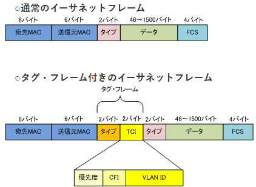
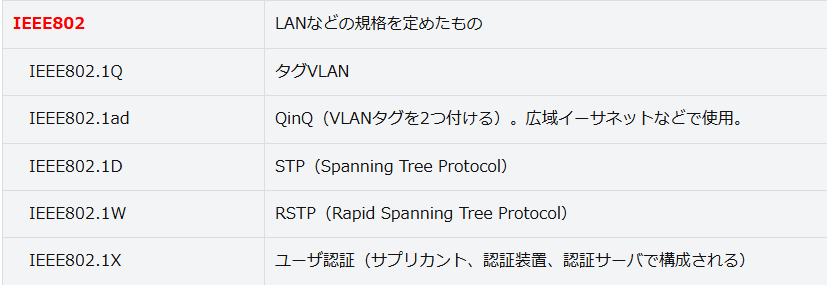

## 物理セキュリティ対策

外部環境によって起こる障害要因より、情報システムの信頼性、可用性を確保するための対策
対象を物理的に守るためのもので、設備施設の強化、入退室管理、バックアップなど。
ネットワーク分離や、無線LANも対象と考える。

#### 物理的セキュリティのガイドライン

ISO/IEC 27002が詳細管理策の中で規定されている。
国内基準だと経産省より好評されている情報システム安全対策基準がある。
ISO/IEC 27002とは視点が異なり、建築物や電源設備、空調設備、地震対策などの稼働確保を中心に作られている。

IDC=**「Internet Data Center」でデータセンターのこと**

例1.電源設備

1. 2系統受電、ループ受電などの受電方式を採用し、ビル内の配電系統を２重化していること
2. 商用電源の瞬断時にはUPSまたはCVCFによって、長時間の停電時には非常用電源によって、十分な電力を供給できること
3. 非常用電源として起動から発電までの時間が短いガスタービン発電機を設置していること

例2,空調設備

1. 空調機は現有系N台+予備系1台で構成されていること
2. 大規模な地震の可用性向上のため、空冷式の空調機を採用していること

## ネットワーク分離、WEB分離、Isolation

ネットワークそのものを物理的に分離する仕組み。

重要な情報を管理する社内LANを、インターネットに接続できるLANとは分離し、インターネットから隔離することで情報漏洩リスクに対して安全性を確保する。

住民情報を扱う自治体や、生徒の情報を扱う教育機関、機密情報を扱う研究開発部門を持つ企業などリスク感度の高い組織や、IT用のネットワークとOT用のネットワークなど質の異なるネットワークを管理している組織で導入されている。

#### コンテナ技術

コンテナという互いに影響しない隔離された実行環境を提供する技術。

通常、１つのOS上で複数プログラムを実行すると、OSのリソースを共有するため、互いに影響することは少なくない。

コンテナ技術を使うことで、コンテナごとに独立した環境を構築することが出来る。

1台のサーバーで複数のシステムを稼働させるということで、仮想化技術と似ている。仮想サーバーごとにOSが必要ではないという点で違いがある。

仮想化技術：仮想化ソフトで複数のハードウェアと同じ環境を作る技術

コンテナ技術：OSから必要機能を切り出して隔離された環境を作り出して、独立して稼働させる

## VLAN

VLANとは仮想的なLANのこと。

仮想的なLANのこと。

通常のLANは物理的に接続されたグループでネットワークを構成する。

上記とは異なり、仮想的に接続されたグループでネットワークを設定することをVLANと呼ぶ。

物理的な設置場所の制約から解放されるためメリットは大きい。

VLANを構成していない場合

LAN1,LAN2,LAN3がフロアをまたがり存在。

ブロードキャスト到達範囲を変更しようとすると、同一LANにしないといけない

→ルータやHUBの変更が必要となる＝物理的な変更が必要となる

1. VLANの仕組み
   VLAN対応のLANスイッチを利用して構築する。各フロアにまたがる端末を一つの同一グループに集約することが出来る。物理的な場所に依存しないネットワークが可能となる。
   ポートVLAN: LANスイッチのポートごとにVLAN番号を設定する方法
   タグVLAN: MACフレームにVLAN番号を記したタグ情報を挿入してフレーム単位でVLANを区別する方法
   認証VLAN: 端末の利用者が接続時にID＋パスワードにより、IDに対応するVLANに接続する方法
2. ポートVLANとタグVLANの違い
   タグVLAN：タグポートに設定したポートではVLAN IDをMACフレームに埋め込んだり取り除く。接続先もタグポートに設定しないといけない。HUBとPC端末も同様。タグポートに設定したポートにPCを接続する場合には、端末同士もイーサネットもタグフレームに対応していないといけない
   ポートVLAN：HUB同士をつなぐポートだけをタグポートに設定し、それ以外のポートにVLAN IDを設定。
3. IEEE 802.1Q
   タグVLANはMACフレームにタグを埋め込む方式。"タグ"を埋め込む方式で、タグはIEEE802.1Qで標準化されている。

**L2での分割単位を「フレーム」と呼び**
「フレーム」でカプセル化して運ばれる**L3以上のペイロード部分を「パケット」と呼ぶ**

#### **TPID (Tag Protocol Identifier)**

「TPID」は、IEEE 802.1Q による「タグ」付きフレームであることを示すため、0x8100 という値を置く16ビットのフィールドです。
EthernetⅡ機器は、到来する信号を概念的には到来順に1ビットずつ受け取っていきます。
そしてType/Sizeフィールドをペイロードの内容・プロトコルを示すEther**Type**として使います。

原則固定値で0x8100。ここを見るとVLANかということが識別できる。

#### TCI

Tag Control Informationの略で、IEEE 802.1pで規定された4ビットの優先情報が含まれている他、フレームが属しているVLANの識別情報である「VLAN ID（VID）」が設定

## IEEE802の規格群

#### VLAN間の通信

VLANは仮想的にLANを構築する。

異なるVLAN間同士で通信を行う場合、ルータやL3SWを用いて、VLAN IDとIPのサブネット対応付けるように設定する。

##### ルートとL2スイッチを接続

VLANに対応していないルータとL2スイッチを接続する場合、VLAN IDの数だけ物理的に接続する。

##### VLAN対応のL3スイッチとL2スイッチを接続

VLAN対応のL3スイッチを上位とする場合、両方のポートをタグポートに設定すればVLANは通過できるようになる。

##### VLAN対応のL3スイッチを接続

VLAN対応のL3スイッチを使うとL3のテーブルの対応関係の設定のみでOK。

## 無線LAN

#### IEEE802.11

IEEEの802委員が策定する技術仕様のため、こんな名前。

#### 2.4Ghzと5GHz

周波数帯域2.4GHzは10mW以下の出力なら屋外でも利用できるため、Bluetoothや産業機器、いたるところで使われてる。

ISMバンドなどと呼ばれている。

5GHzはノイズは少ないが、屋外で使用できる場所が限られている点、指向性が強く障害物に弱い特徴がある。

#### Wi-Fi Alliance

無線LAN製品を製造するメーカが集まって立ち上がった業界団体がWi-Fi Alliance。

IEEE802.11の策定する技術仕様を製品実装し、相互接続性試験を行ている。

2018年IEEE802.11axテクノロジーをWi-Fi6と命名。

| 技術                 | 内容                                                                                                                                                                                                                               |
| -------------------- | ---------------------------------------------------------------------------------------------------------------------------------------------------------------------------------------------------------------------------------- |
| OFDMA                | 直交周波数分割多元接続。IEEE802.11axに採用された技術。 一つのAPと複数端末のようにリソースを共有する方式・多重アクセスを可能にする仕組み。 1チャネルで複数のユーザーを割り当て出来るようになった。                        |
| MIMO                 | 複数のアンテナを使って送受信することで通信を高速化する技術。 APと端末が1:1で通信するSU-MIMO。1:多のMU-MIMO。 MU-MIMOには各端末に向けて集中的に電波を出力し電波干渉を抑制するビームフォーミングという技術が使われている。 |
| チャネルボンディング | 複数チャネルを束ねて通信を高速化する技術。 IEEE802.11ｎ:20MHz×2 IEEE802.11ac, IEEE802.11ax:20MHz×4本=80MHz                                                                                                             |
| 空間再利用           | 無線LANのアクセス制御方式はCSMA/CA方式。 電波を発している端末がないことを確認し、ない場合に電波を発する方式。                                                                                                                 |

#### 無線LANのセキュリティ

無線LANには複数の脅威がつきまとうので、脅威に対するセキュリティがいろいろ考えられる。

無線LANに対する脅威

盗聴

- 壁を隔てた道路で通信を傍受される

不正侵入・なりすまし

- ウォードライビング
- アクセスポイントに無断で侵入される

フリースポット

- パケットの盗聴
- 端末への侵入・ウィルスインストール
- ハニーポットAP

#### ESSIDの隠蔽

ESSIDやSSIDはネットワーク識別のID。

アクセスポイントと無線LAN端末の双方で同じSSIDを設定することで接続→通信することが可能。

ビーコン信号は停止する設定にしておくことが基本。アクセスポイントではANY接続も拒否する設定とすべき。

#### MACアドレスフィルタ

アクセスポイントに登録しているＭＡＣアドレスしか接続できない機能をＭＡＣアドレスフィルタリング機能。

→接続可能端末に制限をかけることが可能。

通信中に不正アクセスできてしまう。

#### 暗号方式

暗号化は必須。とはいえESSIDやMACアドレスを通信する場合、暗号化はされていない。

###### WEP

アクセスポイントと端末に同じWEPキーを設定する。WEPキーは64bitと128bitで、24bitは初期設定ベクトルという乱数。残りの40bitもしくは104bitを両方に設定する。

アクセスポイントに接続する全端末で同一のWEPキーを設定して、使い続けるため、脆弱性あり

###### WPA

2002年委Wi-Fiアライアンスによって策定された無線LANの暗号通信規格。

WPAの暗号化方式はTKIPと呼ばれ、暗号アルゴリズムにはWEPと同じRC4を用いる。

暗号アルゴリズムにはWEPと同じRC4を用いるが、WEPの弱点だった"24bitの初期化ベクトル"を48bitに増加するとともに、暗号鍵を一定時間ごとに更新することでWEPよりも安全となった。

###### WPA2

WPAはWEPに続く暗号技術の標準では持たないことを踏まえて、業界団体が先行して策定した規格。

その間、IEEEではIEEE802.11iの標準化が進められていた。その後、IEEE802.11iは、ほぼ同じもの。

おもな変更点は暗号アルゴリズムの標準をAESとしたこと。暗号方式はCCMP。

###### WPA3

2017年10月にWPA2の脆弱性、"KRACK"が報告されたことを背景に開発がすすめられたものがWPA3
KRACKsがついた脆弱性はWPA2の最初に接続する時のハンドシェイク部分だったため、SAEという方式を実装した。
IEEE802.1X認証を使うエンタープライズ方式の場合、AES128美とよりも強固な暗号アルゴリズムのCNSA192bitを利用可能。

__SAE__
SAE（Simultaneous Authentication of Equals）とは、無線LAN(Wi-Fi)のセキュリティ規格「WPA3」で採用された暗号鍵の(元になる秘密の値の)交換手順で、パスワードと乱数から一定の手順で算出した値を交換することにより、鍵交換と認証を同時に行う方式。

接続を試みる二者（通常は端末とアクセスポイント）は事前に共有したパスワード、両者のMACアドレス、各々が生成した乱数を用いて一定の手順で値を算出して交換する。相手から受け取った値と自らの乱数から一定の計算を行うことで両者で同じ値を得ることができ、これを共有鍵とする。

この過程でパスワード自体やそのハッシュ値、乱数は送受信せず、攻撃者が互いが相手に送信する値を傍受しても「離散対数問題」と呼ばれる数学上の問題を解決しなければならず、算出の元になった秘密の値を逆算することは極めて困難である。楕円曲線上の離散対数問題を選択することもできる。

鍵交換で共有した共通鍵をもとに通信に用いる暗号鍵を生成（および一定期間ごとに再生成）して伝送路を暗号化する。パスワードや通信相手が同じでも共通鍵は接続ごとに毎回異なる値となるため、パスワードが漏れても過去の通信を解読することはできない（前方秘匿性）。また、パスワード自体やそのハッシュ値は直接やり取りしないため、単純で脆弱なパスワードを設定してしまっても割り出されにくい。

#### フリースポット

最近ではフリースポットが普及。
利便性を高めるため、暗号化していないアクセスポイントや、暗号化していても暗号キーが共通のアクセスポイントであるため、セキュリティリスクが高い。

## クラウドサービス利用時の留意点

#### クラウドサービスの適切な選定

クラウドサービスを李王する場合、その安全性や信頼性は事業者のサービス内容に依存する部分が大きいため、契約前に契約約感やサービス内容をチェックして、大丈夫かをチェックして適切なクラウドサービスを選定する必要があります。
大前提として、クラウドサービスに移行しても、自社のセキュリティポリ氏に合致するかの確認は不可欠。
クラウド特有のリスクを紙して、チェックを行うべき。

#### 信頼性

自社のSLAやBCPと比較して、クラウドサービス事業者の障害対策や災害対策が十分かをチェックする必要がある。
データセンターの評価基準やガイドラインを仕様すると良い

#### 入退室管理

部外者が侵入できない厳重な入退室管理がおこなわれているかのチェック。情報漏洩や内部不正の対応策があるかをチェックすべき。

#### 不正アクセス対策

インターネット接続で利用する場合、不正アクセスのリスクが残る。
管理者と利用者のに小方式は安全か、自社のセキュリティポリ氏に合致しているかを確認する。

#### クラウドサービス上のデータ

契約約感を確認して、データ消失の対応をチェックする。
過失の有無にもよるが、クラウド事業者側では責任を持てないケースもあるため、リスクに対する検討が必要。

#### 拡張性やマネージドサービス

セキュリティとは関係ありませんｇあ、サービスのアック調整やマネージドサービスに関しても、自社の要求に合致するかを確認することが望ましい。
契約後の事業感化用の変化を予測して行う必要があるため、中長期計画との整合性が必要となる。

###### 暗号アルゴリズムのモード

ブロック暗号アルゴリズムを使用し、長い平文を暗号化する際はブロック暗号アルゴリズムを繰り返し使って、暗号化する必要があります。この繰り返しの方法のことを、ブロック暗号のモードと呼びます。

* ECBモード：Electronic CodeBook mode (電子符号表モード)
* CBCモード：Cipher Block Chaining mode (暗号ブロック連鎖モード)
* CFBモード：Cipher-FeedBack mode (暗号フィードバックモード)
* OFBモード：Output-FeedBack mode (出力フィードバックモード)
* CTRモード：CounTeR mode (カウンタモード)

# 2nd trial 物理セキュリティ

## 問題把握のコツ

社内LANの問題か、無線LANの問題か、クラウドサービスの問題かを把握。

1. 社内LAN

フロアレイアウト図や設備に関する記載がある

適切な入退室管理がされているか

2. 無線LAN

ネットワーク図に無線LANのアクセスポイントが記載されている場合は無線LANに関する出題の可能性を考えること。

規格、暗号化、認証、無線LAN特有の問題を念頭に。

3. クラウドサービス

シャドーITの問題→CASBの機能を用いる

## 物理セキュリティ対策

### 入退室管理基礎

入室許可がない人を拒否、正当な権限をもつ人のみを入室させる入室チェック。
セキュリティ区域の入口で来訪者を確認し、必要に応じて許可、拒否することが重要。

ドアの開閉：ICカード or IDカード

在室管理やPCのログインシステムとの連携、プレゼンス情報との連携

## 物理セキュリティのガイドライン

ISO/IEC 27002の詳細管理策の中で規定されている。
経産省から公表されている情報システム安全対策基準などがある。

### 物理セキュリティ対策の要件

問題文章内に記載される
※最近この手の問題でてないね。。。

### ネットワーク分離/web分類/isolation

ネットワークそのものを物理的に分離する仕組み。

重要な情報を管理する社内LANをインターネットに接続できるLANと分類し、インターネットから隔離することで情報漏洩リスクに対して安全性を確保する。

IT用のネットワークとOT用のネットワークなど質の異なるネットワークを導入している組織に導入される。

導入に際しては服すネットワークを利用する人の有無とネットワーク間の通信の有無や頻度を考えて、安全性と利便性のバランスを考慮して最適な方法を選択する必要がある。

1. 中継用PC方式 / 2大の端末を使うケース

研究用PCは研究用LAN
事務用PCは事務LAN
という感じで分離する。

2. 1台の端末を使うケース

端末を2台使い分けが手間という場合は、1台の端末で2つのネットワークに接続出来るようにする。
NICを2枚入れるわけではない。
VDIのように仮想マシンなどの仮想化技術を用いて、論理分離する方法。

VDIサーバ側で添付ファイルの削除やエクスプロイトコードの除去などのweb無害化が行われる。

### コンテナ技術

1台のサーバで複数のシステムを稼働させることが出来るという点では、仮想化技術と似ているが、仮想サーバごとにOSが必要ではないという点で違いがある。

コンテナ技術はOSから必要機能を切り出して隔離された環境を作り出して、どの後は独立して稼働させるという感じ。

仮想化ソフトを利用した場合、仮想サーバ上でOSから動作させないといけない。
→パフォーマンスが低下する

コンテナ技術の場合は、OSは動作済みなので、パフォーマンスの低下が少ない。

個々のコンテナは仮想サーバに比べてコンパクトなため、複製も容易。
→リソース管理に優れる、システム構成管理も優れる。

## VLAN

VLANとは仮想的なLAN。

フロアをまたがるグループや階が異なるグループのように仮想的なネットワークグループをつくることが出来る。

ルータによってフロア単位にLANが分割されている場合、ブロードキャストは各階に3つ存在し、他のフロアにはブロードキャストは届かない。

### VLANの仕組み

VLAN対応のLANスイッチを利用して構築する。
例えば、3階のルータをVLAN対応のスイッチに変更すると、各フロアにまたがる端末を一つのグループに主役することが出来る。
→物理的な場所に依存しないネットワークが可能となる。

VLANを構成するにはスイッチングHUBが必要となるが、VLANの方式にも種類が存在する。

__ポートVLAN__

LANスイッチのポートごとにVLAN番号を設定する方法

__タグVLAN__

MACフレームにVLAN番号を記したタグ情報を挿入して、フレーム単位でVLANを区別する方法

__認証VLAN__

端末の利用者が接続時に入力するIDとPWによって、そのIDに対応するVLANに接続する方法

### ポートVLANとタグVLAN

HUB同士をつなぐポートだけをタグポートに設定し、それ以外のポートにVLAN IDを設定する。

VLAN IDを指定するポートには、VLAN ID=1とVALN ID=2を割り当て、2つのVLANを構成する。

タグポートに設定したポートではVLAN IDをMACフレームに埋め込んだり除去したりする。

これは、HUBとPC端末も同様。

### IEEE 802.1Q

タグVLANはMACフレームに"タグ"を埋め込む方式。

タグの形式はIEEE 802.1Qで標準化されている。

タグはTPIDとTCIで構成される。

- TPID: "0x8100"で固定
- TCI: 12ビットのVLAN番号

12ビットなので4096個のVLANを認識する。

### VLAN間の通信

VLANは物理的な制約や接続形態に関係なく仮想的にLANを構成するもの。

ルータやL3スイッチを使い、VLAN IDとIPのサブネットを対応付けるように設定する。

__1. ルータとL2スイッチを接続する__

VLANに対応していないルータとL2スイッチを接続する場合、VLAN IDの数だけ物理的に接続する。

__2. VLAN対応のL3スイッチとL2スイッチを接続する__

VLAN対応のL3スイッチを上位に設定する場合は、両方のポートをタグポートに設定すれば区間は複数のVALN IDが通過できるので、接続は一つでよくなる。

__3. VLAN対応のL3スイッチの場合__

VLAN対応のL3スイッチを使うと、L3スイッチのルーティングテーブルの設定だけで対応できる。

### 無線LAN

### 無線LANの基礎知識

無線LANの規格にはIEEE802.11シリーズなるもので構成される。

これらの規格は、技術仕様の標準化がIEEEの802委員会で行われているためIEEE802.11シリーズ。

| 策定年 | 規格         | 周波数帯域      | 通信速度 |
| ------ | ------------ | --------------- | -------- |
| 1997   | IEEE802.11   | 2.4GHz帯        | 2Mbps    |
| 1999   | IEEE802.11b  | 2.4GHz帯        | 11Mbps   |
| 1999   | IEEE802.11a  | 5GHz帯          | 54Mbps   |
| 2003   | IEEE802.11g  | 2.4GHz帯        | 54Mbps   |
| 2009   | IEEE802.11n  | 2.4GHz帯/5GHz帯 | 600Mbps  |
| 2014   | IEEE802.11ac | 5GHz帯          | 6.93Gbps |
| 2021   | IEEE802.11ax | 2.4GHz帯/5GHz帯 | 9.6Gbps  |
