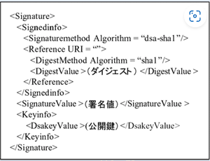

## Cookieとは

サーバーがブラウザに送信するデータのことです。このデータはブラウザに保存されサーバーとのやり取りに使用されます。データはkey=valueの形の文字列で格納されています。

Cookieを使うことで、ログイン情報やショッピングカートのカート情報などを保持してユーザーの操作を助けることができます。

#### Cookieのpath属性

Cookieの有効パスを指定するため

Cookieの情報はサーバーとの通信に含まれます。URLのどのようなpathに、Cookieの情報を含めるかを指定するのがpath属性になります。

指定がない場合は、同じドメインのURLならば含める設定になります。

URLのドメインとpathは、下記のURLの例だと「○○.com」がドメインでその後の/（スラッシュ）以降がpathになります。

#### Set-Cookie

**`Set-Cookie`** は HTTP のレスポンスヘッダーで、サーバーからユーザーエージェントへクッキーを送信するために使用され、ユーザーエージェントはそれを後でサーバーに送り返すことができます。 複数のクッキーを送信するには、複数の **`Set-Cookie`** ヘッダーを同じレスポンスで送信してください。

#### [`Secure` **省略可**](https://developer.mozilla.org/ja/docs/Web/HTTP/Headers/Set-Cookie#secure)

クッキーが、リクエストが SSL と HTTPS プロトコルを使用して行われた場合にのみサーバーに送信されることを示します。ただし HTTP クッキーは、例えば情報が暗号化されないなど、安全ではない仕組みを継承しているので、機密な情報や敏感な情報を転送したり格納したりしないようにしてください。

### 理由:

1. 元のSet-Cookieヘッダには、`session_id`、`secure`、`path`の3つの属性があります。
2. WAFが暗号化するのは `session_id`だけで、`secure`と `path`はそのまま残ります。
3. 解答群の中で、`secure`属性が維持され、`path`が暗号化されていないのは「ウ」のみです。

したがって、正しい解答は「ウ」です。

#### サービス指向アーキテクチャ（SOA）

システムを「1つのデカいシステム」と捉えるのではなく「それぞれの機能を提供する部品（サービス）の集まり」と見なす考え方
システムを「それぞれが独立した部品の集まり」と見なす考え方
が「サービス指向アーキテクチャ」です。

#### レプリケーション

DBMSが持つ機能の一つ。
DBに加えた変更を別ネットワーク上にある複製データベースに自動的に反映する仕組み。
データを長期に保存するバックアップとは異なり、頻繁にデータ更新が行われる。
災害で機器が破壊されても、早期に復旧できる仕組み。

アカウント管理

アカウント管理の一般的な常識に沿って解答をつくるべき。

常識に沿ってというのが難しかった。

#### グループウェア

グループウェアは一つのプラットフォーム上にメール・チャットやWeb 会議などさまざまな機能が搭載されています。

共同編集も可能なため、複数人で共有しながら迅速に書類を完成させることも可能でしょう。

グループウェアは、社内外の情報共有とコミュニケーションを円滑にし、業務の効率化を目指すためのサービスです。さまざまな機能が一つのプラットフォームに搭載されています。主な機能として、メール・スケジュール管理・タスク管理・Web会議・掲示板などがあり、従業員は互いのスケジュールを簡単に確認し、業務を効率的に進められます。

#### PGP

PGP（Pretty Good Privacy）は、Eメールを復号化および暗号化し、デジタル署名およびファイル[暗号化](https://www.fortinet.com/resources/cyberglossary/encryption)を介してEメールメッセージの認証に使用されるセキュリティプログラムです

PGPは1991年に政治活動家のポール・ジマーマンによって設計および開発されました。PGPソフトウェアは、2002年に設立され、2010年にSymantecに買収されたPGP Corporationという会社が所有し、販売しました。

Eメールは、被害者の名前やIDを使用して簡単にメッセージを偽造できるサイバー犯罪者にとって、主要な攻撃方法です。PGPは、データを暗号化して通信方法をよりプライベートなものにすることで、この問題を解決し、[Eメールのセキュリティ](https://www.fortinet.com/jp/resources/cyberglossary/email-security)を強化することを目指しています。

ハッシュ関数の長さ

SHA-256が出力するハッシュ値は256ビット。入力データの長さにかかわらずハッシュは256ビットとなる

XMLデジタル署名

RFC3075として標準化されている。

XMLデジタル署名は指定のエレメントに対して署名することが出来る。

エンベロープ署名では複数の署名を付けるk十はできない。

CMSはInet標準として標準化されている電子署名の形式でデジタル署名で使用される。

**XML署名**

XML形式のデータにくっつけることを想定して作られた電子署名の規格

[電子署名](https://wa3.i-3-i.info/word14395.html)は、大雑把に言えば「コンピュータの世界のハンコ」です。
コンピュータの世界の書類（ファイル）にポンッ！と押すことで、その書類の正当性を示します。

XML文書にくっつける電子署名（に関する規格）

大将の文章が改ざんされていないかを検出するために利用される。

#### CMS

RFC 5652は、Cryptographic Message Syntax (CMS)に関する文書で、デジタル署名、暗号化、その他のメッセージ認証機能を提供するための標準化された方法を定義しています。

この標準は、電子メールのセキュリティ拡張、デジタル証明書の管理、電子商取引トランザクションの保護など、さまざまなセキュリティ要件を満たすために広く利用されています。

CMSは、S/MIME (Secure/Multipurpose Internet Mail Extensions) の基盤としても機能し、RFC 3852から更新されました。関連するRFCには、RFC 5280 (X.509証明書とCRLのプロファイル) やRFC 5751 (S/MIME Version 3.2 Message Specification) などがあります。

#### PGP VS S/MIME

1. 基本的な概念
   PGP:

PGPは、個人の鍵管理を重視した暗号化方式です。ユーザー自身が鍵を生成し、管理します。
PGPは非対称暗号化を使用しており、公開鍵と秘密鍵のペアを利用します。
S/MIME:

S/MIMEは公開鍵インフラストラクチャ（PKI）を利用した暗号化方式です。デジタル証明書を介して鍵が管理されています。
S/MIMEは主に企業や組織で使用され、信頼できる証明書機関によって発行されたデジタル証明書を必要とします。
2. 鍵管理
PGP:

ユーザーが自己管理する形式で、他のユーザーと直接公開鍵を交換します。信頼のネットワークによって鍵の信頼性を確認します（例えば、ウェブオブトラスト）。
S/MIME:

ゼロから自己管理する必要はなく、認証局（CA）を通じて証明書が発行され、管理されます。これにより、より広範な信頼性が確保されます。
3. 暗号化と署名の方式
両者ともに、
メッセージの内容を暗号化し、電子署名を使用してメッセージの整合性と送信者の認証を提供しますが、その実装方法が異なります。
4. 互換性
PGP:

PGPはオープンな標準であり、さまざまなソフトウェアに実装されています。主に個人利用者やオープンソースプロジェクトで用いられています。
S/MIME:

S/MIMEは商業的なメールクライアント（例：Microsoft OutlookやApple Mail）で広くサポートされていますが、通常は企業環境での使用が多いです。
5. 使用例
PGP:

プライベートな通信、個人間でのメールの暗号化に多く見られます。
S/MIME:

組織内の重要な文書や正式なビジネス通信での暗号化に使用されることが一般的です。
結論
PGPとS/MIMEはそれぞれ異なるニーズに応じた暗号化技術ですが、どちらも安全な通信を実現するために重要です。利用者の環境や要件に応じて、どちらを選択するかが決まります。

### PGPとは何か

**電子メールなどのデータ通信におけるセキュリティを確保するための暗号化および認証のための技術 **

PGPは、メッセージの内容を暗号化することで第三者による盗聴や改ざんを防ぎ、また送信者の認証を行うことで、なりすましを防ぐことができます。

PGPは、公開鍵暗号方式を採用しており、各ユーザーは公開鍵と秘密鍵のペアを持ちます。メッセージの暗号化には受信者の公開鍵を使用し、復号には受信者の秘密鍵を使用します。これにより、第三者が暗号化されたメッセージを盗聴しても、秘密鍵を持っていない限り内容を読むことができません。

1. 送信者は、受信者の公開鍵を使ってメッセージを暗号化します。
2. 暗号化されたメッセージは、インターネット上で送信されます。
3. 受信者は、自分の秘密鍵を使って暗号化されたメッセージを復号します。
4. 復号されたメッセージは、受信者のみが読むことができます。

名称説明暗号化メッセージを第三者に理解できない暗号文にすること。機密性を担保する。認証メッセージが本当に通信したい相手からのものであることを確かめること。フィンガープリント一方向ハッシュ関数の出力であるハッシュ値のこと。メッセージダイジェストとも。ソフトウェアの作者がハッシュ値を公開し、利用者が手に入れたソフトウェアのハッシュ値と、作者のハッシュ値が一致するか確かめることでソフトウェアの改ざん検知をすることができる。署名(デジタル署名)メッセージのハッシュ値を暗号化した暗号文。その暗号文はメッセージの作成者しか作ることができないので、「このメッセージは〇〇が作りました」と証明することができる。この暗号文は第三者が解読できる（メッセージの作成者を証明するだけ。機密性は守られない）。解読用の公開鍵が〇〇さんのもであることの証明はないので中間者攻撃ができてしまう。証明書(公開鍵証明書)認証局に登録された公開鍵と、それに対する認証局のデジタル署名をセットにしたもの。デジタル署名を検証するための公開鍵は更に他の認証局によって証明書が発行されており、その繰り返しになっている。証明書のデジタル署名を検証するには、その連なる証明書すべてを検証する必要がある。認証局によって「この公開鍵は確かに〇〇さんのものである」と認められているので中間者攻撃に耐性がある。SSL/TLS対称暗号、公開鍵暗号、デジタル署名、一方向ハッシュ関数などの技術を組み合わせて暗号通信を実現するフレームワーク。HTTPだけでなく、SMTPなどの他のプロトコルもそのフレームワークに乗せて暗号通信を実現できる。

#### サブドメイン

サブドメインとは、既存のドメインに**文字列を追加することで、新しいアドレスを作成**する機能です。

ドメインの先頭に**「.」（ドット）で区切られた別の文字列**を加えることで、元々のドメインとは別のアドレスとして扱えるようになります。

例えば、ドメインが「onamae.com」であれば、任意の文字列（ここでは「sub」）を先頭に追加することで、「sub.onamae.com」というサブドメインを新設できます。

サブドメインでも運用は可能ですが、サブドメインでは**ドメインの先頭に何らかの文字列を追加**することになるため、URL全体の文字列が長くなりやすく、アドレスの視認性や直接入力のしやすさに欠けることになります。

#### CRL

CRL (Certificate Revocation List) は、証明書の失効情報（シリアル番号と失効日）が記載されている認証局 (CA) 毎に作成・更新されるリストです。

同認証局 (CA) から発行された有効期間が満了していないすべての証明書の失効情報が記載されています。

CRL に対応した Web ブラウザからサーバ証明書が設定されている Web サイトへ接続した際、サーバー証明書の情報を受け取った Web ブラウザは証明書の「CRL 配布ポイント（CRL Distribution PointCRL）」という項目で指定された URL へ自動でアクセスして、CRL をダウンロードします。

Web ブラウザは取得した CRL に登録されているすべてのシリアル番号と Web サーバーから送られてきた証明書のシリアル番号を照合して、一致した場合に Web ブラウザが「証明書が失効されている」と判別してセキュリティ警告やエラーメッセージを表示します。

#### SPFを使っているメールサーバーがあります。どんなケースで送信したメールが迷惑メールとされる?

SPF（Sender Policy Framework）は、メールの送信元を検証するための技術です。SPFを使っているメールサーバーが送信したメールが迷惑メールとされる主なケースは以下の通りです：

1. **送信元のドメインがSPFレコードに一致しない場合** : SPFレコードに記載されたIPアドレスとメールが送信されたIPアドレスが一致しない場合、メールは迷惑メールとして分類される可能性があります。
2. **送信元のIPアドレスがブラックリストに含まれている場合** : 送信元のIPアドレスがブラックリストに含まれている場合、そのメールは迷惑メールとして扱われることがあります。
3. **メールヘッダーに不審な内容が含まれている場合** : メールヘッダーにスパム関連のキーワードや不審な内容が含まれている場合、迷惑メールとして分類されることがあります。
4. **送信元のドメインが信頼できないドメインとして分類されている場合** : 送信元のドメインが信頼できないドメインとして分類されている場合、そのメールは迷惑メールとして扱われることがあります。

#### エスケープ処理

* **d** : 特殊文字の置換（例: `<`, `>`, `&`）
* **e** : Unicodeエスケープ（例: 特定の文字を `\uXXXX` に変換）
* **f** : URLエンコード（例: 特定の文字を `%XX` に変換）
* **g** : 最終的な文字列のエスケープ処理
* **特殊文字の置換** : HTMLやXMLで使用される特殊文字（例: `<` や `&`）を安全に扱うために行います。
* **Unicodeエスケープ** : 非ASCII文字を安全に処理するために使われます。
* **URLエンコード** : URLに含める際に必要なエンコード処理です。
* **他のエスケープ処理** : スペースや他の特定の文字をエスケープ処理します。

#### **CGI**

**（回らない）お寿司屋さん方式でホームページを表示するための仕組み**
……と言われても分かりませんよね。

「ホームページをおくれよ」な注文に対して、（何かお仕事をした後に）その場でホームページのファイルを作って返すための仕組み
であり

Webサーバ上に置いてある（クライアントからの要求に応じて動く）プログラムを動かすための仕組み

Referer

現在リクエストされているページへのリンク先を持った直前のウェブページのアドレスが含まれています。

`Referer` ヘッダーにより、サーバーは人々がどこから訪問しに来たかを識別し、分析、ログ、キャッシュの最適化などに利用することができます。

HTTPリファラ（英: HTTP referer）あるいは単にリファラは、HTTPヘッダの1つで、インターネット上の1つのウェブページまたはリソースから見て、それにリンクしているウェブページやリソースのアドレス[1]を指す。リファラを参照することで、どこからそのページに要求が来たのかを知ることができる。

## VoIP

VoIPとは、**V**oice **o**ver **I**nternet **P**rotocolの頭文字を取ったもので、インターネットのようなデータ回線を使って音声通信を行うことができる技術のことです

従来のアナログ電話では、音声信号のままメタル回線でつながっているPSTN網を通って相手に届けられていました。

IP電話は、音声信号をデジタル信号に変換してIPパケット化※し、IPネットワークを通じて送信します。受信時にIPパケット化したデジタル信号を音声信号へ変換し直します。

#### CWE

1999にUSの支援を受けたMITREが中心となり仕様策定が行われたセキュリティの弱点。

多様な脆弱性を脆弱性タイプとして分類している

#### CVE
共通脆弱性識別子CVE(Common Vulnerabilities and Exposures)(*1)は、個別製品中の脆弱性を対象として、米国政府の支援を受けた非営利団体のMITRE社(*2)が採番している識別子です。脆弱性検査ツールや脆弱性対策情報提供サービスの多くがCVEを利用しています。

個別製品中の脆弱性に一意の識別番号「CVE識別番号(CVE-ID)」を付与することにより、組織Aの発行する脆弱性対策情報と、組織Xの発行する脆弱性対策情報とが同じ脆弱性に関する対策情報であることを判断したり、対策情報同士の相互参照や関連付けに利用したりできます。

#### ゾーンとは
ファイアウォールにおけるゾーンとは「ネットワーク上に設けられた区分け」のことで、複雑な通信の設定を簡単にするためのものです。 性質ごとのアクセス制御が可能で、一度ゾーンを作成すれば複数のインターフェースに割り当てられます。 

#### Common Name（コモンネーム）
Common Name(コモンネーム)とは、SSLサーバ証明書の設定項目の一つで、SSL暗号化通信を行うサイトのURLのうち、サブドメインまでを含んだドメイン部分

コモンネームは、SSL接続をする際にブラウザにアドレスとして指定されるURLと一致している必要があります。

ブラウザはSSL暗号化通信を行う際に、指定されたアドレスと接続先ウェブサイトの証明書（サーバID）のコモンネームが一致しているかを検証しています。

→アクセスする際に、サーバ証明書のコモンネームが、アクセス先のURLと一致しているかを確認する

