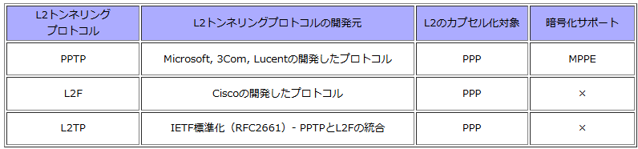

#### RSVP

IPネットワークにおけるホスト間の通信において、映像配信などのリアルタイム通信を円滑におこなうため、ネットワーク資源の予約を行う帯域制御用のプロトコル。
送信側のホストより受信側のホストに対して、Pathメッセージを定期的に送信し、受信ホストではResvメッセージを返信することで帯域予約を行う。

#### FDDI

トークンパッシング方式を採用している。
トークンと呼ばれる特殊な電文をノードよりノードに巡回させて、トークンを獲得したノードがデータの送信権を得る方式。

#### マルチホーミング

複数のISPと契約することで複数のインターネット接続回線を利用できるようにすること。

#### 使うことができないホスト

すべて'0':ネットワーク自信のアドレスを示す
すべて'1':すべてのホストに対するブロードキャストを示す

#### TCP

TCPはトランスポート層のプロトコル。
ゲートウェイはトランスポート層以上の中継を行う装置で、異なるネットワーク間の接続に用いられる。
ちなみにUNIXやWindowsではルータのことをゲートウェイと呼ぶ。

#### sftpコマンド

sftpコマンドは、ftpコマンドのように対話的なファイル転送をするプログラムで、SSHで暗号化された通信経路でファイル転送を行います。

「[sshコマンド](https://webkaru.net/linux/ssh-command/)」と同じ認証を利用するので、鍵認証も利用でき、安全にファイル転送が行えます。

鍵の生成は「[ssh-keygenコマンド](https://webkaru.net/linux/ssh-keygen-command/)」を参照してください。

#### MPLS

**MPLS (Multi-Protocol Label Switching)**は、様々な L2/L3 プロトコル (IPv4/IPv6/Ethernet/ATM/Frame-Relay 等) にラベルを取り付け、そのラベルに基づいてそのプロトコルを高速に転送するスイッチング方法です。

MPLS によるデータ転送が可能になります。MPLS 網内で**ラベル (Label) を交換 (Switching) しながら**目的地に向かいます。

L2/L3プロトコルにラベルを付けて、ラベルに基づいて、高速にパケットを転送するスイッチングのプロトコル。

## PPP

コンピューター同士が1対1の通信を行うための規約を定めたプロトコル

インターネット標準化組織IETF（Internet Engineering Task Force）によって標準化されており、OSI参照モデルでは第2層（データリンク層）に該当するプロトコル

電話回線などの回線を利用した通信方式の一つであり、ルーター同士の接続やダイアルアップ回線、ADSL回線を使ってインターネットに接続する際に利用されています。

光回線が主流となった現在では、イーサネット上でPPPのデータをやり取りするPPPoE（PPP over Ethernet）が利用されています。また、さらに高速な通信を実現するための接続方式として、近年ではIPoE（IP over Ethernet）が利用されるようになりました。

#### PPTP

PPPをインターネット上でトンネリングし、認証と暗号化を提供します。

インターネット上のIPネットワークで使用されている「IP」には、PPPのような認証機能はありません。

一方、「PPP」はWANのシリアル回線のように、2点間がポイントツーポイント接続されている回線でのみ利用可能

どのようにFlet's IP網で、PPPoEのPPP認証を行っているのでしょうか。

PPPフレームをIPデータグラムに埋め込み、「カプセル化」して送信を行い、認証サーバーの受信側でカプセル化解除を行うことにより実現しています。

このようにある通信プロトコル上で異なる通信プロトコルを透過的に伝送することをトンネリングと言います。

PPPはL2のデータリンク層であることから、この場合はレイヤ2トンネリングと言われます

