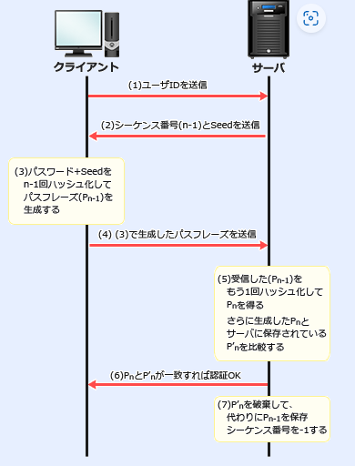

## セキュリティ関連規格

#### JIS Q 37001 (ISO/IEC 27001)

- 情報セキュリティマネジメントシステム=ISMSの要求事項。
- ISMSを確立し、実施し、維持し、継続的に改善するための要求事項を提供するために作成された規格。
- 前者は英国のBSIが制定したBS7799のpart2で、2006年以降、ISMS適合性評価制度の認証基準にもなっている。
- 最新版はjiS Q 27001:2014とISO/IEC 27001:2013

#### JIS Q 27002 (ISO/IEC 27002)

- 情報セキュリティ管理策の実践のための規範。
- JIS Q 27001を実施するためのプロセスにおいて、具体的な管理策を選定するための参考として用いられるために作成されたもの
- 情報セキュリティのベストプラクティスといわれる
- 最新版はJIS Q 27002:2014。
- 全身はBS7799のpart1で、そのあと、JIS X 5080の規格となった

#### ISO/IEC 15408 (JIS X 5070)

- 情報システムや情報システムを構成する製品が、十分なセキュリティ機能を装備していることを評価するための基準について規定したもの。
- 前進はCCとよばれるもの
- 日本にはこの基準に基づく評価認証制度のJISECがあり、政府調達で活用されている

#### PCI DSS

- 国際クレジットカード会社５社が共同で設立したPCI SSCという国際協議会が策定したグローバルセキュリティ基準。
- クレジットカードの発行会社や加盟店などのクレジットカード情報を取り扱う企業における順守事項を定めたもの
- ＩＳＭＳよりもかなり具体的で詳細な要件が定められているため、カード情報を扱っていない企業でも、参考にすることがある

参考:https://www.jcdsc.org/pci_dss.php

```
加盟店やサービスプロバイダにおいて、クレジットカード会員データを安全に取り扱う事を目的として策定された、クレジットカード業界のセキュリティ基準です。
Payment Card Industry Data Security Standardの頭文字をとったもので、国際カードブランド5社(American Express、Discover、JCB、MasterCard、VISA)が共同で設立したPCI SSC(Payment Card Industry Security Standards Council)によって運用、管理されています。
```

#### そのほか

#### OECDプライバシー原則

個人情報の保護に関する国際的なガイドライン。
8つの原則より構成される

1. 収集制限
2. データ内容
3. 目的明確化
4. 利用制限
5. 安全保護
6. 公開
7. 個人参加
8. 責任

#### ISO/IEC 27018:2019

通常のISMSの認証に加えて、クラウド上に保管されている個人情報の取り扱いが適切に導入、実施されているかを認証する規格

ISO/IEC 27701:2019

2019年8月発行。

ISO/IEC 27001, ISO/IEC 27002を拡張した規格。

両規格のプライバシー情報保護の部分を保管している。

#### ISO/IEC 28018:2019

ISMS認証に加えて、クラウド上に保管されている個人情報の扱いが重要。

認証審査はBSIジャパンが行っている。

#### S/Key

ワンタイムパスワードにより認証を行う方式の一つで、フリーで公開されている。



CVE

情報セキュリティに関して一般公表される脆弱性ごとに振られている識別子。

各脆弱性に一意の識別番号をつけることでベンダやセキュリティ期間で共通の脆弱性情報を参照することを可能としている。

## セッションオブジェクトとは

セッションオブジェクトは、クライアントとサーバー間の状態を保持するためのオブジェクトです。ウェブアプリケーションでは、HTTPプロトコルがステートレスであるため、各リクエストが独立しており、サーバーは以前のリクエストの情報を保持していません。セッションオブジェクトを使用することで、ユーザーの状態や情報を保持することができます。

 **セッションオブジェクトの主な用途** :

1. **ユーザー認証** :

* ログイン状態を維持し、ユーザーが認証されていることを確認します。例えば、ユーザーがログインした後、セッションにユーザーIDを保存し、次のリクエストでそのユーザーIDを確認することで、ユーザーがログインしているかどうかを判断します。

1. **ユーザー設定の保存** :

* ユーザーのカスタマイズ設定や選択情報を保持します。例えば、ユーザーがダッシュボードの設定を変更した場合、その設定をセッションに保存し、次回アクセス時にその設定を適用します。

1. **ショッピングカートの保持** :

* 電子商取引サイトで、ユーザーが商品をカートに追加した情報を保持します。セッションにショッピングカートの内容を保存することで、ユーザーが再度アクセスした際にカートの内容が保持されます。

1. **ページ間のデータ共有** :

* 複数のページ間でデータを共有する必要がある場合に使用します。例えば、フォームの入力データを途中のページで保存し、後でまとめて処理する場合などです。

#### FedRamp

US政府で用いられるクラウドサービス調達におけるセキュリティ評価のための仕組み→開発の指針ではなく、評価側の仕組み

#### OWASP ASVS

webアプリケーションセキュリティ分野に関するOSSのコミュニティであるOWASPが策定したアプリケーションが必要とするセキュリティ要件

アーキテクチャ、認証、セッション管理、アクセス制御がまとめられている。

設計プロセスにおけるセキュリティ設計やテスト計画において参考となる。

→webアプリのセキュリティチェック時に参考となるため、開発のための指針となる。

## リンクローカルアドレス（Link Local Address）

リンクローカルアドレスとは、DHCPサーバ（プライベートIPアドレスを割り当てる役目を持ったサーバ）が存在しないネットワーク内で使われる、特別なIPアドレス。

DHCPサーバがなくても個々のコンピュータが自分自身にIPアドレスを割り振ることから、「自己割り当てIPアドレス（AutoIP）」とも呼ばれます。

ローカルネットワーク内だけで使われるという点では、リンクローカルアドレスとプライベートIPアドレス。


## 情報セキュリティ３要素

1. **機密性（Confidentiality）**
   　情報が許可された人だけにアクセスできるようにすること。
2. **完全性（Integrity）**
   　情報が正確で、改ざんされていないことを保証すること。
3. **可用性（Availability）**
   　必要なときに情報へアクセスできる状態を保つこと。
