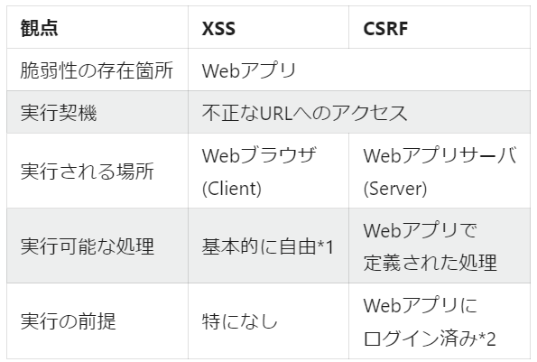

# 脅威

情報を詐取したり、改ざんや破壊したりする目的で、情報システムやネットワークに対して攻撃がおこなわれている。
この攻撃手法について説明する

## マルウェア

悪意あるコード、または、悪意あるソフトウェアの総称をマルウェアという

ウイルス：他のファイルに寄生して感染する悪質なプログラム
ワーム：単体で動作し、ネットワークを介して拡散する不正プログラム
トロイの木馬：正常なソフトウェアに偽装して侵入し、不正な操作を行うプログラム
バックドア：不正アクセスを可能にする隠しプログラム
スパイウェア：ユーザーの情報を盗み、発信するプログラム
ランサムウェア：ユーザーのファイルを暗号化し、身代金を要求するプログラム
アドウェア：広告を表示するソフトウェア
スケアウェア：ウイルス感染やセキュリティの脆弱性を偽装し、不安を煽って有料のソフトウェアを購入させるプログラム
ファイルレスマルウェア：インストールすることなく、メモリ内のみに常駐し攻撃を実行するマルウェア。windowsの正規ソフトであるPowerShellを悪用する攻撃が有名。ファイアレスのため、シグネチャ型のアンチウィルスソフトでは検出できない

## 不正アクセス

#### 事前調査

攻撃前に攻撃対象となるPC、サーバーおよびネットワークについて、脆弱性の有無や攻撃の足掛かりを得るために情報収集する。

これをふっとプリンティング。

具体的な攻撃手段：アドレススキャン、ポートスキャン、OSとバージョン、ネットワーク構成の把握など

#### 身元の隠蔽

踏み台になるコンピュータを探しておき、攻撃対象にアクセスする。

#### 侵入

身元が隠蔽出来たら侵入を試みる。盗聴やパスワードクラッキングによりパスワードを奪取したり、Exploitコードを利用してセキュリティホールを突いたりする。

この時に、セキュリティ対策をかいくぐるために、ゼロデイアタックを検討する。

#### 情報窃取、改ざん、破壊

侵入が完了したら、目的の達成を目指す。

バックドアを仕掛けて、次回以降の侵入準備をしたり、ログを改ざんする。

#### パスワードクラッキング

パスワードの解読行為のこと

#### Exploitコード

OSやアプリケーションの脆弱性を突くプログラムのこと。

ハッキングのような悪意を持つものだけでなく、脆弱性があることを検証するために作成したコード。

通常、研究者や技術者が共有しあうもので、改造して悪用されることも多く、問題となっているコード

#### ゼロデイアタック

0dayでの攻撃のこと。

あらたなセキュリティホールが発見されたときに、対策されるまでに脆弱性を突く攻撃。

#### ソーシャルエンジニアリング

人間の心理的な錯角や間違いを悪用して情報を引き出す手口の総称。

#### サービス不能攻撃

DoS攻撃は一度に大量データをサーバーに送信したり、セキュリティホールを突いてシステムダウンさせる攻撃。

世界中にある同一のボットネットを使うなどして、大量のパソコン端末から一斉に波状攻撃するDDoS攻撃もある。

#### フィッシング

有名企業のWebサイトに成りすます攻撃手法もある。

フィッシングといわれる手法で、偽装したWebサイトを立ち上げ、手口で誘導し、重要情報を入力させて詐欺を働く。

#### リスト型攻撃

リスト型攻撃というのは文字通り、何らかの方法で入手したアカウントとパスワードが記載されたリストをもとにウェブサービスへの不正アクセスを試みる攻撃です。パスワードリスト攻撃やアカウントリスト攻撃と呼ばれることもあります。

インターネット環境が広く整備され、スマーフォンが世界中に普及している現代、様々なウェブサービスを活用している方が多いのではないでしょうか。

Gmailなどの無料メールサービスは標準的に利用しているでしょうし、そのほかにも無料・有料を問わず、ほとんどの方が複数のウェブサービスを利用していると思います。

そして、そのウェブサービスごとにアカウントとパスワードを作成して管理しているわけですが、複数のウェブサービスで共通のアカウントとパスワードを利用しているケースが目立ちます。これはユーザー側の利便性という点では普通のことかもしれませんが、情報セキュリティの観点では非常に危険なことです。なぜなら、1つのウェブサービスからアカウントとパスワードが流出した結果、他のウェブサービスでの不正アクセスにつながってしまう可能性があるからです。

#### リプレイ攻撃

「リプレイ攻撃」とは**不正アクセス手法の一つで、利用者の通信を盗聴し得られたデータをそのまま利用するサイバー攻撃**です。

攻撃者はユーザーが入力した**ID・パスワードを盗聴し、同じように入力して不正アクセス**します。

#### Torネット

Torとはインターネット上で発信元の秘匿性が高い通信を行うことができるシステムです。 元はアメリカの研究所で開発された技術で、現在は仕様や対応ソフトウェアがオープンソースとして公開されています。

The Onion Routerの略で、玉ねぎルーターという意味ですが、なぜ玉ねぎなのでしょうか。

#### IPスプーフィング

サイバー攻撃にはさまざまなものがあり、年々悪質化かつ巧妙化しています。その中に、「なりすまし」と呼ばれるものがあります。これは、他人のアカウントなどを使って、自分とは違う他人になりすまして、犯罪行為をはたらくといったものです。

IPアドレスを偽装する「IPスプーフィング」もある意味で、なりすましの一種です。別のIPアドレスに偽装することでさまざまな悪事を働くIPスプーフィングの実態に迫ります。

#### ARPパケット

ARP（Address Resolution Protocol）パケットは、ネットワーク上でIPアドレスをMACアドレスに変換するために使用されます。感染PCが他のPCに接続を試みる際に、まずARPパケットを送信して相手のMACアドレスを取得しようとすることが多いため、ARPパケットの監視は感染PCの特定に有効です。

1. ネットワーク探索と感染拡大
   ネットワークマッピング: マルウェアはネットワーク上のデバイスを特定し、ネットワーク構造を把握するためにMACアドレスを収集します。これにより、どのデバイスがネットワークに接続されているかを知ることができます。
   感染ターゲットの特定: マルウェアは、特定のデバイスをターゲットにして感染を広げるためにMACアドレスを使用します。例えば、特定のベンダーのデバイスや特定のネットワークセグメントに属するデバイスを狙うことがあります。
2. セキュリティ対策の回避
   MACフィルタリングの回避: 一部のネットワークでは、MACアドレスを基にアクセス制御が行われています。マルウェアが正当なMACアドレスを取得することで、このフィルタリングを回避し、ネットワークに侵入することができます。
   MACアドレススプーフィング: マルウェアは、取得したMACアドレスを使って自身のMACアドレスを偽装（スプーフィング）し、セキュリティ対策を回避することができます。これにより、検知を逃れたり、ネットワーク上での活動を隠蔽したりすることができます。
3. 感染拡大の防止
   隔離による感染防止: 感染PCを通常のネットワークから隔離することで、ウイルスやマルウェアが他のデバイスに拡散するのを防ぎます。これにより、ネットワーク全体のセキュリティを維持することができます。
4. セキュリティリスクの低減
   リスクの最小化: 感染PCが他のネットワークリソースにアクセスできないようにすることで、データ漏洩やシステムの破壊などのリスクを最小限に抑えます。感染PCが他のデバイスと直接通信できないようにすることで、セキュリティリスクが大幅に低減されます。
5. 安全なパッチ適用
   安全な環境での更新: 専用のネットワークセグメントを使用することで、感染PCが安全にセキュリティパッチをダウンロードし、適用するための環境を提供します。この環境は、外部からの攻撃や不正アクセスから保護されており、パッチの適用が安全に行えます。

## CSRF VS XSS

Webアプリケーションの脆弱性を利用した攻撃という点は一致

クロスサイトリクエストフォージェリ（CSRF）とは、Webアプリケーションに存在する脆弱性、もしくはその脆弱性を利用した攻撃方法のことです。掲示板や問い合わせフォームなどを処理するWebアプリケーションが、本来拒否すべき他サイトからのリクエストを受信し処理してしまいます。



## 水飲み場攻撃

企業を狙ったサイバー攻撃の一種。
標的企業の従業員がよく利用するウェブサイトにマルウェアを仕掛けて、特定の企業をピンポイントで狙う手口
従業員は普段通りサイトを閲覧するだけで、知らぬ間にマルウェアに感染してしまうリスクがあります

- この攻撃手法は、動物が水飲み場に集まるように、標的とする人々が集まるサイトを悪用することから、そのように呼ばれています。
- 従業員が日常的に利用するサイトを経由するため、ユーザーも攻撃に気づきにくいという特徴があります。
- 攻撃者は、そのサイトの脆弱性を突いてマルウェアを埋め込む
- 標的企業の従業員が、感染したサイトを閲覧することでマルウェアに感染する。
- マルウェアは、従業員のPC内の情報を窃取したり、社内ネットワークに侵入したりする。

### バッファオーバーフローが生じる可能性

このコードでは特定のバッファ（例えば配列）に書き込む操作は行われていません。そのため、直接的なバッファオーバーフローのリスクは低いです。ただし、間接的に以下の点で注意が必要です：

1. **配列アクセス** :

* `arrayInput` の配列アクセス時に、範囲外のアクセスが発生すると、バッファオーバーフローのリスクがあります。
* 例えば、以下の内部ループでは `indexCurrent` の範囲チェックを行っていますが、条件次第で範囲外のアクセスが発生する可能性があります：

```
// サルマンアルゴリズム
int solve(int* arrayInput, int sizeArray, int rangeValid) {
    for (int i = 0; i < sizeArray; i++) {
        printf("%d ", arrayInput[i]);
    }
    printf("\n");
    int countSigning = 0;
    int indexCurrent = 0;
    while (indexCurrent < sizeArray) {
        // checking
        int positionSign = arrayInput[indexCurrent] + rangeValid;
        countSigning += 1;
        while (arrayInput[indexCurrent] < positionSign + rangeValid && indexCurrent < sizeArray) {
            indexCurrent++;
        }

    }
  
    return countSigning;
}

```

#### IPスプーフィング

攻撃者が身元を隠すために応答パケットを攻撃対象に送付する際に、IPヘッダーの送信元IPアドレスを偽装する攻撃手法

→送信元IPアドレスが注意すべき点


#### Man-in-the-middle攻撃

公開鍵暗号方式で暗号化通信を行っている相手にたいするもので、通信している双方の間に入って情報を搾取する。

中間者攻撃とも呼ばれる。

1. メール受信者がメール送信者に対して、公開鍵を送信したときに、悪意をもった第３者が横取りする
2. メール送信者には新たに作成した鍵ペアを公開鍵を送付する
3. 送信者と受信者の間に入り、メール受信者とは搾取した公開鍵でやり取りし、メール送信者とは中間者が作成した鍵ペアで通信を継続する

#### 標的型攻撃

特定の個人、企業、組織を標的にした攻撃を標的型攻撃。

ソーシャルエンジニアリングを屈指して取引先や知人を装ったメールを送付して、マルウェア感染を起こす。
