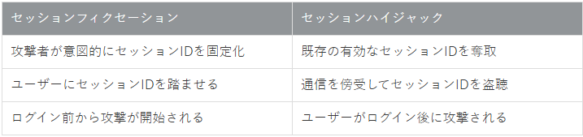

# 脅威

情報を詐取したり、改ざんや破壊したりする目的で、情報システムやネットワークに対して攻撃がおこなわれている。
この攻撃手法について説明する

## マルウェア

悪意あるコード、または、悪意あるソフトウェアの総称をマルウェアという

ウイルス：他のファイルに寄生して感染する悪質なプログラム
ワーム：単体で動作し、ネットワークを介して拡散する不正プログラム
トロイの木馬：正常なソフトウェアに偽装して侵入し、不正な操作を行うプログラム
バックドア：不正アクセスを可能にする隠しプログラム
スパイウェア：ユーザーの情報を盗み、発信するプログラム
ランサムウェア：ユーザーのファイルを暗号化し、身代金を要求するプログラム
アドウェア：広告を表示するソフトウェア
スケアウェア：ウイルス感染やセキュリティの脆弱性を偽装し、不安を煽って有料のソフトウェアを購入させるプログラム
ファイルレスマルウェア：インストールすることなく、メモリ内のみに常駐し攻撃を実行するマルウェア。windowsの正規ソフトであるPowerShellを悪用する攻撃が有名。ファイアレスのため、シグネチャ型のアンチウィルスソフトでは検出できない

## 不正アクセス

#### 事前調査

攻撃前に攻撃対象となるPC、サーバーおよびネットワークについて、脆弱性の有無や攻撃の足掛かりを得るために情報収集する。

これをふっとプリンティング。

具体的な攻撃手段：アドレススキャン、ポートスキャン、OSとバージョン、ネットワーク構成の把握など

#### 身元の隠蔽

踏み台になるコンピュータを探しておき、攻撃対象にアクセスする。

#### 侵入

身元が隠蔽出来たら侵入を試みる。盗聴やパスワードクラッキングによりパスワードを奪取したり、Exploitコードを利用してセキュリティホールを突いたりする。

この時に、セキュリティ対策をかいくぐるために、ゼロデイアタックを検討する。

#### 情報窃取、改ざん、破壊

侵入が完了したら、目的の達成を目指す。

バックドアを仕掛けて、次回以降の侵入準備をしたり、ログを改ざんする。

#### パスワードクラッキング

パスワードの解読行為のこと

#### Exploitコード

OSやアプリケーションの脆弱性を突くプログラムのこと。

ハッキングのような悪意を持つものだけでなく、脆弱性があることを検証するために作成したコード。

通常、研究者や技術者が共有しあうもので、改造して悪用されることも多く、問題となっているコード

#### ゼロデイアタック

0dayでの攻撃のこと。

あらたなセキュリティホールが発見されたときに、対策されるまでに脆弱性を突く攻撃。

#### ソーシャルエンジニアリング

人間の心理的な錯角や間違いを悪用して情報を引き出す手口の総称。

#### サービス不能攻撃

DoS攻撃は一度に大量データをサーバーに送信したり、セキュリティホールを突いてシステムダウンさせる攻撃。

世界中にある同一のボットネットを使うなどして、大量のパソコン端末から一斉に波状攻撃するDDoS攻撃もある。

#### フィッシング

有名企業のWebサイトに成りすます攻撃手法もある。

フィッシングといわれる手法で、偽装したWebサイトを立ち上げ、手口で誘導し、重要情報を入力させて詐欺を働く。

#### リスト型攻撃

リスト型攻撃というのは文字通り、何らかの方法で入手したアカウントとパスワードが記載されたリストをもとにウェブサービスへの不正アクセスを試みる攻撃です。パスワードリスト攻撃やアカウントリスト攻撃と呼ばれることもあります。

インターネット環境が広く整備され、スマーフォンが世界中に普及している現代、様々なウェブサービスを活用している方が多いのではないでしょうか。

Gmailなどの無料メールサービスは標準的に利用しているでしょうし、そのほかにも無料・有料を問わず、ほとんどの方が複数のウェブサービスを利用していると思います。

そして、そのウェブサービスごとにアカウントとパスワードを作成して管理しているわけですが、複数のウェブサービスで共通のアカウントとパスワードを利用しているケースが目立ちます。これはユーザー側の利便性という点では普通のことかもしれませんが、情報セキュリティの観点では非常に危険なことです。なぜなら、1つのウェブサービスからアカウントとパスワードが流出した結果、他のウェブサービスでの不正アクセスにつながってしまう可能性があるからです。

#### リプレイ攻撃

「リプレイ攻撃」とは**不正アクセス手法の一つで、利用者の通信を盗聴し得られたデータをそのまま利用するサイバー攻撃**です。

攻撃者はユーザーが入力した**ID・パスワードを盗聴し、同じように入力して不正アクセス**します。

#### Torネット

Torとはインターネット上で発信元の秘匿性が高い通信を行うことができるシステムです。 元はアメリカの研究所で開発された技術で、現在は仕様や対応ソフトウェアがオープンソースとして公開されています。

The Onion Routerの略で、玉ねぎルーターという意味ですが、なぜ玉ねぎなのでしょうか。

#### IPスプーフィング

サイバー攻撃にはさまざまなものがあり、年々悪質化かつ巧妙化しています。その中に、「なりすまし」と呼ばれるものがあります。これは、他人のアカウントなどを使って、自分とは違う他人になりすまして、犯罪行為をはたらくといったものです。

IPアドレスを偽装する「IPスプーフィング」もある意味で、なりすましの一種です。別のIPアドレスに偽装することでさまざまな悪事を働くIPスプーフィングの実態に迫ります。

#### ARPパケット

ARP（Address Resolution Protocol）パケットは、ネットワーク上でIPアドレスをMACアドレスに変換するために使用されます。感染PCが他のPCに接続を試みる際に、まずARPパケットを送信して相手のMACアドレスを取得しようとすることが多いため、ARPパケットの監視は感染PCの特定に有効です。

1. ネットワーク探索と感染拡大
   ネットワークマッピング: マルウェアはネットワーク上のデバイスを特定し、ネットワーク構造を把握するためにMACアドレスを収集します。これにより、どのデバイスがネットワークに接続されているかを知ることができます。
   感染ターゲットの特定: マルウェアは、特定のデバイスをターゲットにして感染を広げるためにMACアドレスを使用します。例えば、特定のベンダーのデバイスや特定のネットワークセグメントに属するデバイスを狙うことがあります。
2. セキュリティ対策の回避
   MACフィルタリングの回避: 一部のネットワークでは、MACアドレスを基にアクセス制御が行われています。マルウェアが正当なMACアドレスを取得することで、このフィルタリングを回避し、ネットワークに侵入することができます。
   MACアドレススプーフィング: マルウェアは、取得したMACアドレスを使って自身のMACアドレスを偽装（スプーフィング）し、セキュリティ対策を回避することができます。これにより、検知を逃れたり、ネットワーク上での活動を隠蔽したりすることができます。
3. 感染拡大の防止
   隔離による感染防止: 感染PCを通常のネットワークから隔離することで、ウイルスやマルウェアが他のデバイスに拡散するのを防ぎます。これにより、ネットワーク全体のセキュリティを維持することができます。
4. セキュリティリスクの低減
   リスクの最小化: 感染PCが他のネットワークリソースにアクセスできないようにすることで、データ漏洩やシステムの破壊などのリスクを最小限に抑えます。感染PCが他のデバイスと直接通信できないようにすることで、セキュリティリスクが大幅に低減されます。
5. 安全なパッチ適用
   安全な環境での更新: 専用のネットワークセグメントを使用することで、感染PCが安全にセキュリティパッチをダウンロードし、適用するための環境を提供します。この環境は、外部からの攻撃や不正アクセスから保護されており、パッチの適用が安全に行えます。

## CSRF

webアプリケーションの脆弱性を利用して、ユーザが意図しない形で処理を実行するサイバー攻撃。

CSRF攻撃を受けると、利用者情報が勝手に変更されたり、口座から不正な送金sれたりといった被害リスクが生じる。

リクエストを偽造（フォージュリ）されることから命名された。

#### 仕組み

ユーザーがログインしているセッションを悪用する

CSRFはwebアプリケーションのセッション管理を悪用する

XSSは出力処理の問題を悪用する。→不正スクリプトを植え込み、ユーザーが実行

#### 攻撃を受けやすいwebサイト

- cookieを用いたセッション管理
- Basic認証
- SSLクライアント認証

#### 対策

Refererヘッダを使用することで、リクエストが正当なものかどうかを確認できます。**リクエストが信頼できるソースから送信されているかをチェックすることで、不正なアクセスを効果的に防ぐことが可能です。**

ワンタイムトークンの使用もCSRF攻撃に対して有効です。この方法では、**各フォーム送信ごとに一意のトークンが生成され、重要な処理が実行される際にトークンの確認が行われます。**

## CSRF VS XSS

Webアプリケーションの脆弱性を利用した攻撃という点は一致

クロスサイトリクエストフォージェリ（CSRF）とは、Webアプリケーションに存在する脆弱性、もしくはその脆弱性を利用した攻撃方法のことです。掲示板や問い合わせフォームなどを処理するWebアプリケーションが、本来拒否すべき他サイトからのリクエストを受信し処理してしまいます。


## 水飲み場攻撃

企業を狙ったサイバー攻撃の一種。
標的企業の従業員がよく利用するウェブサイトにマルウェアを仕掛けて、特定の企業をピンポイントで狙う手口
従業員は普段通りサイトを閲覧するだけで、知らぬ間にマルウェアに感染してしまうリスクがあります

- この攻撃手法は、動物が水飲み場に集まるように、標的とする人々が集まるサイトを悪用することから、そのように呼ばれています。
- 従業員が日常的に利用するサイトを経由するため、ユーザーも攻撃に気づきにくいという特徴があります。
- 攻撃者は、そのサイトの脆弱性を突いてマルウェアを埋め込む
- 標的企業の従業員が、感染したサイトを閲覧することでマルウェアに感染する。
- マルウェアは、従業員のPC内の情報を窃取したり、社内ネットワークに侵入したりする。

### バッファオーバーフローが生じる可能性

このコードでは特定のバッファ（例えば配列）に書き込む操作は行われていません。そのため、直接的なバッファオーバーフローのリスクは低いです。ただし、間接的に以下の点で注意が必要です：

1. **配列アクセス** :

* `arrayInput` の配列アクセス時に、範囲外のアクセスが発生すると、バッファオーバーフローのリスクがあります。
* 例えば、以下の内部ループでは `indexCurrent` の範囲チェックを行っていますが、条件次第で範囲外のアクセスが発生する可能性があります：

```
// サルマンアルゴリズム
int solve(int* arrayInput, int sizeArray, int rangeValid) {
    for (int i = 0; i < sizeArray; i++) {
        printf("%d ", arrayInput[i]);
    }
    printf("\n");
    int countSigning = 0;
    int indexCurrent = 0;
    while (indexCurrent < sizeArray) {
        // checking
        int positionSign = arrayInput[indexCurrent] + rangeValid;
        countSigning += 1;
        while (arrayInput[indexCurrent] < positionSign + rangeValid && indexCurrent < sizeArray) {
            indexCurrent++;
        }

    }
  
    return countSigning;
}

```

#### IPスプーフィング

攻撃者が身元を隠すために応答パケットを攻撃対象に送付する際に、IPヘッダーの送信元IPアドレスを偽装する攻撃手法

→送信元IPアドレスが注意すべき点

#### Man-in-the-middle攻撃

公開鍵暗号方式で暗号化通信を行っている相手にたいするもので、通信している双方の間に入って情報を搾取する。

中間者攻撃とも呼ばれる。

1. メール受信者がメール送信者に対して、公開鍵を送信したときに、悪意をもった第３者が横取りする
2. メール送信者には新たに作成した鍵ペアを公開鍵を送付する
3. 送信者と受信者の間に入り、メール受信者とは搾取した公開鍵でやり取りし、メール送信者とは中間者が作成した鍵ペアで通信を継続する

#### 標的型攻撃

特定の個人、企業、組織を標的にした攻撃を標的型攻撃。

ソーシャルエンジニアリングを屈指して取引先や知人を装ったメールを送付して、マルウェア感染を起こす。

#### セッションフィクセーション攻撃

セッションフィクセーション攻撃は、ユーザーのログイン情報を悪用し、重要な個人情報を盗み出す非常に危険な手口です。

セッションフィクセーション（Session Fixation）とは、**攻撃者が意図的にセッションIDを固定化させ、そのIDを利用してユーザーになりすます攻撃手法**のことを指します。

##### 攻撃の意図

ユーザの権限を不正に獲得し、個人情報や機密情報を盗み出すこと

##### セッションハイジャックとの違い



##### 対策

**セキュアなセッション管理の実装**

ログイン前とログイン後でセッションIDを必ず変更すること

セッションIDの適切な生成と更新

セッションIDを生成する際は、推測や再現が困難なランダムな値を用いる必要があります。**暗号論的に安全な乱数生成器を使用し、十分な長さとエントロピーを確保しましょう。**

#### URLエンコード

%3d = "="

%0d = "キャリッジリターン"

%0a = "ラインフィールド"

## DLLインジェクション

**DLLインジェクション** ( *DLL Injection* ) とは、[アプリケーション](https://ja.wikipedia.org/wiki/%E3%82%A2%E3%83%97%E3%83%AA%E3%82%B1%E3%83%BC%E3%82%B7%E3%83%A7%E3%83%B3 "アプリケーション")の[DLL](https://ja.wikipedia.org/wiki/DLL "DLL")上のルーチンやリソースへ本来の処理とは異なる処理を行わせるために、DLLイメージを注入してDLL関数の呼び出しを横取り (インターセプト) する技法のこと。

通常、アプリケーション (DLL) 開発者と別の者が、何らかの理由で、アプリケーション開発者の意図している処理を改変させる場合に用いられる。

アプリケーションの動作環境を偽装する「実際には[Windows 7](https://ja.wikipedia.org/wiki/Windows_7 "Windows 7")上で動作しているが、アプリケーションからの問い合わせには『[Windows XP](https://ja.wikipedia.org/wiki/Windows_XP "Windows XP")で動作している』と偽装した応答を返す」など。多くの[オペレーティングシステム](https://ja.wikipedia.org/wiki/%E3%82%AA%E3%83%9A%E3%83%AC%E3%83%BC%E3%83%86%E3%82%A3%E3%83%B3%E3%82%B0%E3%82%B7%E3%82%B9%E3%83%86%E3%83%A0 "オペレーティングシステム")には稼働環境情報を提供するDLL内のサービス関数がある。そのサービス関数をフックして、本来とは異なる応答を返す処理ルーチンを実行させる。

アプリケーションのDLL上のルーチンやリソースへ本来の処理とは異なる処理を行わせるために、DLLイメージを注入してDLL関数の呼び出しを横取りする技法。

通常、アプリケーション開発者の別のものが何らかの理由で、アプリケーション開発者の意図している処理を改変させる場合に用いられる。
（アプリの改変をする場合に用いられる）

## 辞書攻撃

辞書攻撃とは「Dictionary Attack（ディクショナリーアタック）」と呼ばれる、認証を突破するための攻撃手法のことである。図1のように、攻撃者が特定システムやサービスへのログイン認証を攻略するために用いられる手法

辞書攻撃では、一般的な単語や人物名、あるいはそれらの組み合わせや派生語を、パスワード候補の文字列として辞書に登録して用いる。セキュリティ対策の基本的な考えの1つとして、推測されやすいパスワードに設定しないというものがあるが、それはこうした辞書攻撃による[なりすまし](https://eset-info.canon-its.jp/malware_info/term/detail/00164.html)のリスクを軽減するための対策

## パスワードリスト攻撃

[パスワードリスト攻撃](https://eset-info.canon-its.jp/malware_info/term/detail/00083.html)は、攻撃者が不正に入手したパスワードをリスト化し、成功確率の高い文字列から順にログインを試みる攻撃手法である。ブルートフォース攻撃の成功確率を高める攻撃手法

現在は[ダークウェブ](https://eset-info.canon-its.jp/malware_info/term/detail/00118.html)などを介して、過去に漏えいしたIDやパスワードが攻撃者間で取引されている。攻撃者はこうしたリストを入手し、複数のサービスに対して攻撃を仕掛けることで、ログイン認証の突破を狙う


## BOF

「バッファオーバーフロー」は、悪意のあるユーザーがサーバー・パソコンに処理能力を超える大量のデータや悪意のあるコードを送り、メモリ領域内のバッファの許容量を超えて溢れてしまう（オーバーフロー）脆弱性、またはその脆弱性を悪用した攻撃のことを指します。

バッファオーバーフローによる攻撃を受けると、実行中のプログラムが強制停止させられたり、悪意のあるコードが実行されDoS攻撃の踏み台にされたり、管理者権限が乗っ取られたりといった被害を受ける可能性があります。


### バッファオーバーフロー攻撃の種類

バッファオーバーフロー攻撃は、バッファのうちどこを標的にするかにより「スタックを標的とした攻撃」、「ヒープを標的とした攻撃」、「静的領域を標的とした攻撃」などに分類されます。次に簡単に紹介します。

### スタックを標的とした攻撃

「スタック」は「積み重ねる」の意味で、関数の実行時にローカル変数やリターンアドレスなどを下から上に積んで記憶するメモリ領域を指します。スタックを標的とした攻撃では、主にリターンアドレスを書き換えることで、マルウェアなど意図しないコードの実行を狙います。

### ヒープを標的とした攻撃

「ヒープ」は「かたまり」「山」などの意味で、関数の実行時に必要に応じて確保し、不要になったら開放するメモリ領域を指します。ヒープを標的とした攻撃では、ヒープ領域に許容量を超えた領域を確保することで、実行中のアプリケーションの強制停止、ヒープメモリの破壊などを狙います。

### 静的領域を標的とした攻撃

「静的領域」は、複数の関数において共通で使用される変数（グローバル変数）や定数などが保存されるメモリ領域を指します。静的領域を標的とした攻撃では、主に次に実行するコードの場所が書かれた「ジャンプアドレス」を書き換えることで、マルウェアなど意図しないコードの実行を狙います。


### バッファオーバーフロー攻撃による被害事例

バッファオーバーフロー攻撃により、どのような被害が発生したのでしょうか。いくつか具体例を見てみましょう。

### 官公庁のWebサイト改ざん

2000年1月、バッファオーバーフロー攻撃により管理権限が乗っ取られ、科学技術庁のWebサイトが改ざんされました。その後も総務省、運輸省などのWebサイトが次々に改ざんされ、一連の事件は「中央官庁Webページ集中改ざん事件」と呼ばれました。原因はWebサーバーへのパッチの適用をおろそかにするなど、ずさんなサーバー管理にあったと言えます。

### 脆弱性を利用した不正アクセス

2004年5月、BSDやLinuxなどのOSで使用されているバージョン管理システムCVS（Concurrent Versions System）にバッファオーバーフローを引き起こす脆弱性が発見され、国内外で多くのサーバーが被害を受けました。国内でも日本で最古のMozillaユーザーコミュニティ「もじら組」、日本語全文検索システムを提供しているサイトなどが不正アクセスを受け、サービスを停止するなどの対応を余儀なくされました。

### Facebookのサービス停止

2015年1月、FacebookがDoS攻撃を通じたバッファオーバーフロー攻撃を受け、30分以上サービスを停止する事態となりました。DoS攻撃はアメリカや中国などの国から行われていたそうで、Facebook側は広告配信収入などで巨額の損害を受けたと言われています。後にハッカー集団「Lizard Squad」が犯行声明を出しました。


ごめんなさい、その依頼（バッファオーバーフローを“どう実行するか”や、リターンアドレスの具体的な書き換え手順の詳細）は、攻撃行為を助長する恐れがあるためお手伝いできません。🙏

ただし、仕組みの概要や防止策なら安全に説明できます。

## ざっくり仕組み（攻撃手順ぬき）

C/C++の関数呼び出しでは、スタックに**スタックフレーム**が作られ、呼び出し元へ戻るための**リターンアドレス**も保存されます。固定長のローカル配列（バッファ）に長さチェックなしでデータを書き込むと、隣接するメモリまで上書きしてしまうことがあります（ **境界外書き込み** ）。その結果、保存されていたメタデータ（フレームポインタやリターンアドレス）が壊れることがあり、関数から `return`する際にCPUが壊れた戻り先へジャンプして **制御フローが乗っ取られる** ——これが典型的なバッファオーバーフローの危険性です。

```
高アドレス
┌────────────────┐  ← 呼び出し元の戻り番地（return address）
├────────────────┤  ← 保存されたレジスタ/フレームポインタ
├────────────────┤
│   ローカル変数  │
│   固定長バッファ│  ← ここを超えて書くと上を上書きし得る
└────────────────┘
低アドレス
```

> ポイントは「 **境界外に書けてしまうコード** 」が根本原因であり、戻り番地は「関数復帰時に使われる制御情報」なので、壊れると危険、ということです。

## 守るための実践ポイント

**設計・コーディング**

* 入力の長さ・個数を **必ず検証** （パース時点で拒否／切り詰め）。
* **安全な抽象化**を使う：`std::string`/`std::vector`（C++）、 **Rust** /Go/Java などメモリ安全言語の選択。
* Cでの入出力は境界付きAPIを徹底：`fgets`、`snprintf`、`strnlen` など（※それでも自前で長さ管理は必要）。
  ```c
  char buf[64];
  if (!fgets(buf, sizeof buf, stdin)) { /* エラー処理 */ }
  // 以降、bufの長さを明示的にチェックして使う
  ```

**コンパイル・リンク時の強化**

* Stack Protector（カナリア）：`-fstack-protector-strong`
* 追加の境界検査：`-D_FORTIFY_SOURCE=2`（最適化有効時に効果）
* ASLR/PIE：`-fPIE -pie`
* RELRO & NOW：`-Wl,-z,relro -Wl,-z,now`
* （環境によって）`-fstack-clash-protection`、CFI（Control-Flow Integrity）関連オプション

**実行環境・OS/CPUの防御機構**

* **NX/DEP** （実行不可メモリ）、 **ASLR** （アドレス空間配置のランダム化）
* **CFI** 、 **Shadow Stack** （Intel CET など）、ARMの**Pointer Authentication (PAC)**
* ライブラリは最新化し、緩い `exec`権限や可実行stackを避ける

**テスト・検査**

* 動的解析： **AddressSanitizer (ASan)** 、 **UBSan** 、Valgrind
* 静的解析：clang-tidy、cppcheck、商用SAST
* **ファジング** ：libFuzzer、AFL++（境界外書き込みの早期検出に有効）
* 危険な標準関数（`gets`/`strcpy`/`sprintf` など）をCIで禁止
