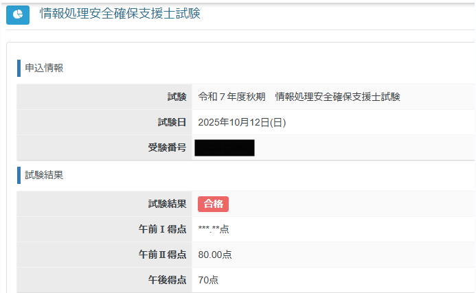

# [Network Technics](https://github.com/Shinichi0713/NetworkTechnics)

## Newtwork Specialist

### 目的

ネットワークスペシャリストを目指すためのノウハウをつける。

### コンテンツ

コンテンツ

#### 内容

__学習コンテンツ__

1. 無線LANのインフラ
2. IPとTCP
3. DNSの仕組み
4. アプリケーションプロトコル

## Security Specialist

### 目的

情報安全支援士勉強を効率化するためのgitレポジトリ。

合格しました。

### 構成

検討中

2025年度

- 学習内容をITを活用した効率化を行う
- 今回分析した問題点に基づいた対策を行う

### 試験申し込み

基本的には７月第２週より
https://www.ipa.go.jp/shiken/mousikomi/moushikomi.html
2024/12
R7の春季申し込みは以下より
1/17より申し込み受付
https://www.ipa.go.jp/shiken/2025/r07haru_exam.html

### 反省点

過去問を解いた際に、正解の当落線上にあるような解答が多い。そして、ことごとく落としているような感触がある。

1. 問題に求められている解答とずれている
2. 詳細に答えるべき箇所が、あいまいに解答している

2024/12

今度は58点(あと2点)。原因は解答の完成度と想定。

問題は、一人での自習で、やはり解答の完成度を高めるための第３者目線が不足している。このため、問題の回答は作れていても言葉足らずであったり、キーポイントが描けていたりしていることが多いことが原因と想定する

対応として考えたこと

- 第３者目線を補るため、自分の作った解答をAIで採点する方法をとる

上記を取り入れるための手段を考える必要がある。主に以下の点で検討することとする

- 生成AIの採点を容易にする仕組みの検討
- 問題を定期的に見直し出来るようにする
- 最新知見について理解を行うため、定期的にIPAなどの機関のドキュメントレビューを行う。また、記載内容についてもチェックを行えるようにする

### これまでの傾向

1. 問題文をよく読まず回答＋過去の記憶で回答して間違えるパターンあり
2. 解答を作る際にすべてのキーポイントを押さえてない
3. 個々のセキュリティ内容への理解不足

#### 午後問題解説

[情報処理安全確保支援士への道(1)：令和７年 春 午後問題 問1を解いてみる(設問1(1)～(2)編)｜ルチルMike](https://note.com/huge_boar6554/n/nd098ec10d634)

## Rustの研究

Rustのスキルを付けて、Rustを使ったツールを作る。
スキル取得のためのコツをまとめる。

[Rust研究](https://github.com/Shinichi0713/NetworkTechnics/tree/main/rust_lesson)

