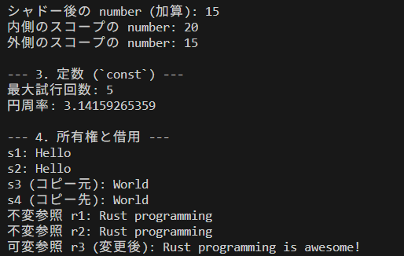

# Rustの変数の主な特徴
- デフォルトで不変 (Immutable by default)
- 型推論と明示的な型指定
- 所有権 (Ownership)、借用 (Borrowing)、ライフタイム (Lifetimes)
- シャドーイング (Shadowing)
- const (定数)

## 1. デフォルトで不変 (Immutable by default)
これがRustの変数で最も顕著で、他の多くの言語と異なる点です。

### 他の言語との違い:

C++, Java, Python, JavaScriptなどの多くの言語では、変数はデフォルトで可変 (mutable) です。つまり、一度値を割り当てた後でも、その値を変更できます。

例えば、JavaScriptでは let x = 5; x = 6; は問題なく実行できます。

一部の関数型言語（Haskellなど）や、定数を明示的に宣言する言語（C++のconst、JavaScriptのconst）を除けば、Rustのようなデフォルト不変は珍しいです。

### Rustの場合:

Rustでは、変数を宣言すると、その変数はデフォルトで不変 (immutable) になります。これは、一度値が割り当てられたら、その値を変更できないことを意味します。

不変性は、プログラムの予測可能性を高め、バグ（特に並行処理におけるデータ競合）を減らすのに役立ちます。

```rust
let x = 5; // x は不変
// x = 6; // エラー: `x` は不変のため再代入できません
```

### 可変にする方法:

変数を可変にしたい場合は、キーワード mut を明示的に使用する必要があります。

```rust
let mut y = 5; // y は可変
println!("The value of y is: {}", y); // 出力: The value of y is: 5
y = 6;
println!("The value of y is: {}", y); // 出力: The value of y is: 6
```

## 2. 型推論と明示的な型指定
Rustは静的型付け言語ですが、非常に強力な型推論機能を持っています。

型推論:

多くの場合、Rustコンパイラは変数の初期値からその型を推論できます。これにより、開発者は冗長な型宣言を省略できます。

```rust
let a = 10;     // コンパイラは `a` を `i32` と推論
let b = "hello"; // コンパイラは `b` を `&str` と推論
let c = 3.14;   // コンパイラは `c` を `f64` と推論
```

### 明示的な型指定:

型を明示的に指定したい場合や、コンパイラが型を推論できない場合は、変数の名前の後にコロン (:) と型名を付けて宣言します。

```rust
let d: i32 = 20;
let e: f32 = 2.718;
let f: bool = true;
```
特に、異なる型の整数リテラルを持つ場合や、型があいまいな場合には明示的な型指定が役立ちます。


## 3. 所有権 (Ownership)、借用 (Borrowing)、ライフタイム (Lifetimes)
これらはRustの最も革新的な特徴であり、メモリ安全性を保証するためにコンパイル時に実行されます。変数のライフサイクルとメモリの解放方法を厳密に管理します。

### 所有権 (Ownership):

Rustの全ての値には、それを所有 (own) する変数が1つだけ存在します。

所有者がスコープを抜けると、その値に関連付けられたメモリは自動的に解放されます（RAII: Resource Acquisition Is Initialization）。これにより、ガベージコレクタなしでメモリリークや二重解放を防ぎます。

値が別の変数に代入されると、所有権は移動 (move) します。元の変数はその値をもう使用できません。

```rust
let s1 = String::from("hello"); // s1がStringの所有者
let s2 = s1;                     // 所有権がs1からs2に移動
// println!("{}", s1);            // エラー: s1はもう所有していない
println!("{}", s2);
```

### 借用 (Borrowing):

所有権を移動させずに値を使用したい場合、借用 (borrow) を行います。借用は参照 (&) を通じて行われます。

共有参照 (&T): 複数の参照を同時に持つことができますが、参照先の値を変更することはできません。

可変参照 (&mut T): 参照先の値を変更できますが、同時に存在できる可変参照は1つだけです。共有参照と可変参照を同時に持つことはできません。

これにより、データ競合を防ぎ、安全な並行処理を可能にします。

```rust
let mut s = String::from("world");

let r1 = &s; // 共有参照
// let r2 = &mut s; // エラー: 共有参照と可変参照は同時に存在できない

println!("{}", r1); // 共有参照はここで使用され、スコープを抜ける

let r2 = &mut s; // r1がスコープを抜けたので、可変参照が可能
r2.push_str("!");
println!("{}", r2);
```

### ライフタイム (Lifetimes):

Rustコンパイラは、参照が有効なスコープ（ライフタイム）を追跡します。参照が指すデータよりも長く生き残らないことを保証します。

コンパイラが自動的に推論できない場合（例: 関数の引数と戻り値の参照関係）、開発者はライフタイムを明示的に指定する必要があります。

```rust
// 'a はライフタイムパラメータ
fn longest<'a>(x: &'a str, y: &'a str) -> &'a str {
    if x.len() > y.len() {
        x
    } else {
        y
    }
}
```
これらの概念は、Rustのメモリ安全性を保証する上で不可欠であり、学習曲線が急になる主要な要因の一つでもあります。

## 4. シャドーイング (Shadowing)
Rustでは、同じ名前の新しい変数を宣言することで、前の変数をシャドー (shadow) することができます。

### 特徴:

シャドーイングは、mutキーワードを使わずに変数の型や値を変更したい場合に便利です。

新しい変数は元の変数とは完全に別物であり、メモリ上の位置も異なる可能性があります。

これは、他の言語における再代入とは異なります。再代入は既存の変数の値を変更しますが、シャドーイングは新しい変数を定義します。

```rust
let spaces = "   "; // spaces は文字列
println!("Original spaces: '{}'", spaces);

let spaces = spaces.len(); // spaces は数値 (文字列の長さにシャドーされる)
println!("Shadowed spaces: {}", spaces);

// let spaces: u32 = "   ".len() as u32; // 型を変える例
```

上記の例では、最初の spaces 変数は文字列型ですが、2番目の spaces 変数は len() メソッドの結果である数値型（usize）になります。これは mut 変数ではできないことです（mutでは型を変更できません）。


## 5. const (定数)
constキーワードを使用して定数を宣言できます。

### 特徴:

constは常に不変です。mutを付けることはできません。

const変数の型は必ず明示的に指定する必要があります。型推論は行われません。

constは、プログラムの実行中に計算される値ではなく、コンパイル時に確定する定数式でなければなりません。関数の呼び出し結果やランタイムの値で初期化することはできません。

命名規則は、通常、すべて大文字でアンダースコアで区切ります (MY_CONSTANT)。

プログラムの任意のスコープで宣言でき、宣言されたスコープ全体で有効です。グローバルな定数として使用することも多いです。

```rust
const MAX_POINTS: u32 = 100_000; // 型は必須、アンダースコアは可読性のため

fn main() {
    println!("Max points allowed: {}", MAX_POINTS);
    // MAX_POINTS = 50_000; // エラー: 定数は変更できない
}
```

### 変数の定義の仕方 (まとめ)
基本的な変数の定義方法は以下の通りです。

```rust
// 不変変数 (デフォルト)
let variable_name = initial_value;

// 可変変数
let mut variable_name = initial_value;

// 明示的な型指定
let variable_name: Type = initial_value;

// 明示的な型指定と可変
let mut variable_name: Type = initial_value;

// 定数 (型指定必須、常に不変)
const CONST_NAME: Type = constant_expression;
```

## 実践

ということでサンプルで変数を扱うサンプルコード作ってみました。
実行すると以下の出力が得られるはずです。




```rust

const MAX_ATTEMPTS: u32 = 5; // 定数はすべて大文字で記述するのが慣習
const PI: f64 = 3.14159265359;

fn main() {
    immutable_and_mutable_variables();
    shadowing_variables();
    constants();
    ownership_and_borrowing();
}

fn immutable_and_mutable_variables() {
    println!("--- 1. 不変変数と可変変数 ---");

    // 不変変数 (デフォルト)
    let x = 5;
    println!("不変変数 x: {}", x);

    // x = 6; // コンパイルエラー: `x` は不変のため再代入できません
    // error[E0384]: cannot assign twice to immutable variable `x`

    // 可変変数
    let mut y = 10;
    println!("可変変数 y (初期値): {}", y);
    y = 15; // 値を変更可能
    println!("可変変数 y (変更後): {}", y);

    // 型推論の例
    let inferred_string = "Hello, Rust!"; // &str と推論される
    println!("型推論された文字列: {}", inferred_string);

    // 明示的な型指定の例
    let explicit_f32: f32 = 3.14; // f32 型を明示
    println!("明示的に型指定されたf32: {}", explicit_f32);

    let explicit_u8: u8 = 255; // u8 型を明示
    println!("明示的に型指定されたu8: {}", explicit_u8);
}

fn shadowing_variables() {
    println!("\n--- 2. シャドーイング ---");

    let spaces = "   "; // spaces は文字列型 (&str)
    println!("シャドー前の spaces (文字列): '{}', 長さ: {}", spaces, spaces.len());

    let spaces = spaces.len(); // 同じ名前の新しい変数で、型は usize になる
    println!("シャドー後の spaces (数値): {}", spaces);

    let number = 10;
    println!("元の number: {}", number);

    let number = number + 5; // 値を変更しつつ、新しい変数を定義
    println!("シャドー後の number (加算): {}", number);

    {
        // 内側のスコープでシャドー
        let number = 20;
        println!("内側のスコープの number: {}", number);
    } // このスコープを抜けると内側の number は破棄される

    println!("外側のスコープの number: {}", number); // 外側の number が再び見える
}


fn constants() {
    println!("\n--- 3. 定数 (`const`) ---");

    println!("最大試行回数: {}", MAX_ATTEMPTS);
    println!("円周率: {}", PI);

    // MAX_ATTEMPTS = 10; // コンパイルエラー: 定数は変更できない
    // error[E0070]: invalid left-hand side of assignment
}

fn ownership_and_borrowing() {
    println!("\n--- 4. 所有権と借用 ---");

    // 所有権の移動 (Move)
    let s1 = String::from("Hello"); // s1がStringデータ"Hello"の所有者
    println!("s1: {}", s1);

    let s2 = s1; // s1からs2へ所有権が移動。s1はもう無効。
    println!("s2: {}", s2);
    // println!("s1: {}", s1); // コンパイルエラー: s1は所有権を失ったため使用できない
    // error[E0382]: use of moved value: `s1`

    // データのクローン (Copy) - ヒープデータの場合、明示的にコピーする
    let s3 = String::from("World");
    let s4 = s3.clone(); // s3のデータをコピーしてs4が新しい所有者になる
    println!("s3 (コピー元): {}", s3);
    println!("s4 (コピー先): {}", s4);

    // 借用 (Borrowing)
    let mut some_string = String::from("Rust programming");

    // 不変参照 (shared borrow)
    // 複数の不変参照を同時に持つことができるが、参照先は変更できない
    let r1 = &some_string;
    let r2 = &some_string;
    println!("不変参照 r1: {}", r1);
    println!("不変参照 r2: {}", r2);
    // some_string.push_str(" is awesome!"); // エラー: 不変参照が存在するため変更できない

    // 不変参照 r1 と r2 はここで最後に使用されるため、
    // ここでそれぞれのライフタイムが終了するとコンパイラが判断します。
    // そのため、明示的な drop は不要です。

    // 可変参照 (mutable borrow)
    // 1つの可変参照のみを同時に持つことができる。参照先を変更できる
    let r3 = &mut some_string; // r1 と r2 のライフタイムが終了しているため、作成可能
    r3.push_str(" is awesome!");
    println!("可変参照 r3 (変更後): {}", r3);
    // let r4 = &mut some_string; // エラー: r3がまだ存在するため、別の可変参照は作成できない
    // let r5 = &some_string; // エラー: 可変参照が存在するため、不変参照も作成できない

    // r3がスコープを抜けると、再び変更や他の参照が可能になる
}
```


