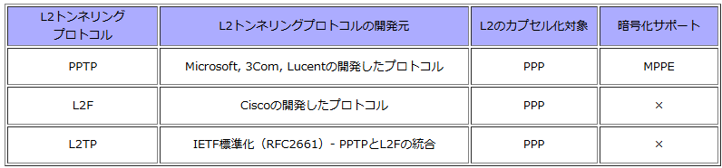

#### RSVP

IPネットワークにおけるホスト間の通信において、映像配信などのリアルタイム通信を円滑におこなうため、ネットワーク資源の予約を行う帯域制御用のプロトコル。
送信側のホストより受信側のホストに対して、Pathメッセージを定期的に送信し、受信ホストではResvメッセージを返信することで帯域予約を行う。

#### FDDI

トークンパッシング方式を採用している。
トークンと呼ばれる特殊な電文をノードよりノードに巡回させて、トークンを獲得したノードがデータの送信権を得る方式。

#### マルチホーミング

複数のISPと契約することで複数のインターネット接続回線を利用できるようにすること。

#### 使うことができないホスト

すべて'0':ネットワーク自信のアドレスを示す
すべて'1':すべてのホストに対するブロードキャストを示す

#### TCP

TCPはトランスポート層のプロトコル。
ゲートウェイはトランスポート層以上の中継を行う装置で、異なるネットワーク間の接続に用いられる。
ちなみにUNIXやWindowsではルータのことをゲートウェイと呼ぶ。

#### sftpコマンド

sftpコマンドは、ftpコマンドのように対話的なファイル転送をするプログラムで、SSHで暗号化された通信経路でファイル転送を行います。

「[sshコマンド](https://webkaru.net/linux/ssh-command/)」と同じ認証を利用するので、鍵認証も利用でき、安全にファイル転送が行えます。

鍵の生成は「[ssh-keygenコマンド](https://webkaru.net/linux/ssh-keygen-command/)」を参照してください。

#### MPLS

**MPLS (Multi-Protocol Label Switching)**は、様々な L2/L3 プロトコル (IPv4/IPv6/Ethernet/ATM/Frame-Relay 等) にラベルを取り付け、そのラベルに基づいてそのプロトコルを高速に転送するスイッチング方法です。

MPLS によるデータ転送が可能になります。MPLS 網内で**ラベル (Label) を交換 (Switching) しながら**目的地に向かいます。

L2/L3プロトコルにラベルを付けて、ラベルに基づいて、高速にパケットを転送するスイッチングのプロトコル。

## PPP

コンピューター同士が1対1の通信を行うための規約を定めたプロトコル

インターネット標準化組織IETF（Internet Engineering Task Force）によって標準化されており、OSI参照モデルでは第2層（データリンク層）に該当するプロトコル

電話回線などの回線を利用した通信方式の一つであり、ルーター同士の接続やダイアルアップ回線、ADSL回線を使ってインターネットに接続する際に利用されています。

光回線が主流となった現在では、イーサネット上でPPPのデータをやり取りするPPPoE（PPP over Ethernet）が利用されています。また、さらに高速な通信を実現するための接続方式として、近年ではIPoE（IP over Ethernet）が利用されるようになりました。

#### PPTP

PPPをインターネット上でトンネリングし、認証と暗号化を提供します。

インターネット上のIPネットワークで使用されている「IP」には、PPPのような認証機能はありません。

一方、「PPP」はWANのシリアル回線のように、2点間がポイントツーポイント接続されている回線でのみ利用可能

どのようにFlet's IP網で、PPPoEのPPP認証を行っているのでしょうか。

PPPフレームをIPデータグラムに埋め込み、「カプセル化」して送信を行い、認証サーバーの受信側でカプセル化解除を行うことにより実現しています。

このようにある通信プロトコル上で異なる通信プロトコルを透過的に伝送することをトンネリングと言います。

PPPはL2のデータリンク層であることから、この場合はレイヤ2トンネリングと言われます

## WebDav

[HTTP](https://it-biz.online/it-skills/http/)のプロトコルを拡張しサーバ上のファイル編集を可能とする仕組み・技術のこと。

**WebDAV** （ウェブダブ）とは**サーバ上のファイル編集やファイル削除等を簡単に（FTPを利用せずに）処理できるようにした仕組み・技術のこと**

通常サーバ上のファイル操作はFTPクライアントを利用して処理を行いますが、FTPを利用する場合はFTPクライアントをあらかじめパソコンにインストールしておく必要があったり、そもそもセキュリティ的な要件でFTPの利用が難しいといったような場合があります。

このような場合にWebDAVを１つの代替手段として用いることができるようになります。**WevDAVはFTOとは異なり特別なソフトウェアを必要としないので、より簡易的にサーバ上のファイルを操作できるようになるという点も特徴の１つです。**

## IEEE802.1Q

トランクリンク上で、イーサネットフレームにVLAN情報を付加することによって、複数のスイッチにまたがったVLANを作成することができます。

このVLAN情報を付加するトランクプロトコルとして、以下の2つあります。

#### アクセスポートとトランクポートの違い

1. 決まった１つのネットワークのデータのみが通る穴がアクセスポートで、複数のネットワークのデータが通る穴がトランクポート
2. アクセスポートはPCなどの端末をつなぐ穴で、トランクポートは主にスイッチ同士をつなぐ穴

アクセスポートとは、1つのネットワークを形成する穴のことです。主にPCやプリンターなどの端末とスイッチ（ネットワークを作る機器のこと）を接続するために使われます。

トランクポートとは、複数のネットワークを形成できる穴のことです。スイッチ同士をつなげるように設定することで、他のスイッチとネットワークを形成できます。また、このトランクポートでは、トランクリンク(タグLAN )が使われるのが特徴です。このトランクリンクとは、いわば「名札付け」のようなものと考えるとよいでしょう。

荷物を届ける際、あて先と送り主の住所を書きます。データを送るときも同じで、どのアクセスポートに送るかを送る側のスイッチがタグ付けするのです。受け取った側のスイッチはつけられたタグを読み取り、対象のアクセスポートへ送ります。この機能により、送り先に正確な情報を送ることができるのです。

#### トランクリンク

- タグVLANのこと
- VLANのやり方
- データに名札を付けて、名札によって所属するネットワークを判断する

もともとのネットワークを理論的に区切ったネットワークの作り方の仕方の一つ。

所属するネットワークを描いた名札をデータにくっつけて、名札で宛先を制御する方法。

#### QUIC

googleが開発したUDP上で通信を行うプロトコル

#### LDAPサーバ
「LDAP（Lightweight Directory Access Protocol）」というプロトコルを使って、ディレクトリサービスを提供するサーバーのことです。

__機能__

__1. ディレクトリ情報の管理__

ユーザーアカウント、グループ、組織、コンピュータ、メールアドレス、電話番号など、ネットワーク上のさまざまな情報（ディレクトリ情報）を階層的（ツリー構造）に管理します。
__2. 認証と認可__

ネットワーク上のユーザーやシステムの「認証」（本人確認）や「認可」（アクセス権限の管理）を行うための情報源として利用されます。
たとえば、ユーザーがシステムにログインする際、LDAPサーバーに保存されたユーザー情報とパスワードで認証を行います。
__3. 情報の検索と参照__

管理されているディレクトリ情報を、クライアント（PCやアプリケーション）が検索・参照できます。
たとえば、メールクライアントがLDAPサーバーからアドレス帳情報を取得する、といった使い方ができます。

