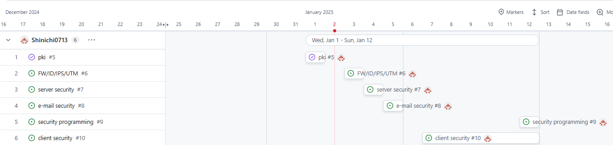

## マークダウンでやった結果の課題

1.問題が一望できない

2.集計機能がつけられない

3.文字数カウントの付加が結構手間

反省すると同時に、問題のカスタマイズができるなどからエクセルがやはり良いのか・・・・？

## そのほか

情報をまとめた後、その内容の理解チェックを行うと良いと考えた。
生成AIに
"以下文面から内容を問う問題を作成してください"
と表記した結果

生成

```
問題
PKIとは何を証明する基盤ですか？
RAとCAの役割は何ですか？
デジタル証明書にはどのような情報が含まれていますか？
X.509形式とは何を表していますか？
PKIの運用環境における3つの役割を説明してください。
```

確認問題は作成してくれる

"以下問題に対して、回答が正解か不正解かを採点してください。回答が正解に対して不足ある場合は不足している情報を指摘してください"

__生成AIの採点__
PKIとは何を証明する基盤ですか？
回答: デジタル署名
採点: 不正解
指摘: PKIはデジタル署名の正当性を証明する基盤です。単に「デジタル署名」だけでは不十分です。
RAとCAの役割は何ですか？
回答:
RA: デジタル証明書の登録申請を受け付けて、承認や認可を行う
CA: デジタル証明書に対して、発行の保証を行う
採点: 正解
指摘: 回答は正しいですが、CAの役割について「発行の保証」よりも「デジタル証明書のお墨付きを与える信頼のおける第3者機関」と表現するとより正確です。
デジタル証明書にはどのような情報が含まれていますか？
回答: 有効期限、公開鍵、認証局のデジタル証明書
採点: 正解
指摘: 回答は正しいですが、「認証局のデジタル証明書」よりも「証明書の正当性を示す情報」と表現するとより正確です。
X.509形式とは何を表していますか？
回答: デジタル証明書の表記するフォーマット
採点: 正解
指摘: 回答は正しいですが、X.509形式は「証明書および証明書失効リスト（CRL）のフォーマット」と表現するとより正確です。
PKIの運用環境における3つの役割を説明してください。
回答: CA, RA, IA
採点: 正解
指摘: 回答は正しいですが、それぞれの役割について具体的に説明するとより良いです。例えば、CAは「デジタル証明書のお墨付きを与える信頼のおける第3者機関」、RAは「利用者からデジタル証明書の登録を受け付けて承認や認可を行う機関」、IAは「デジタル証明書の正当性を確認するAPPが直接やり取りを行う機関」となります。

## タスク管理

目的に基づいた全貌理解のため、プロジェクト管理の機能を使う

登録が面倒な点、なんとかできないかが要検討



## 達成度の測定

勉強の達成度の測定を考えたい。

問題の正答率→過去やったことがあるか、ないかで大きく結果が変わる

履修事項の確認→やった、やってないだけだと、自分が理解したかとリンクしていない

今回試験においては以下を重要な点と考える

- 該当するセクションの問いに対して正確な解答が出来る
- セクションに対して知識が定着している
- 説明の内容が簡潔にまとまっている

今回試験の結果を踏まえて以下を重要な評価点と考える

- 説明が分かりやすくまとまっている
- 知識が記載された通りでなく、活用可能な知識となっている
- 自分目線ではなく、第３者目線の評価となっている

問題は３点目。自分で自習している以上、第３者目線の活用は非常に困難。

解決法としてLLM as a judgeを使う。

→あらかじめ記述問題の評価軸を定義して起き、定義された評価軸で判断。

あとで総合得点を勘案して、見直しや復習の指針とする。


#### 具体的な実現法

1.AIに単元の情報を渡し、総合的な知識を問う問題を生成

2.著者が解答を作成

3.2の回答をLLM As A Judgeにより評価

上記の章末を総合問題として評価→全体が終わった後、一覧でレビュー出来るようにして、後日の復習や補強の指針とする
